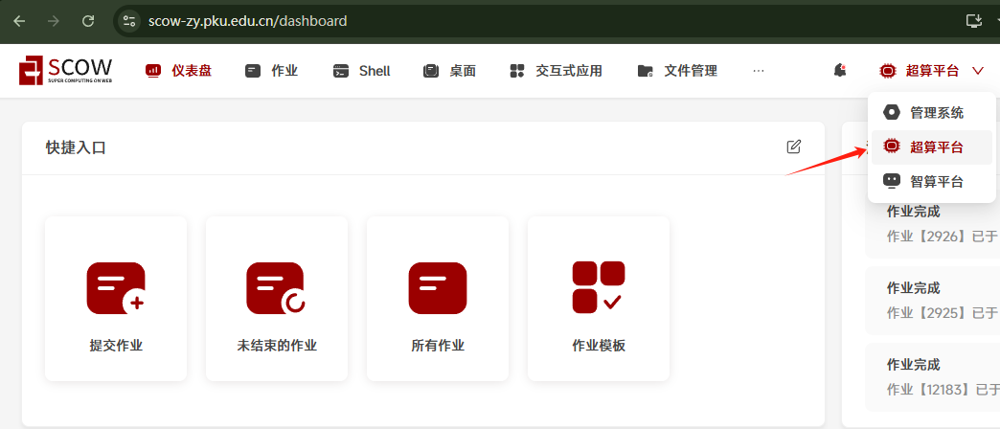
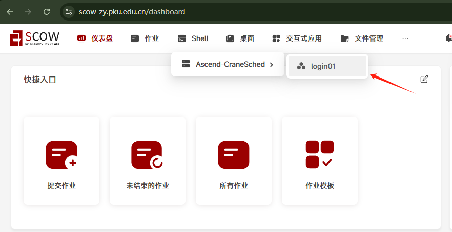
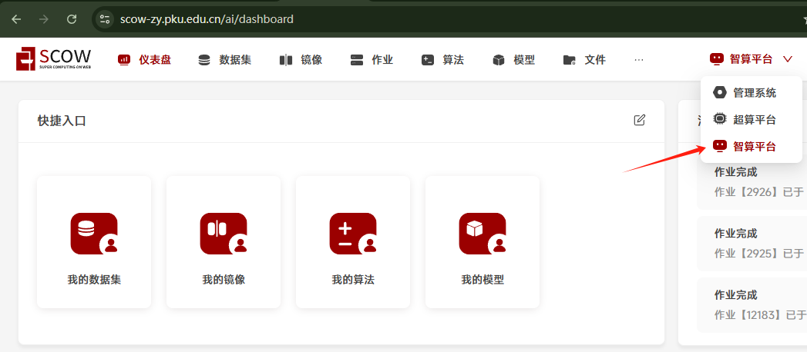
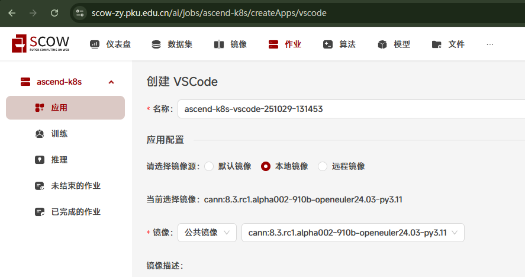
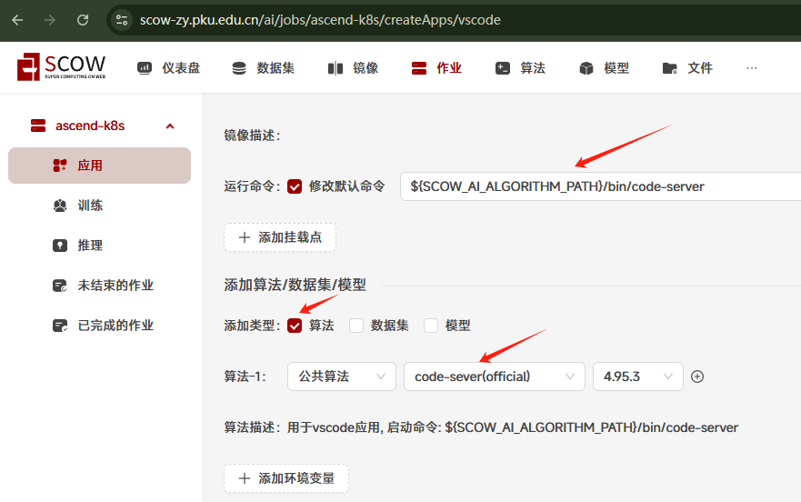
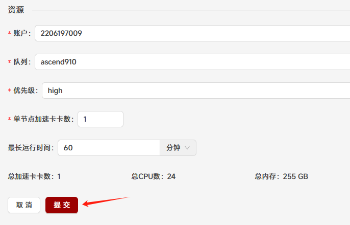
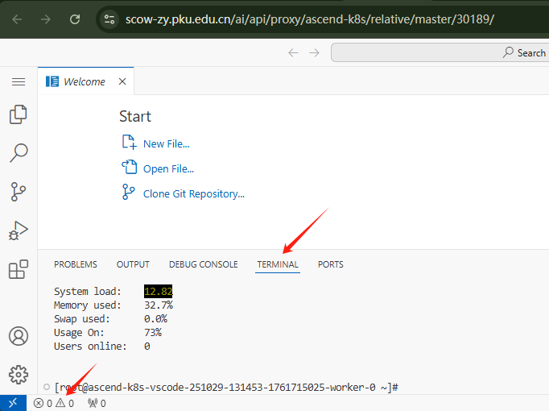
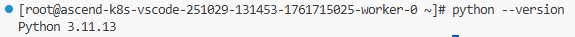

# Tutorial0: 在SCOW超算和超算平台配置python环境

* 集群类型：SCOW超算平台、SCOW智算平台
* 所需镜像：无
* 所需模型：无
* 所需数据集：无
* 所需资源：任意资源均可
* 目标：本节旨在向用户演示如何分别在SCOW各平台配置python环境，这是后续教程的基础环境，具体来说在SCOW超算平台中，我们安装miniconda以创建隔离的python环境；在SCOW智算平台中，我们提供的基础镜像一般已经包含python环境，只需验证python环境即可

## 1、SCOW超算平台
### 1.1、打开shell
首先进入超算平台



点击Shell->login01进入shell



### 1.2、安装conda
Conda 是一个开源的包管理和环境管理系统。它用于安装和管理软件包及其依赖项，同时允许用户创建独立的环境，以便在一个系统上运行多个项目。在命令行终端中运行如下命令以安装 conda：
```shell
# 0. 安装 wget
sudo apt update
sudo apt install wget

# 1. 获得最新的miniconda安装包；
wget https://repo.anaconda.com/miniconda/Miniconda3-py313_25.7.0-2-Linux-aarch64.sh

# 2. 安装
chmod +x Miniconda3-py313_25.7.0-2-Linux-aarch64.sh
./Miniconda3-py313_25.7.0-2-Linux-aarch64.sh

# 3. 安装成功后可以删除安装包，节省存储空间
rm -f Miniconda3-py313_25.7.0-2-Linux-aarch64.sh

# 4. 执行以下命令，即可导入 conda 环境
source ~/.bashrc

# 5. 检查是否安装成功
conda --version

# 6. 初始化
conda init bash
```

### 1.3、创建环境
运行下面的命令创建conda环境
```shell
# python版本可按需填写
conda create -n tutorial0 python==3.10
conda activate tutorial0
```

运行命令`python --version`，可以看到python版本，已经具备python环境


## 2、SCOW智算平台
### 2.1、创建应用
首先进入智算平台



点击作业->应用，选择vscode应用


在创建应用中，选择你需要的镜像，包含python环境



点击添加算法，选择公共算法->code-server->4.95.3，点击修改默认命令，并填入`${SCOW_AI_ALGORITHM_PATH}/bin/code-server`



按需填写单节点加速卡卡数以及最长运行时间，本教程仅为示例因此保留默认值，最后点击提交



在跳转的页面中点击进入即可进入应用


### 2.2、环境验证
进入应用后，打开终端



运行命令`python --version`，可以看到python版本，已经具备python环境

