# Tutorial10: 使用LLaMA-Factory官方镜像完成Qwen大模型的多机多卡微调、推理

* 集群类型：智算平台
* 所需镜像：app-store-images.pku.edu.cn/hiyouga/llamafactory:0.9.4-npu-a2
* 所需模型：Qwen2.5-1.5B-Instruct
* 所需数据集：教程内提供
* 所需资源：多机多卡（2节点*2加速卡）
* 目标：本节以Qwen2.5-1.5B-Instruct模型为例，使用LLaMA-Factory官方镜像对这个Qwen大模型完成多机多卡微调、推理的步骤。未经过微调的Qwen大模型认为自己是Qwen大模型；经过微调后，Qwen大模型认为自己是北大人工智能助手。

## 1、准备环境

1.1 准备数据集

根据[Tutorial5_添加和管理数据集](../Tutorial5_添加和管理数据集/tutorial5_添加和管理数据集.md) 准备数据集

这里简单介绍数据集，部分数据如下所示，目的是希望微调后的模型自我认同为北京大学开发的AI助手，可与最终的推理验证进行对照

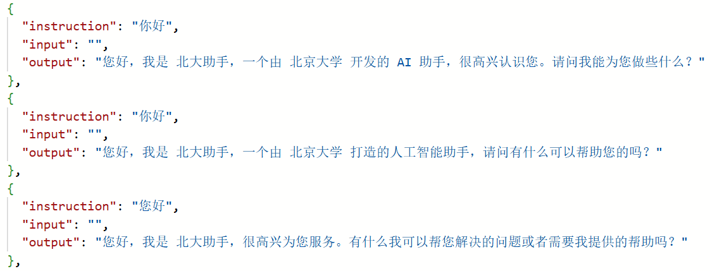

1.2 创建交互式应用

进入智算平台，创建两个vscode应用

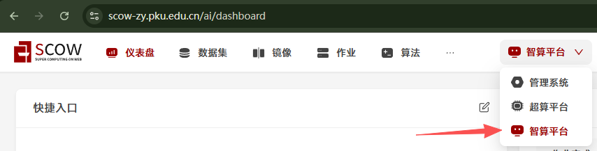


镜像源选择远程镜像，远程镜像地址填写教程开头给出的镜像地址`app-store-images.pku.edu.cn/hiyouga/llamafactory:0.9.4-npu-a2`


添加算法、数据集、模型
* 算法：公共算法->code-server->4.95.3
* 数据集：我的数据集->identity->latest
* 模型：公共模型->Qwen2.5-1.5B-Instruct->latest（如果您使用的集群没有该模型，请参考[Tutorial16](../Tutorial16_下载模型/tutorial16_下载模型.md)下载模型，其中的1.1.6步骤命令使用modelscope download --model Qwen/Qwen2.5-1.5B-Instruct --local_dir ./Qwen/Qwen/Qwen2.5-1.5B-Instruct）
* 运行命令：勾选修改默认命令，填入`${SCOW_AI_ALGORITHM_PATH}/bin/code-server`，确保能够运行选择的算法

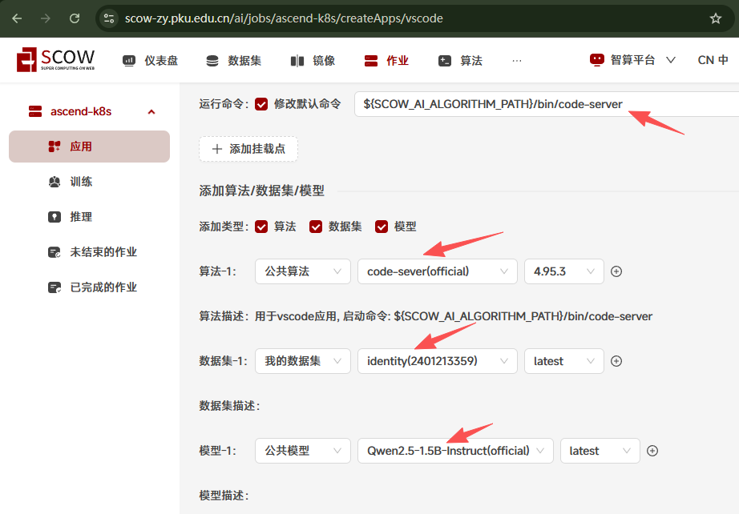

填写加速卡卡数为2，因为本教程是多机多卡，最长运行时间按需填写，最后点击提交


由于要创建两个vscode应用，因此第一个作业提交后点击再次提交，此时不需要改动任何配置，直接点击提交即可


能够看到已经创建两个vscode应用

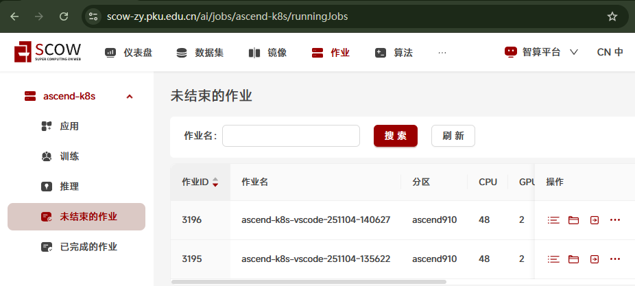

选择第一个应用作为主节点，点击详情进入，查看其ip并记录，这里是`10.0.5.216`，请务必记住您选择的主节点，因为多机多卡微调时主节点和从节点的微调命令不同


分别点击进入应用（最好在此时分不同页面区分主节点应用和从节点应用）

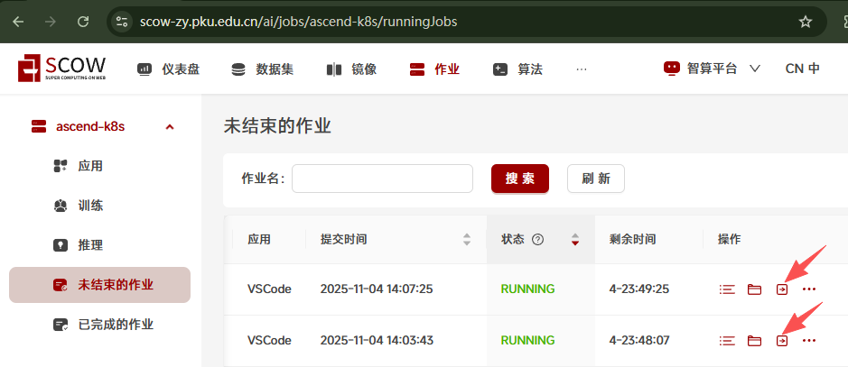

进入app文件夹，打开终端（两个应用都要做）

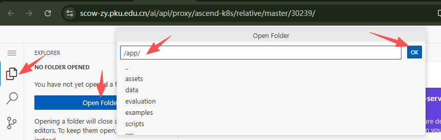
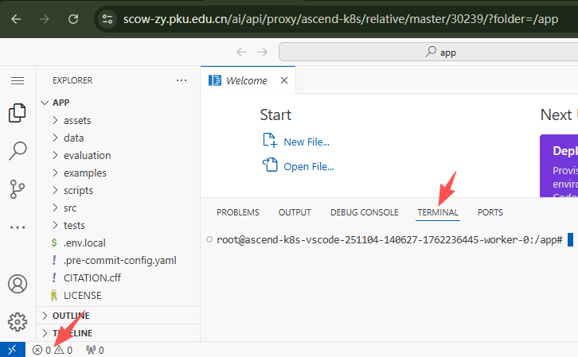

## 2、模型微调

在两个应用的终端都运行下面的命令进行配置
```shell
echo "model_name_or_path: $SCOW_AI_MODEL_PATH

stage: sft  # Supervised Fine-Tuning 有监督的微调
do_train: true
finetuning_type: lora # 微调类型,例如lora
lora_target: all  # LoRA微调的目标模块
dataset: identity #新模型的数据集名称
template: qwen # 数据模板，例如qwen,llama3
cutoff_len: 1024 # 序列截断长度。
max_samples: 1000 # 最大样本数 
output_dir: ${WORK_DIR}/llama-factory-output
num_train_epochs: 20.0
learning_rate: 1.0e-4
lr_scheduler_type: cosine
resume_from_checkpoint: null

# 配置文件中的TensorBoard设置
logging_dir: ./logs/tensorboard
# report_to: tensorboard" > /app/config.yaml && echo "{\"identity\":{\"file_name\":\"${SCOW_AI_DATASET_PATH}/identity-pku-assistant.json\"}}" > /app/data/dataset_info.json
```

开始微调（两条命令请同时运行，间隔不要超过30s）：
* 在主节点应用中运行以下命令（这里的MASTER_ADDR为前面记录的主节点ip，不同集群、用户、作业的ip都不同，务必使用你自己记录的主节点ip）
```shell
FORCE_TORCHRUN=1 NNODES=2 NODE_RANK=0 MASTER_ADDR=10.0.5.216 MASTER_PORT=29500 llamafactory-cli train /app/config.yaml
```

* 在从节点应用中运行以下命令
```shell
FORCE_TORCHRUN=1 NNODES=2 NODE_RANK=1 MASTER_ADDR=10.0.5.216 MASTER_PORT=29500 llamafactory-cli train /app/config.yaml
```

在主节点终端看到如下输出则微调成功

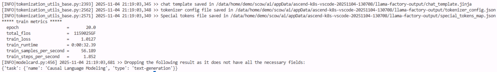

## 3、模型合并

微调后输出的模型还需要与原模型进行融合才能得到最终的模型

在主节点运行下面的命令进行模型合并配置
```shell
echo "### model
model_name_or_path: $SCOW_AI_MODEL_PATH
adapter_name_or_path: ${WORK_DIR}/llama-factory-output
template: qwen
trust_remote_code: true

### export
export_dir: ${WORK_DIR}/llama-factory-merged
export_size: 5
export_device: auto  # choices: [cpu, auto]
export_legacy_format: false
" > /app/lora_merge.yaml
```

在主节点运行下面的命令开始模型合并
```shell
llamafactory-cli export /app/lora_merge.yaml
```

在终端看到以下输出则模型合并成功，红框的部分就是合并模型的存储路径，记录下来后续模型推理验证会使用到，这里是`/data/home/demo/scow/ai/appData/ascend-k8s-vscode-20251104-130708/llama-factory-merged`

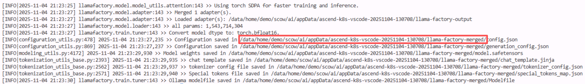

## 4、推理验证

创建nextchat应用

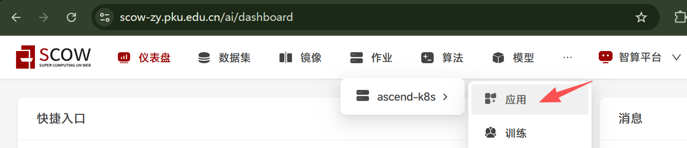
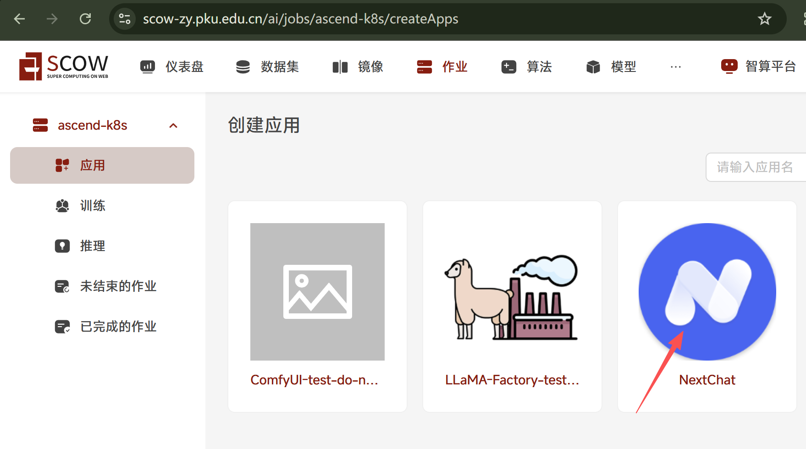

使用默认镜像，不用改动默认命令


添加挂载点，填写前面记录到的合并模型存储路径；添加环境变量，名称填写`SCOW_AI_MODEL_PATH`，值填写前面记录到的合并模型存储路径，这里是`/data/home/demo/scow/ai/appData/ascend-k8s-vscode-20251104-130708/llama-factory-merged`


加速卡卡数和最长运行时间按需填写，这里不改动，点击提交


点击进入nextchat应用


在对话框中提问`你是谁`，模型回答`您好，我是由 北京大学 发明的 北大助手。我可以为您提供多种多样的服务，比如翻译、写代码、闲聊、为您答疑解惑等。`，达到微调效果


