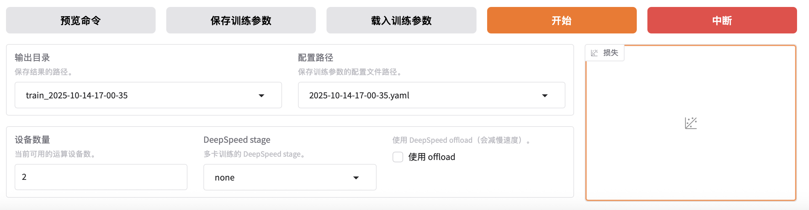

# Tutorial12: 使用LLaMa-Factory交互应用做大模型微调

* 集群类型：智算平台
* 所需镜像：app-store-images.pku.edu.cn/pkuhpc/llama-factory-ascend-v1:20250909-8.0.0-910b-ubuntu22.04-py3.10
* 所需模型：Qwen2.5-1.5B-Instruct
* 所需数据集：教程内提供
* 所需资源：建议使用1张910B NPU运行本教程。
* 目标：本节以Qwen2.5-1.5B-Instruct模型为例，使用LLaMA-Factory交互应用对这个Qwen大模型完成微调、推理的步骤。未经过微调的Qwen大模型认为自己是Qwen大模型；经过微调后，Qwen大模型认为自己是北大人工智能助手。

分以下几步来实现：
1. 创建LLaMA-Factory交互应用，选取Qwen2.5-1.5B-Instruct模型
2. 按照步骤，使用LLaMA-Factory交互应用完成对大模型的微调和推理

## 1、拉取镜像并安装

1.1 准备数据集，创建交互应用

1.1.1 登录SCOW平台，选取智算平台，进入AI集群


1.1.2 准备微调所需要的数据集
点击文件 -> ascend-k8s 


进入AI集群的文件系统


点击 新目录，用来创建数据集及相关文件所在的目录


创建目录时，将目录名定为 data ，点击 确定 按钮


进入新建的 data 目录，看到目录里什么文件都没有

点击 新文件，来创建新文件，文件命名为 identity.json 


点击 确定 按钮，data 目录里面，已经创建了一个名字为 identity.json 的文件


此时文件没有内容，点击文件名 identity.json，打开文件，文件为空白，点击右下角的 编辑 按钮，对文件进行编辑


把[数据集内容](https://app-store-images.pku.edu.cn/pku-app-store-storage/dataset/identity-pku-assistant.json)进行 复制，然后粘贴到 文件 中，点击 保存 按钮，identity.json 就有了内容，在后续的步骤中将作为数据集使用


1.1.3 创建数据集相关的文件

点击 新文件，来创建新文件，文件名命名为 dataset_info.json


将下面 代码 复制后，粘贴到文件

```json
{
  "identity": {
    "file_name": "identity.json"
  }
}  
```

点击 保存 按钮，可以看到 dataset_info.json 文件创建成功，data目录下面已创建两个文件：indentiy.json作为数据集，dataset_info.json作为数据相关信息


1.1.4 为数据集设置版本，方便管理

点击 数据集 > 我的数据集


进入 我的数据集 页面进行管理，点击 添加 按钮


将数据集名称命名为 identity，数据类型中选择 文本，点击 确定 按钮


点击刚添加的数据集 identity 后的 + 加号，为它创建新版本


版本名称可以用日期，例如 2025922，也可以使用自己好理解的名称，点击 选择数据集 最右边图标


选择刚创建的目录 data, 点击 确认 按钮


点击数据集名称前的 + 加号，+ 加号变成 - 减号后，展开查看数据集的版本已经添加成功：


1.1.5 然后点击 作业 > ascend-k8s > 应用 > 创建应用


1.1.6 进入AI集群的应用页面，点击LLaMA-Factory图标，创建LLaMA-Factory应用


1.1.7 选取大模型

在创建LLaMA-Factory页面中，进行配置：

应用配置中，选择 默认镜像，app-store-images.pku.edu.cn/pkuhpc/llama-factory-ascend-v1:20250909-8.0.0-910b-ubuntu22.04-py3.10


1.1.8 添加模型和算法

* 勾选添加类型 - 模型，下拉菜单中，选取 公共模型；模型下拉菜单中，选取 Qwen2.5-1.5B-Instruct(official) 模型，版本下拉菜单中，选取 latest


* 勾选添加类型 - 数据集，下拉菜单中，选取 我的数据集；数据集下拉菜单中，选取刚创建的 identity（这里有你的用户名） 数据集，版本下拉菜单中，选取刚在数据集中设置的版本号；有多个版本的话，选取恰当的版本


1.1.9 资源部分不需要修改，也可以根据实际需要在 单节点加速卡卡数 中修改为2/4/8（单节点上限是8卡，卡数越多，对大模型训练的时间会相应缩短）然后点击 提交 按钮


1.1.10 进入新创建的LLaMA-Factory应用的浏览器界面

提交后，刚创建的作业在 未结束的作业 列表中，作业状态为 PENDING


点击 刷新 按钮，手动进行刷新后，作业状态转为 RUNNING，在这条作业的操作中，点击 进入 图标，浏览器将打开新的页面来展示新创建的LLaMA-Factory应用


进入新创建的LLaMA-Factory应用的浏览器界面，可以看到：
前面步骤中选取的模型 Qwen2.5-7B-Instruct
前面步骤中创建的数据集所在目录


## 2、用LLaMA-Factory交互应用对Qwen模型进行微调
这里主要会用到 Train 训练来进行模型微调 和 Chat 对话来验证模型微调前后的比较
2.1 点击 Chat 对话，询问问题，让模型进行推理，查看微调前的模型表现


2.1.1 现在模型还未加载，点击 加载模型


模型加载中，这里加载的模型是前面步骤中选取的模型 Qwen2.5-7B-Instruct


2.1.2 模型加载后，可以跟模型进行对话聊天，这里使用推理的模型是 Qwen2.5-1.5B-Instruct 也就是在创建交互应用时选择的模型


2.1.3 与模型进行对话

在输入框中，提问：你好，你是谁？


点击 提交 按钮，查看模型进行推理后的回答，确认是 通义千问 大模型


提出更多问题，例如：
是谁创造了你？
你是chat gpt吗？并逐一提交，查看模型进行推理后的回答，问题主要集中在 identity 身份 方面，为后面经过微调后的模型的回答作对比


2.2 点击 Train 训练，配置微调所用的数据集

2.2.1 查看数据路径，在数据集下拉菜单中，选择刚创建的数据集 identity


2.2.2 选择好数据集后，可以点击 预览数据集


对数据集预览时，可以用 上一页 或 下一页 进行翻页，浏览完后，可以点击 关闭


2.3 在 Train 训练中，配置微调所需要的参数

2.3.1 在 对话模板 的下拉菜单中，选择 qwen 模型，因为是对 qwen 千问模型进行微调和对话


2.3.2 修改微调所需要的参数
* 在 学习率 中，将参数修改为 1e-4
* 在 训练轮数 中，将参数修改为 20
* 在 最大样本数 中，将参数修改为 1000
* 在 截断长度 中，将参数修改为 1024


2.3.3 点击 保存训练参数，使得修改后的参数保存起来


2.3.4 点击 预览命令，查看所有参数的配置


可以看到微调时会使用的命令和参数


2.4 在 Train 训练中，使用数据集对模型进行微调

2.4.1 点击 开始 按钮，这里使用的数据集是2.2.1中设置的 identiy 数据集，对模型进行微调。
输出目录、配置路径都不要修改。在还没有开始进行微调时，损失曲线为空白。


2.4.2 等几秒后，可以看到，对模型开始微调，进程条在走动，损失曲线在变化


2.4.3 微调完成后，提示：训练完毕，损失曲线不再变化


2.5 在 Chat 对话中， 询问问题，让模型进行推理，查看微调后的模型表现

2.5.1 回到 Chat 页面，在 检查点路径 点击下拉菜单，刚微调的输出目录出现在下拉菜单，选中这个目录。如果是多次微调的话，下拉菜单中会有多个可选目录，选择合适的目录


2.5.2 为了让微调后的模型生效，要先点击 卸载模型，把没有经过微调的模型进行卸载


2.5.3 再点击 加载模型，将微调过的模型进行加载


2.5.4 与模型进行对话

在输入框中，提问：你好，你是谁？
点击 提交 按钮，查看模型进行推理后的回答，回答不再是 通义千问 大模型，而是北大人工智能助手


提出更多问题：
是谁创造了你？
你和北京大学是什么关系？
并逐一提交，查看模型进行推理后的回答，问题主要集中在 身份 方面，与2.1.3中模型的回答作对比


