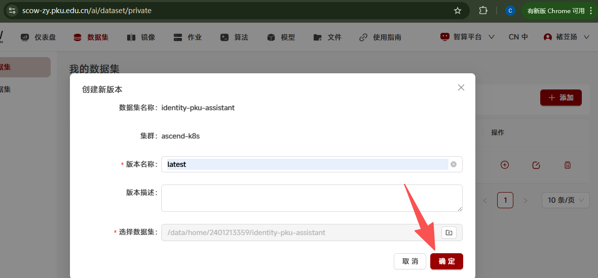
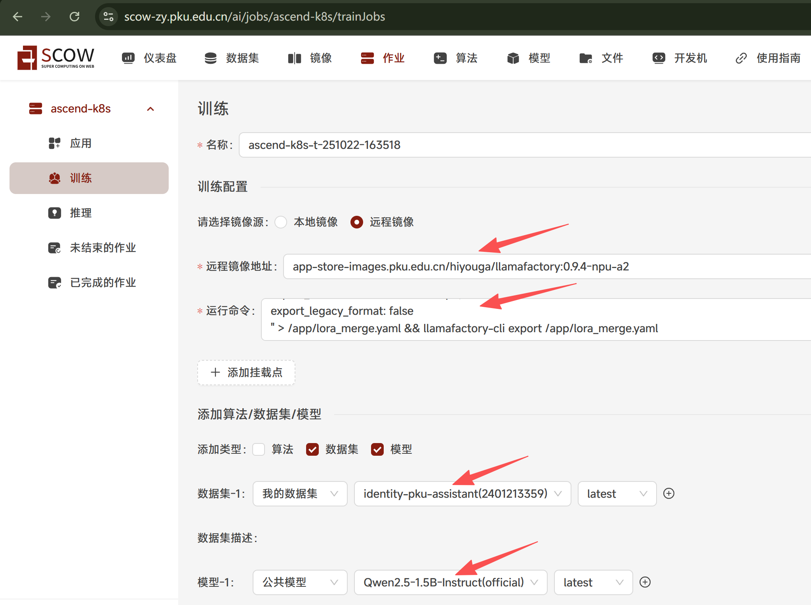
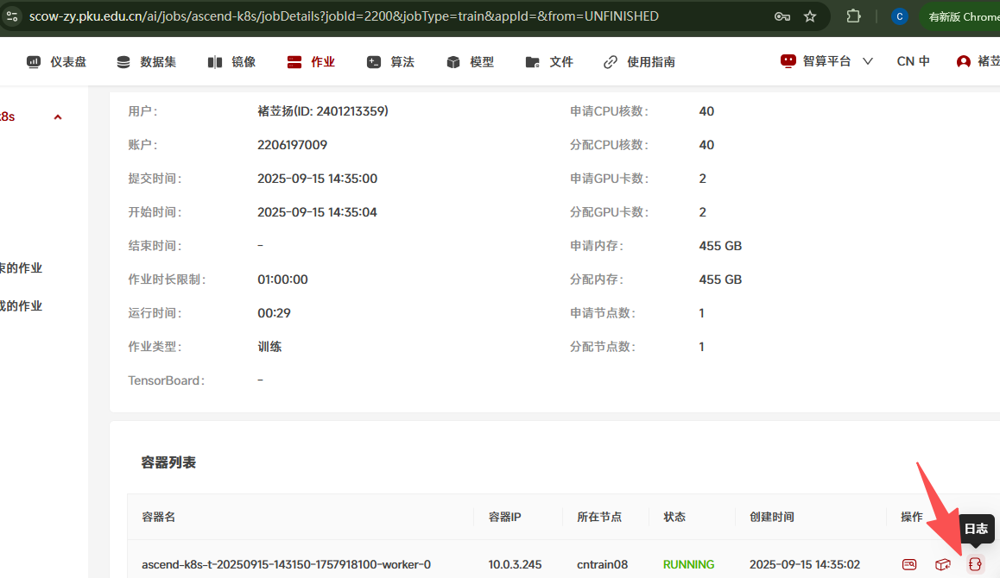

# Tutorial12: 在SCOW-AI集群的训练模块中使用LLaMA-Factory进行单机单卡/多卡模型微调

* 集群类型：智算平台
* 所需镜像：app-store-images.pku.edu.cn/hiyouga/llamafactory:0.9.4-npu-a2
* 所需模型：Qwen2.5-1.5B-Instruct
* 所需数据集：教程内提供
* 所需资源：建议使用2张910B NPU(单节点)运行本教程。
* 目标：本节以Qwen2.5-1.5B-Instruct模型为例，在SCOW-AI集群的训练模块中使用LLaMA-Factory框架对这个Qwen大模型完成单机单卡/多卡微调、推理的步骤。未经过微调的Qwen大模型认为自己是Qwen大模型；经过微调后，Qwen大模型认为自己是北大人工智能助手。


## 1、数据集准备
使用identity-pku-assistant数据集，这个数据集的作用是调整大模型的自我身份认知，让大模型认为自己是北大助手。接下来介绍上传该数据集的方法。

在文件系统中创建文件夹，填写目录名为`identity-pku-assistant`：


进入创建好的文件夹中，点击新文件，填写文件名`identity-pku-assistant.json`。


直接点击创建好的文件进入编辑界面，点击编辑，把[数据集内容](dataset/identity-pku-assistant.json)粘贴到文本框，点击保存。


到我的数据集中点击添加，填写数据集名称`identity-pku-assistant`，数据集描述`调整大模型自我身份认知为北大助手`，最后点击确定


数据集创建完成后点击创建新版本，填写版本名称和版本描述，然后点击选择数据集栏进入文件系统界面，选择前面创建的文件夹，最后点击确定




这样数据集就创建完成了，后续模型训练可以挂载该数据集


## 2、训练模块单机单卡/多卡训练
在scow-ai网页中点击作业->训练


填写训练所需字段：
* 镜像来源选择远程镜像
* 远程镜像地址填写教程开头给出的地址：app-store-images.pku.edu.cn/hiyouga/llamafactory:0.9.4-npu-a2
* 运行命令填写：
```
echo "model_name_or_path: $SCOW_AI_MODEL_PATH

stage: sft  # Supervised Fine-Tuning 有监督的微调
do_train: true
finetuning_type: lora # 微调类型,例如lora
lora_target: all  # LoRA微调的目标模块
dataset: identity #新模型的数据集名称
template: qwen # 数据模板，例如qwen,llama3
cutoff_len: 1024 # 序列截断长度。
max_samples: 1000 # 最大样本数 
output_dir: ${WORK_DIR}/llama-factory-output
num_train_epochs: 20.0
learning_rate: 1.0e-4
lr_scheduler_type: cosine

# 配置文件中的TensorBoard设置
logging_dir: ./logs/tensorboard
# report_to: tensorboard" > /app/config.yaml && echo "{\"identity\":{\"file_name\":\"${SCOW_AI_DATASET_PATH}/identity-pku-assistant.json\"}}" > /app/data/dataset_info.json && cd /app && llamafactory-cli train /app/config.yaml && echo "### model
model_name_or_path: $SCOW_AI_MODEL_PATH
adapter_name_or_path: ${WORK_DIR}/llama-factory-output
template: qwen
trust_remote_code: true

### export
export_dir: ${WORK_DIR}/llama-factory-merged
export_size: 5
export_device: auto  # choices: [cpu, auto]
export_legacy_format: false
" > /app/lora_merge.yaml && llamafactory-cli export /app/lora_merge.yaml 
```
* 数据集选择 我的数据集->identity-pku-assistant
* 模型选择 公共模型->Qwen2.5-1.5B-Instruct(如果您使用的集群没有该模型，请参考[Tutorial16](../Tutorial16_下载模型/tutorial16_下载模型.md)下载模型，其中tutorial16中的1.1.6步骤使用`modelscope download --model Qwen/Qwen2.5-1.5B-Instruct --local_dir ./Qwen/Qwen/Qwen2.5-1.5B-Instruct`)


填写加速卡卡数，卡数与模型大小有关，并且卡数越多，相同模型大小情况下，训练速度越快。这里填写2，点击提交


训练过程中点击详情->日志



可以看到训练日志


训练完成之后进入作业目录可以看到训练完成的新模型在目录中，微调后的模型完整路径一般为`[家目录]/scow/ai/appData/[作业名]/llama-factory-merged`，注意最后的`llama-factory-merged`，复制该路径便于后续测试


## 3、推理验证
得到微调后的模型完整路径，进行推理验证微调是否成功，使用nextchat应用


选择默认镜像，添加挂载点，填写微调后的模型完整路径，添加环境变量`SCOW_AI_MODEL_PATH`，同样填写微调后的模型完整路径


选择一张加速卡，点击提交


点击连接


在聊天框进行对话，可以发现模型回答达到预期效果

