# Tutorial13: 在SCOW-AI集群的训练模块中使用LLaMA-Factory进行模型微调

* 集群类型：SCOW AI集群
* 所需镜像：app-store-images.pku.edu.cn/hiyouga/llamafactory:0.9.4-npu-a2
* 所需模型：Qwen2.5-1.5B-Instruct
* 所需数据集：教程内提供
* 所需资源：建议使用1张910B NPU运行本教程。
* 目标：本节以Qwen2.5-1.5B-Instruct模型为例，在SCOW-AI集群的训练模块中使用LLaMA-Factory框架对这个Qwen大模型完成微调、推理的步骤。未经过微调的Qwen大模型认为自己是Qwen大模型；经过微调后，Qwen大模型认为自己是北大人工智能助手。

## 1、准备训练环境
基础镜像我们选择官方的llamafactory镜像环境，llamafactory:0.9.4-npu-a2用于昇腾NPU对应scow-zy集群，llamafactory:0.9.4用于英伟达GPU对应scow-ai集群，本节以配置NPU环境为主。

```
# 昇腾npu
hiyouga/llamafactory:0.9.4-npu-a2
app-store-images.pku.edu.cn/hiyouga/llamafactory:0.9.4-npu-a2

# nvidia
hiyouga/llamafactory:0.9.4
app-store-images.pku.edu.cn/hiyouga/llamafactory:0.9.4
```

在镜像->我的镜像中添加镜像，点击添加。
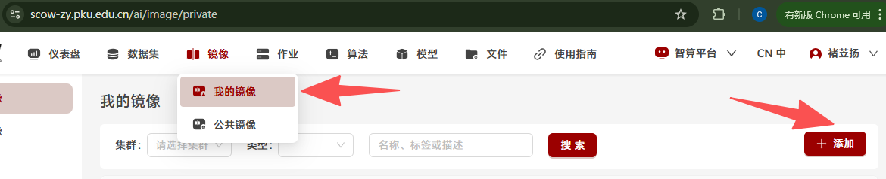
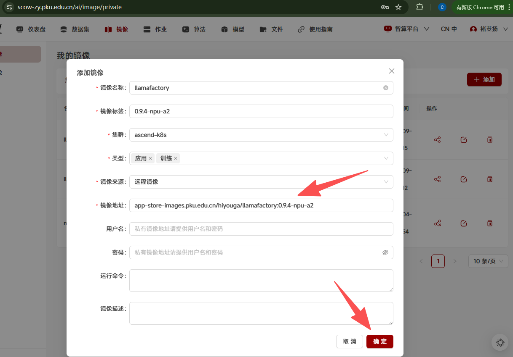

这样在我的镜像界面就能看到刚刚添加的镜像，后续训练时会使用。
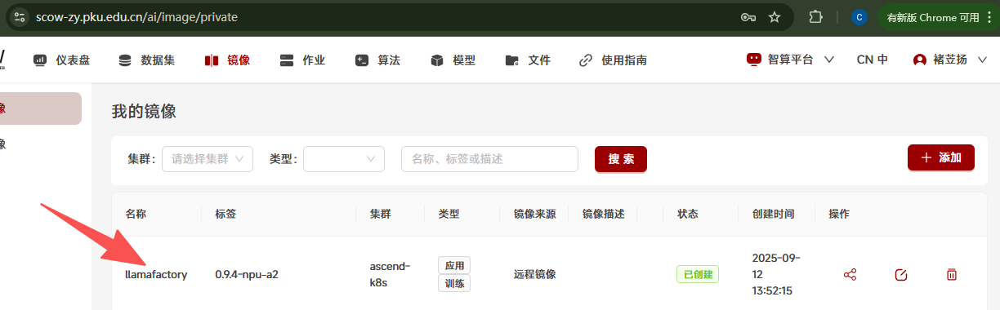

## 2、数据集准备
使用identity-pku-assistant数据集，这个数据集的作用是调整大模型的自我身份认知，让大模型认为自己是北大助手。接下来介绍上传该数据集的方法，也可跳过当前步骤，使用集群内置的identity-pku-assistant数据集。

在文件系统中创建文件夹，填写目录名
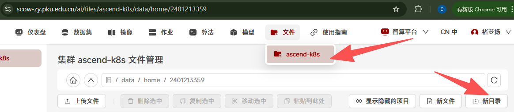
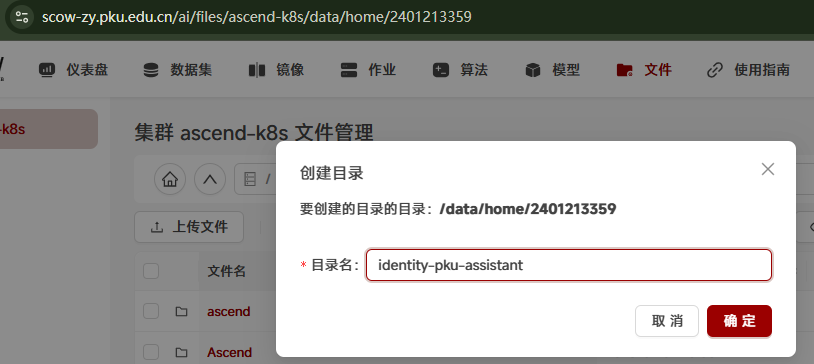

进入创建好的文件夹中，点击新文件，填写文件名。
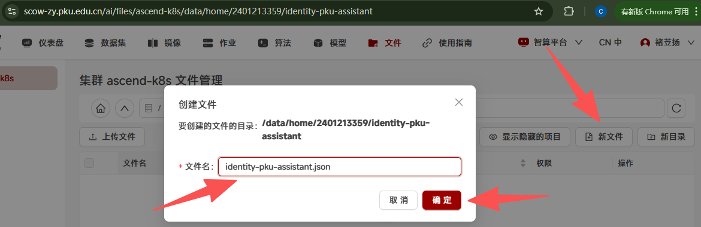

直接点击创建好的文件进入编辑界面，点击编辑，把数据集内容粘贴到文本框，点击保存。（数据集内容可参考https://app-store-images.pku.edu.cn/pku-app-store-storage/dataset/identity-pku-assistant.json）
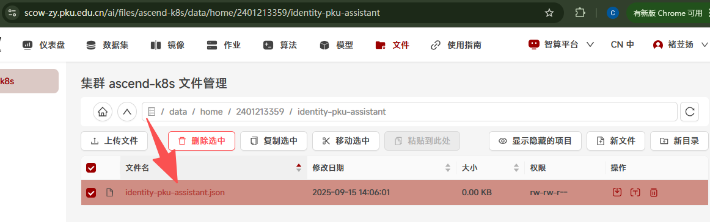
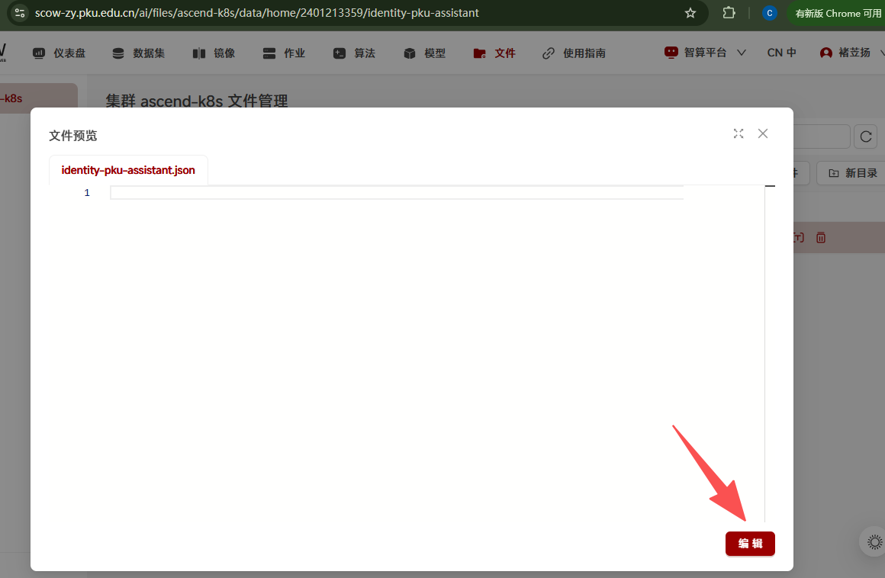
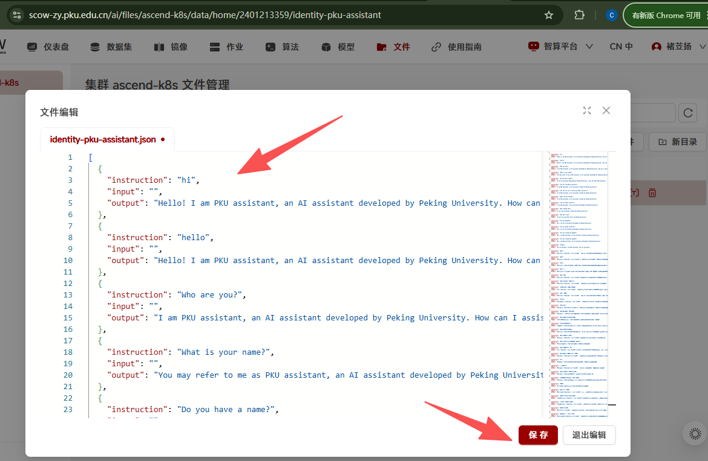

到我的数据集中点击添加，填写数据集信息，最后点击确定
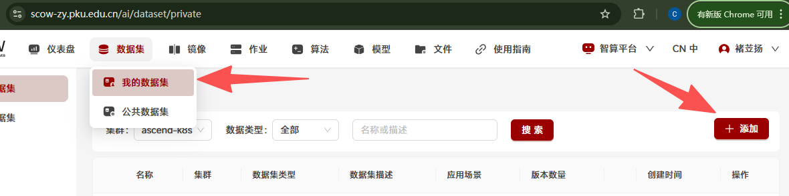
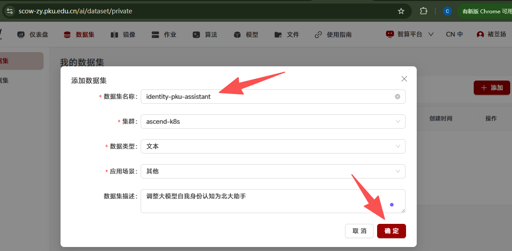

数据集创建完成后点击创建新版本，填写版本名称和版本描述，然后点击选择数据集栏进入文件系统界面，选择前面创建的文件夹，最后点击确定
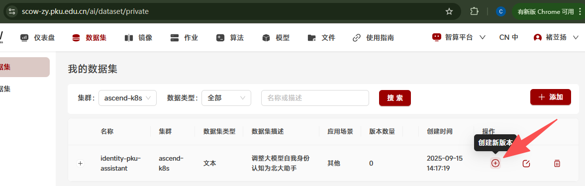
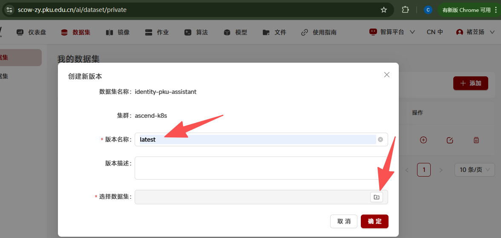
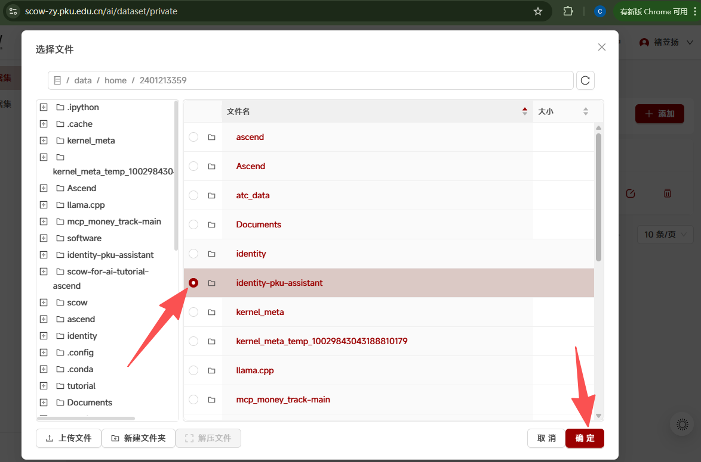
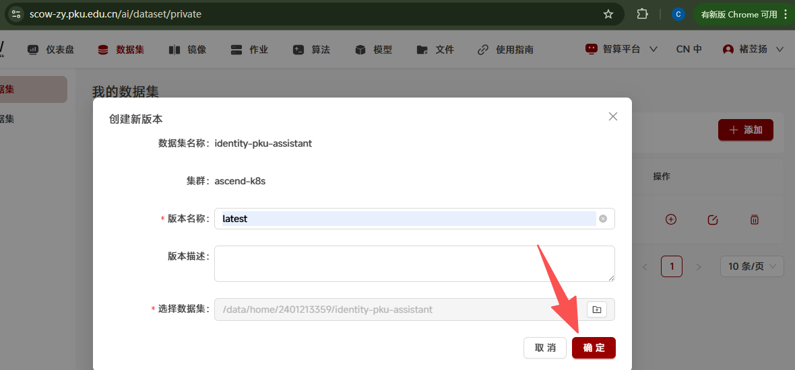

这样数据集就创建完成了，后续模型训练可以挂载该数据集
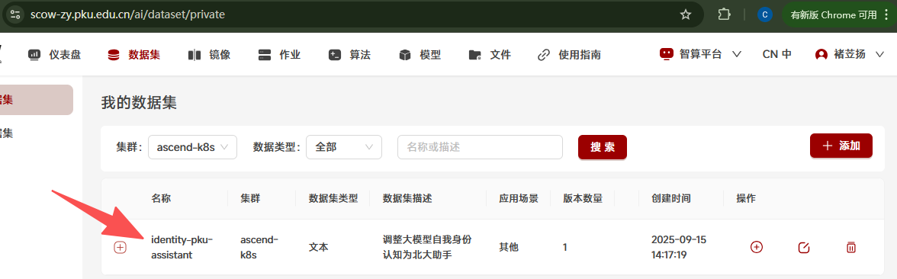

## 3、训练模块单机单卡/多卡训练
运行命令如下，包含五个部分，创建config.yaml、注册训练数据集、切换到项目目录、训练、参数合并

```
echo "model_name_or_path: $SCOW_AI_MODEL_PATH

stage: sft  # Supervised Fine-Tuning 有监督的微调
do_train: true
finetuning_type: lora # 微调类型,例如lora
lora_target: all  # LoRA微调的目标模块
dataset: identity #新模型的数据集名称
template: qwen # 数据模板，例如qwen,llama3
cutoff_len: 1024 # 序列截断长度。
max_samples: 1000 # 最大样本数 
output_dir: ${WORK_DIR}/llama-factory-output
num_train_epochs: 20.0
learning_rate: 1.0e-4
lr_scheduler_type: cosine

# 配置文件中的TensorBoard设置
logging_dir: ./logs/tensorboard
# report_to: tensorboard" > /app/config.yaml && echo "{\"identity\":{\"file_name\":\"${SCOW_AI_DATASET_PATH}/identity-pku-assistant.json\"}}" > /app/data/dataset_info.json && cd /app && llamafactory-cli train /app/config.yaml && echo "### model
model_name_or_path: $SCOW_AI_MODEL_PATH
adapter_name_or_path: ${WORK_DIR}/llama-factory-output
template: qwen
trust_remote_code: true

### export
export_dir: ${WORK_DIR}/llama-factory-merged
export_size: 5
export_device: auto  # choices: [cpu, auto]
export_legacy_format: false
" > /app/lora_merge.yaml && llamafactory-cli export /app/lora_merge.yaml 
```

在创建训练作业时选择前面配置好的镜像，选择Qwen2.5-1.5B-Instruct模型，以及添加的identity-pku-assistant数据集（注意切换路径要填写绝对路径！！！）
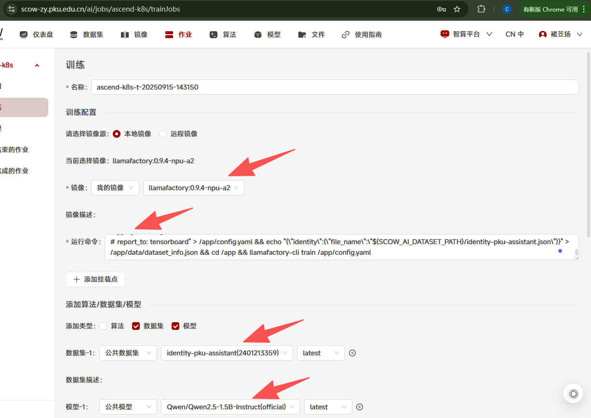

填写对应资源，如果单卡则选择1张卡，多卡就选择2、4、8，这里选择2，点击提交
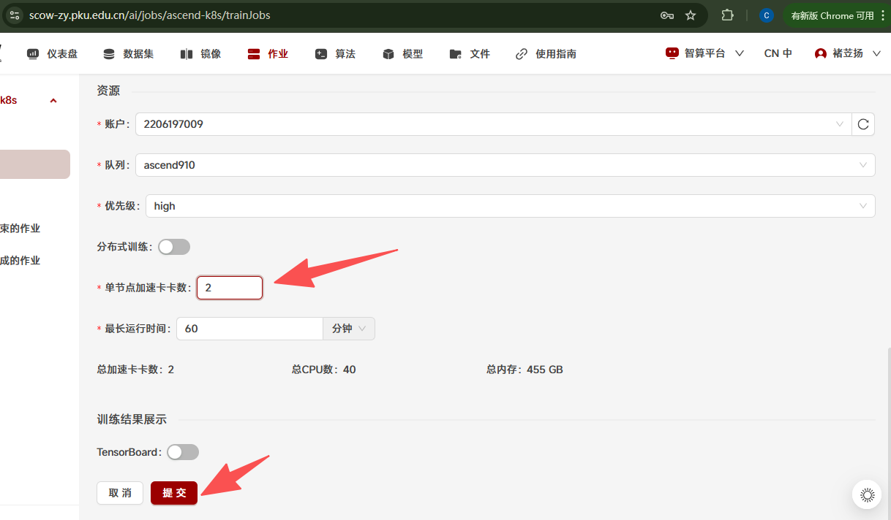

训练过程中点击详情->日志
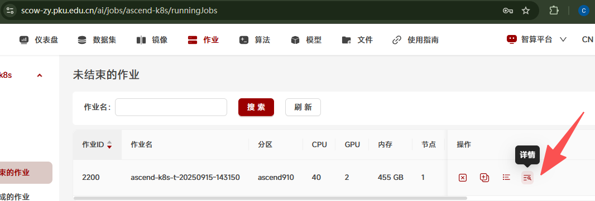
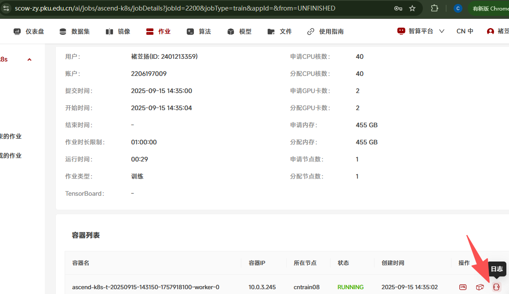

可以看到训练日志
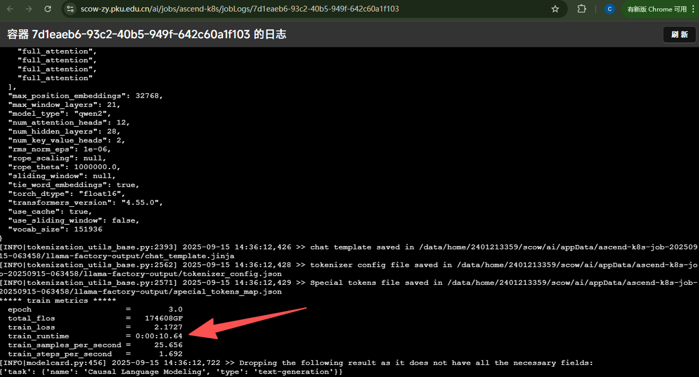

训练完成之后进入作业目录可以看到训练完成的新模型在目录中，可以下载进行后续测试等实验
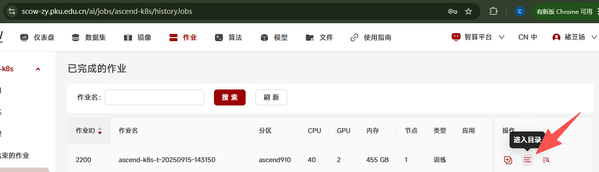
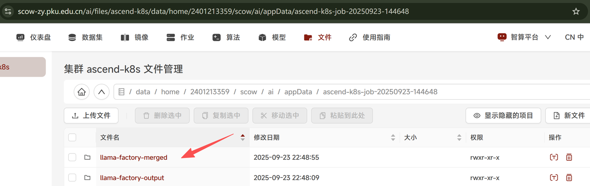
