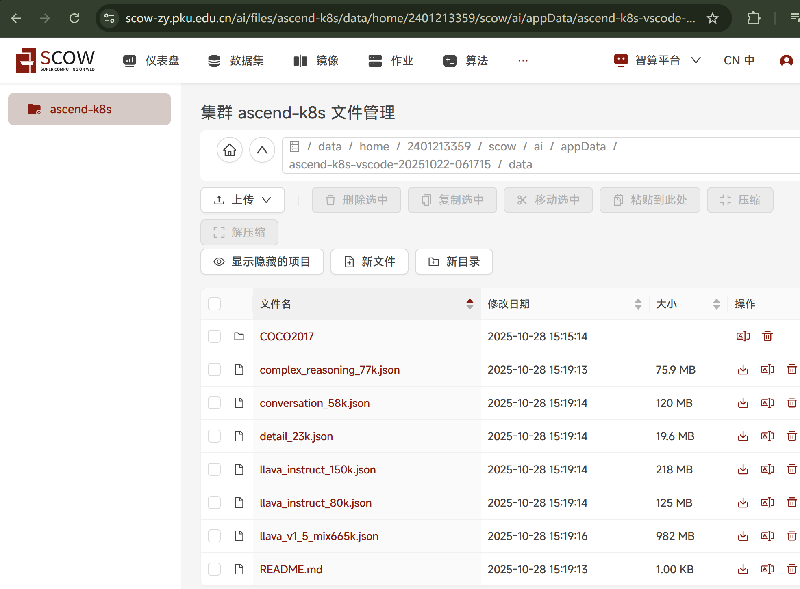
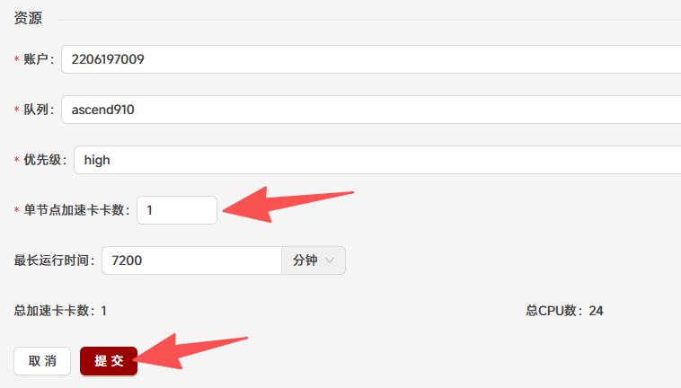
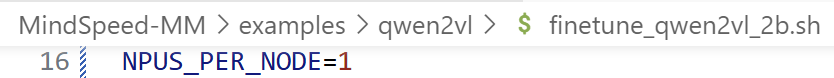
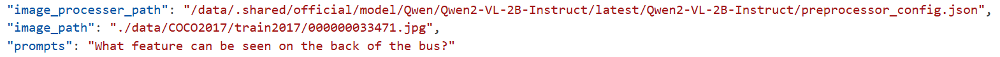

# Tutorial14: 在SCOW-AI集群配置MindSpeed-MM框架进行模型微调

* 集群类型：智算平台
* 所需镜像：app-store-images.pku.edu.cn/ascend/cann:8.1.rc1-910b-ubuntu22.04-py3.10
* 所需模型：Qwen/Qwen2-VL-2B-Instruct
* 所需数据集：教程内提供
* 所需资源：单机单卡
* 目标：本节以Qwen2-VL-2B-Instruct模型为例，在SCOW-AI集群中创建VScode应用配置MindSpeed-MM框架使用COCO2017数据集对这个QwenVL模型进行微调，并给出微调前后模型推理结果对比
* 参考文档：https://gitee.com/ascend/MindSpeed-MM/blob/2.0.0/examples/qwen2vl/README.md

## 0、准备数据集

如果您所使用的集群没有COCO2017这一公共数据集，您需要自行下载数据集并上传到集群（建议在超算集群中使用shell或创建应用进行下载）

需要下载两个部分的数据：
* COCO2017数据集[COCO2017](https://cocodataset.org/#download)，并解压到目标目录下的./data/COCO2017文件夹中
* 获取图片数据集的描述文件（[LLaVA-Instruct-150K](https://huggingface.co/datasets/liuhaotian/LLaVA-Instruct-150K/tree/main)），下载至./data/路径下

得到的目录结构如下：

最后参考教程[Tutorial17](../Tutorial17_添加和管理数据集/tutorial17_添加和管理数据集.md)在集群中创建COCO2017数据集

## 1、启动VScode应用
根据文档的配套环境版本，我们选择CANN版本为8.1.RC1、Python版本为3.10的镜像，镜像链接在开头已经给出

进入SCOW-AI集群后点击作业->应用进入创建应用页面，选择创建vscode

选择远程镜像，填入给出的镜像链接

添加算法、数据集、模型，算法选择`code-server`，数据集选择`COCO2017`，模型选择`Qwen/Qwen2-VL-2B-Instruct`(如果您使用的集群没有该模型，请参考Tutorial16下载模型，其中tutorial16中的1.1.6步骤使用modelscope download --model Qwen/Qwen2-VL-2B-Instruct --local_dir ./Qwen/Qwen/Qwen2-VL-2B-Instruct)。并且在运行命令中填入`${SCOW_AI_ALGORITHM_PATH}/bin/code-server`，以确保在启动应用时运行code-server算法

在资源中选择1张加速卡，点击提交

提交成功后点击进入vscode应用

进入应用后打开root文件夹以及终端，至此VScode应用启动完成

## 2、配置微调环境
首先在终端中分别运行下面的命令，安装系统环境包
~~~shell
apt-get update
apt-get install -y build-essential g++ gcc git wget
~~~

分别运行下面的命令，拉取项目仓库
~~~shell
git clone -b 2.0.0 https://gitee.com/ascend/MindSpeed-MM.git
git clone https://github.com/NVIDIA/Megatron-LM.git
cd Megatron-LM
git checkout core_r0.8.0
cp -r megatron ../MindSpeed-MM/
cd ..
cd MindSpeed-MM
mkdir logs
mkdir data
mkdir ckpt
mkdir save_dir
~~~

分别运行下面的命令，安装torch和torch_npu，具体版本和安装包可参考[https://www.hiascend.com/document/detail/zh/Pytorch/700/configandinstg/instg/insg_0004.html](https://www.hiascend.com/document/detail/zh/Pytorch/700/configandinstg/instg/insg_0004.html)
~~~shell
# 下载软件包
wget https://download.pytorch.org/whl/cpu/torch-2.1.0-cp310-cp310-manylinux_2_17_aarch64.manylinux2014_aarch64.whl
# 安装命令
pip3 install torch-2.1.0-cp310-cp310-manylinux_2_17_aarch64.manylinux2014_aarch64.whl
# 下载插件包
wget https://gitee.com/ascend/pytorch/releases/download/v7.0.0-pytorch2.1.0/torch_npu-2.1.0.post12-cp310-cp310-manylinux_2_17_aarch64.manylinux2014_aarch64.whl
# 安装命令
pip3 install torch_npu-2.1.0.post12-cp310-cp310-manylinux_2_17_aarch64.manylinux2014_aarch64.whl
~~~

分别运行下面的命令，安装apex for Ascend，可参考https://gitee.com/ascend/apex
~~~shell
git clone -b master https://gitee.com/ascend/apex.git
cd apex/ && git checkout ac331b5c7ac6e9f1ba0106f090c0eea64dd17d39
pip install setuptools==65.7.0 wheel==0.45.1
bash scripts/build.sh --python=3.10
cd apex/dist/
pip3 uninstall apex
pip3 install --upgrade apex-0.1+ascend-cp310-cp310-linux_aarch64.whl
cd ~/MindSpeed-MM
~~~

分别运行下面的命令，安装其他依赖
~~~shell
# 安装加速库
git clone https://gitee.com/ascend/MindSpeed.git
cd MindSpeed
# checkout commit from MindSpeed core_r0.8.0
git checkout 6f11a6c9edd409f32a805a71e710b01f9191438f
pip install -r requirements.txt
pip3 install -e .
cd ..
# 替换MindSpeed中的文件
cp examples/qwen2vl/dot_product_attention.py MindSpeed/mindspeed/core/transformer/dot_product_attention.py

# 安装其余依赖库
pip install -e .
~~~

## 3、模型格式转换
在终端运行下面的命令对模型进行格式转换，转换后的模型保存在`./ckpt/mm_path/Qwen2-VL-2B-Instruct`路径下
~~~shell
mm-convert  Qwen2VLConverter hf_to_mm \
  --cfg.mm_dir "ckpt/mm_path/Qwen2-VL-2B-Instruct" \
  --cfg.hf_config.hf_dir $SCOW_AI_MODEL_PATH \
  --cfg.parallel_config.llm_pp_layers [[28]] \
  --cfg.parallel_config.vit_pp_layers [[32]] \
  --cfg.parallel_config.tp_size 1
~~~

如果出现以下输出则转换成功

## 4、修改微调配置文件
首先使用以下命令获取创建应用时选择的模型与数据集的路径以及工作目录，后续修改脚本、运行命令都会用到，请务必实际运行得到结果
~~~shell
echo $SCOW_AI_MODEL_PATH
echo $SCOW_AI_DATASET_PATH
echo $WORK_DIR
~~~

注：每个用户的模型路径与数据集路径可能不同，需根据实际情况决定。

运行下面的命令配置数据集
~~~shell
cd ~/MindSpeed-MM
ln -s $SCOW_AI_DATASET_PATH/* ./data/
python examples/qwen2vl/llava_instruct_2_mllm_demo_format.py
~~~

修改~/MindSpeed-MM/examples/qwen2vl/data_2b.json文件:
* dataset_param.preprocess_parameters.model_name_or_path：模型路径(也就是`echo $SCOW_AI_MODEL_PATH`命令得到的环境路径，不同集群不同用户的路径可能不同)

修改~/MindSpeed-MM/examples/qwen2vl/finetune_qwen2vl_2b.sh文件：
* NPUS_PER_NODE=1

* train-iters=100

* save-interval=50
* eval-interval=50
* eval-iters=25

## 4、开始微调
运行微调
~~~shell
cd ~/MindSpeed-MM
bash examples/qwen2vl/finetune_qwen2vl_2b.sh
~~~

微调完成后运行下面的命令将微调后的模型转换为huggingface格式，将转换后的模型保存到工作目录`$WORK_DIR`中
~~~shell
mm-convert  Qwen2VLConverter mm_to_hf \
  --cfg.save_hf_dir $WORK_DIR/Qwen2-VL-2B-Instruct-finetuned \
  --cfg.mm_dir "save_dir" \
  --cfg.hf_config.hf_dir $SCOW_AI_MODEL_PATH \
  --cfg.parallel_config.llm_pp_layers [28] \
  --cfg.parallel_config.vit_pp_layers [32] \
  --cfg.parallel_config.tp_size 1
~~~

## 5、微调前后模型推理效果对比
运行下面的命令安装必要的环境包
~~~shell
pip install qwen_vl_utils
~~~

### 5.1、微调前模型推理
修改~/MindSpeed-MM/examples/qwen2vl/inference_qwen2vl_2b.json文件：
* tokenizer.from_pretrained：模型路径

* image_processer_path：模型路径/preprocessor_config.json
* image_path：./data/COCO2017/train2017/000000033471.jpg
* prompts：What feature can be seen on the back of the bus?

运行推理命令
~~~shell
bash examples/qwen2vl/inference_qwen2vl_2b.sh
~~~

得到如下结果（the feature can be seen on the back of the bus(139,42),(703,771)）

### 5.2、微调后模型推理
修改~/MindSpeed-MM/examples/qwen2vl/inference_qwen2vl_2b.json文件：
* tokenizer.from_pretrained：工作目录/Qwen2-VL-2B-Instruct-finetuned

* image_processer_path：工作目录/Qwen2-VL-2B-Instruct-finetuned/preprocessor_config.json

修改~/MindSpeed-MM/examples/qwen2vl/inference_qwen2vl_2b.sh文件：
* LOAD_PATH：save_dir

运行推理命令
~~~shell
bash examples/qwen2vl/inference_qwen2vl_2b.sh
~~~

得到如下结果（On the back of the bus, there is a large advertisement for a drink.）

### 5.3、推理结果对比
推理时我们都给了以下参数：
* image：./data/COCO2017/train2017/000000033471.jpg

* prompt：What feature can be seen on the back of the bus?

微调前模型推理结果：`the feature can be seen on the back of the bus(139,42),(703,771)`

微调后模型推理结果：`On the back of the bus, there is a large advertisement for a drink.`

可以发现微调后的模型更能理解我们给出的prompt并给出更为准确的答案
