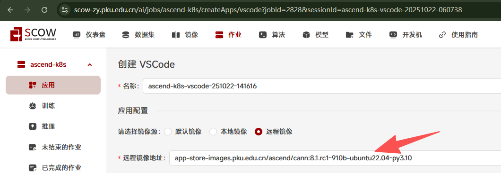
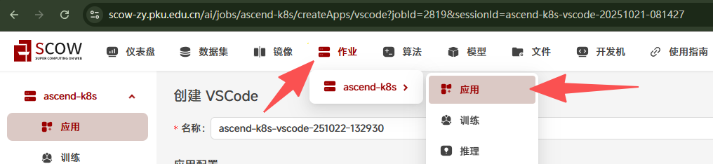
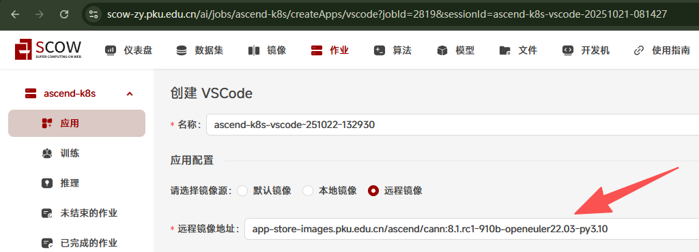
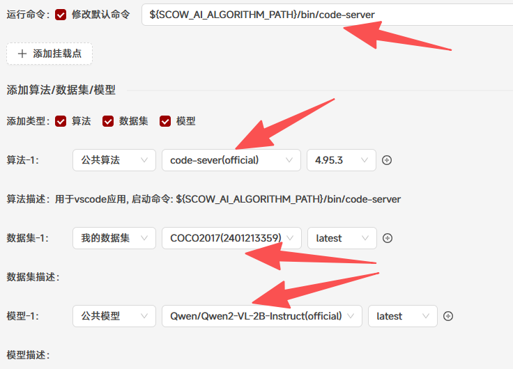
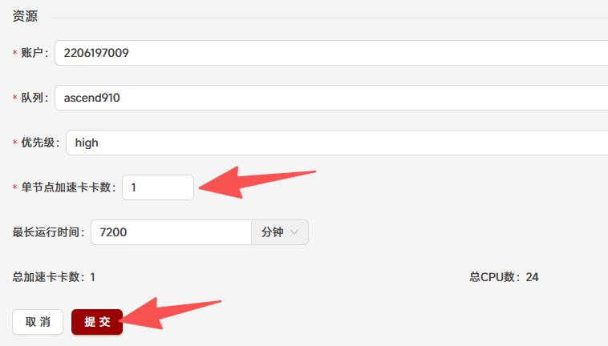
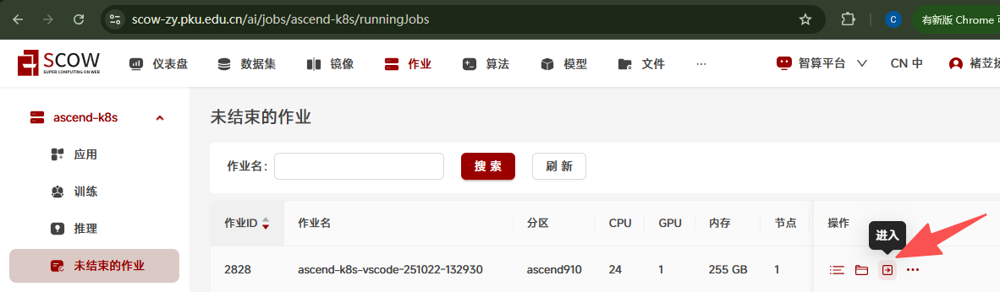
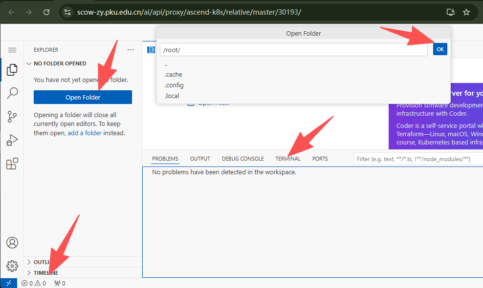
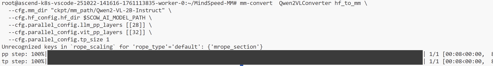

# Tutorial15: 在SCOW-AI集群配置MindSpeed-MM框架进行模型微调

* 集群类型：SCOW AI集群
* 所需镜像：app-store-images.pku.edu.cn/ascend/cann:8.1.rc1-910b-ubuntu22.04-py3.10
* 所需模型：Qwen/Qwen2-VL-2B-Instruct
* 所需数据集：COCO2017
* 所需资源：建议使用1张910B NPU运行本教程。
* 目标：本节以Qwen2-VL-2B-Instruct模型为例，在SCOW-AI集群中创建VScode应用配置MindSpeed-MM框架使用COCO2017数据集对这个QwenVL模型进行微调
* 参考文档：https://gitee.com/ascend/MindSpeed-MM/blob/2.0.0/examples/qwen2vl/README.md

## 1、启动VScode应用
根据文档的配套环境版本，我们选择CANN版本为8.1.RC1、Python版本为3.10的镜像，镜像链接在开头已经给出

进入SCOW-AI集群后点击作业->应用进入创建应用页面

选择远程镜像，填入给出的镜像链接

添加算法、数据集、模型，算法选择code-server，数据集选择COCO2017，模型选择Qwen/Qwen2-VL-2B-Instruct。并且在运行命令中填入${SCOW_AI_ALGORITHM_PATH}/bin/code-server，以确保在启动应用时运行code-server算法

在资源中选择1张加速卡，点击提交

提交成功后点击进入vscode应用

进入应用后打开root文件夹以及终端，至此VScode应用启动完成

## 2、配置微调环境
首先在终端中分别运行下面的命令，安装系统环境包
~~~shell
apt-get update
apt-get install -y build-essential g++ gcc git wget
~~~

分别运行下面的命令，拉取项目仓库
~~~shell
git clone -b 2.0.0 https://gitee.com/ascend/MindSpeed-MM.git
git clone https://github.com/NVIDIA/Megatron-LM.git
cd Megatron-LM
git checkout core_r0.8.0
cp -r megatron ../MindSpeed-MM/
cd ..
cd MindSpeed-MM
mkdir logs
mkdir data
mkdir ckpt
~~~

分别运行下面的命令，安装torch和torch_npu，可参考https://www.hiascend.com/document/detail/zh/Pytorch/700/configandinstg/instg/insg_0004.html
~~~shell
# 下载软件包
wget https://download.pytorch.org/whl/cpu/torch-2.1.0-cp310-cp310-manylinux_2_17_aarch64.manylinux2014_aarch64.whl
# 安装命令
pip3 install torch-2.1.0-cp310-cp310-manylinux_2_17_aarch64.manylinux2014_aarch64.whl
# 下载插件包
wget https://gitee.com/ascend/pytorch/releases/download/v7.0.0-pytorch2.1.0/torch_npu-2.1.0.post12-cp310-cp310-manylinux_2_17_aarch64.manylinux2014_aarch64.whl
# 安装命令
pip3 install torch_npu-2.1.0.post12-cp310-cp310-manylinux_2_17_aarch64.manylinux2014_aarch64.whl
~~~

分别运行下面的命令，安装apex for Ascend，可参考https://gitee.com/ascend/apex
~~~shell
git clone -b master https://gitee.com/ascend/apex.git
pip install setuptools==65.7.0 wheel==0.45.1
cd apex/
bash scripts/build.sh --python=3.10
cd apex/dist/
pip3 uninstall apex
pip3 install --upgrade apex-0.1+ascend-cp310-cp310-linux_aarch64.whl
cd ~/MindSpeed-MM
~~~

分别运行下面的命令，安装其他依赖
~~~shell
# 安装加速库
git clone https://gitee.com/ascend/MindSpeed.git
cd MindSpeed
# checkout commit from MindSpeed core_r0.8.0
git checkout 6f11a6c9edd409f32a805a71e710b01f9191438f
pip install -r requirements.txt
pip3 install -e .
cd ..
# 替换MindSpeed中的文件
cp examples/qwen2vl/dot_product_attention.py MindSpeed/mindspeed/core/transformer/dot_product_attention.py

# 安装其余依赖库
pip install -e .
~~~

## 3、模型格式转换
运行下面的命令对模型进行格式转换
~~~shell
mm-convert  Qwen2VLConverter hf_to_mm \
  --cfg.mm_dir "ckpt/mm_path/Qwen2-VL-2B-Instruct" \
  --cfg.hf_config.hf_dir $SCOW_AI_MODEL_PATH \
  --cfg.parallel_config.llm_pp_layers [[28]] \
  --cfg.parallel_config.vit_pp_layers [[32]] \
  --cfg.parallel_config.tp_size 1
~~~

如果出现以下输出则转换成功
