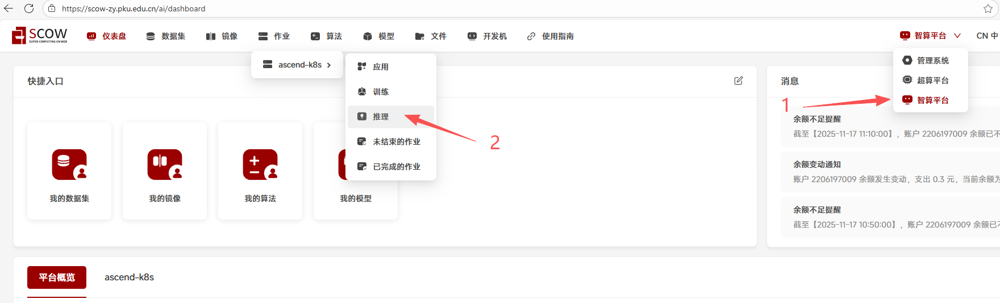
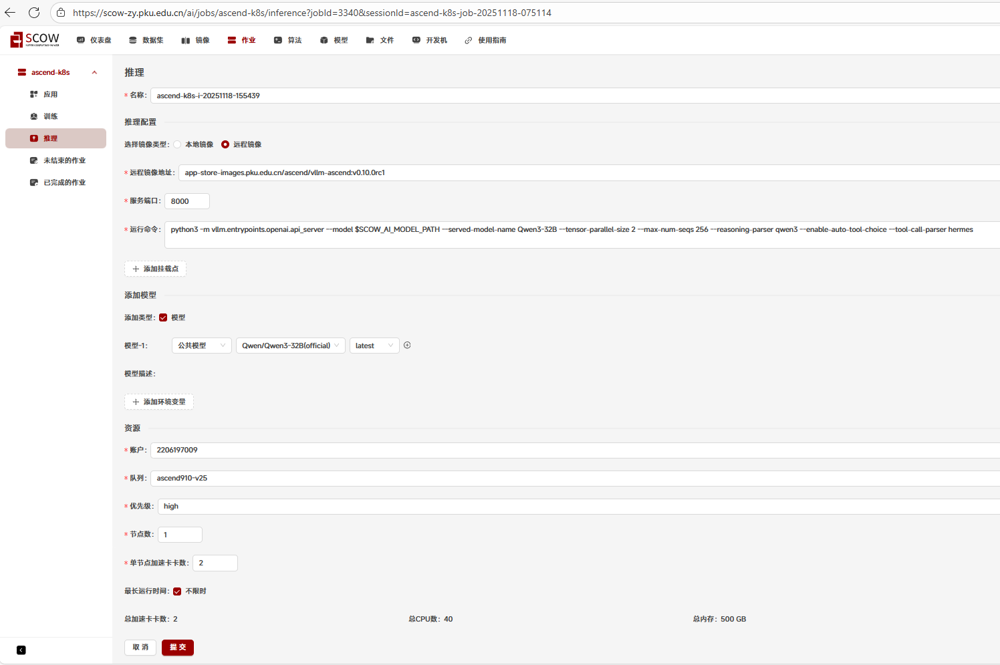
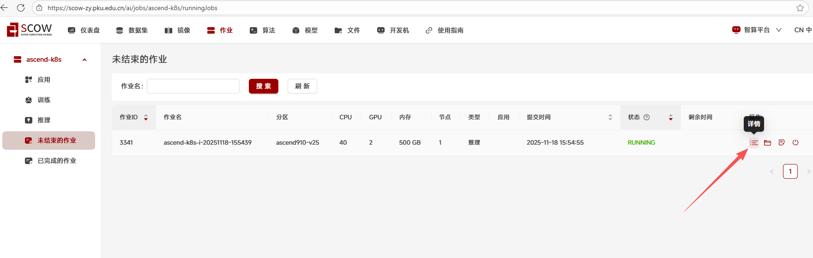
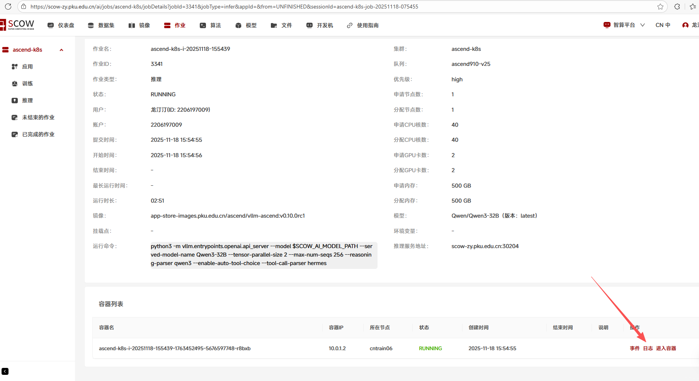
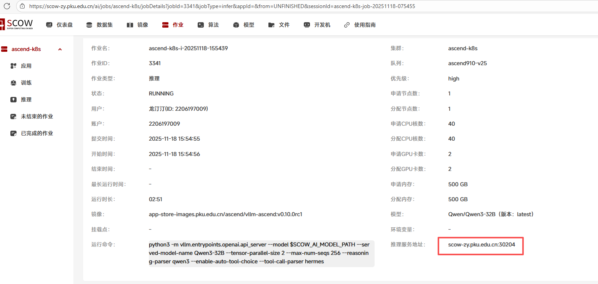
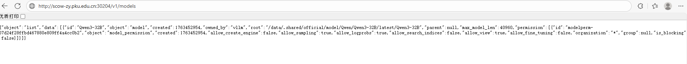
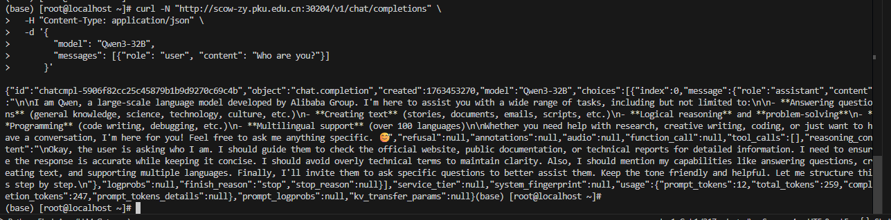

# Tutorial15: 通过vllm-ascend部署大模型服务

* 集群类型：智算平台
* 所需镜像：app-store-images.pku.edu.cn/ascend/vllm-ascend:v0.10.0rc1
* 所需模型：Qwen/Qwen3-32B
* 所需数据集：无
* 所需资源：单机2卡910B
* 目标：本节以Qwen3-32B模型为例，在SCOW-AI集群中部署用于长期运行并对外提供API服务的Qwen3-32B

## 1、进入"推理"页面

## 2、在页面上填写各项参数
* 选择镜像类型：远程镜像
* 远程镜像地址：app-store-images.pku.edu.cn/ascend/vllm-ascend:v0.10.0rc1
* 服务端口：8000
* 运行命令：
~~~shell
python3 -m vllm.entrypoints.openai.api_server --model $SCOW_AI_MODEL_PATH --served-model-name Qwen3-32B --tensor-parallel-size 2 --max-num-seqs 256 --reasoning-parser qwen3 --enable-auto-tool-choice --tool-call-parser hermes
~~~
* 模型：Qwen3-32B
* 队列: 请根据集群具体情况，选择910B的队列
* 节点数：1
* 单节点加速卡卡数：2或者4
* 最长运行时间: 不限时

填写完成，检查无误后提交。

## 3、等待推理服务运行
页面会自动跳转到"未结束的作业"查看作业状态，点击刷新来获取最新状态, PENDING状态表示在排队或者下载镜像；RUNNING状态表示正在运行

待状态变为RUNNING后，查看作业详情

查看作业日志

等待数分钟后，如下图所示显示"Application startup complete."则表示推理服务启动成功

## 4、调用推理服务
回到作业详情，确认推理服务地址（请注意，通常集群管理员会设置防火墙来限制外部访问，因此如需在集群以外访问请联系集群管理员申请开通防火墙）

调用/v1/models接口，确认服务正常

下一步可通过API在外部通过/v1/chat/completions接口调用该模型，例如：

也可以进一步接入cline、dify等智能体框架

---
> 作者：张宇飞；龙汀汀*
>
> 联系方式：l.tingting@pku.edu.cn