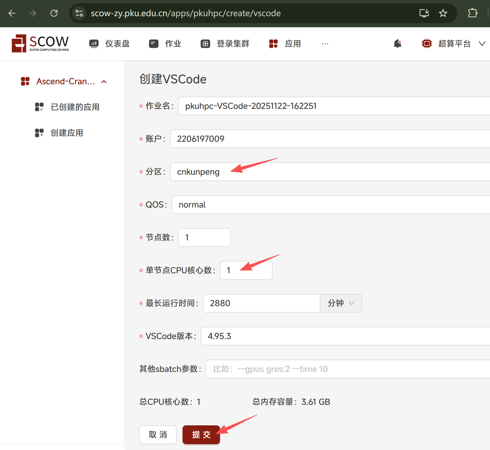
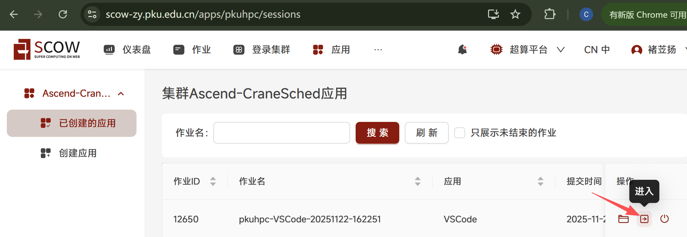
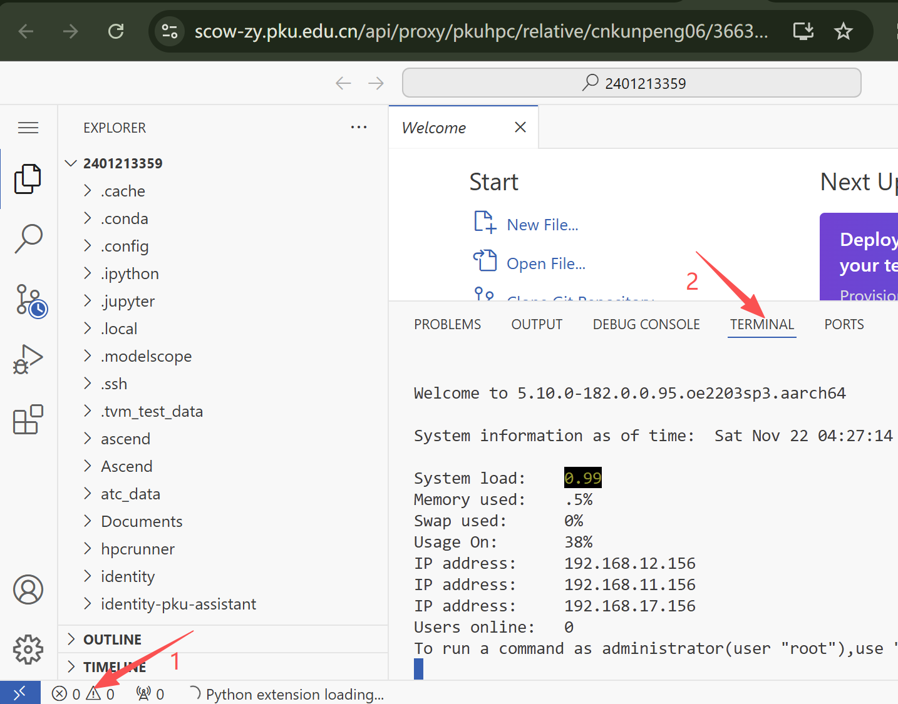
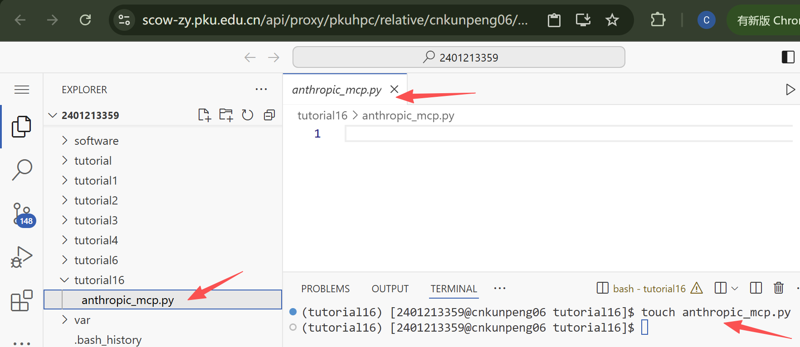
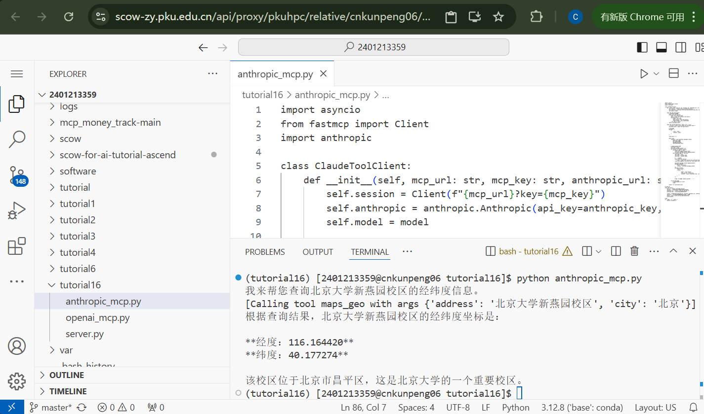
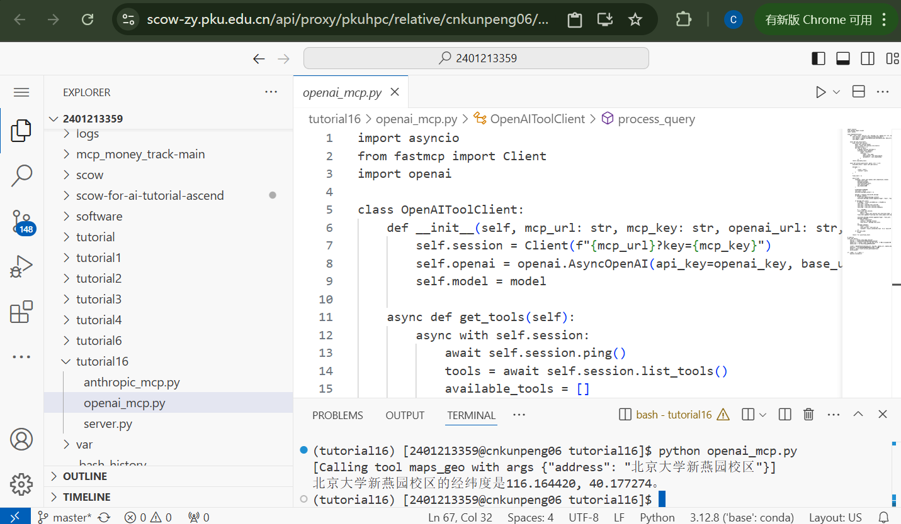

# Tutorial16: 使用大模型调用远程高德mcp进行交互

* 集群类型：超算平台
* 所需镜像：无
* 所需模型：无
* 所需数据集：无
* 所需资源：单机单CPU
* 目标：本节基于几个不同发布方（openai、anthropic）的大模型，调用远程高德mcp来查询给定地点的经纬度，从而展示大模型与mcp server交互的方法

此教程运行在SCOW超算平台中，请确保运行过[Tutorial0 搭建Python环境](../Tutorial0_python_env/tutorial0.md)中1.2安装conda的步骤，再来尝试运行本教程

## 0、获取大模型和高德mcp调用资格

### 0.1、获取大模型发布方url和apikey

本教程需要调用anthropic和openai的api。

假设你获取到的apikey为 `abcdefg1234567`，anthropic和openai的url和apikey格式如下：
```
# anthropic
anthropic_url = "https://大模型api地址"
anthropic_key = "abcdefg1234567"

# openai
openai_url = "https://大模型api地址/v1"
openai_key = "abcdefg1234567"
```

### 0.2、获取高德开放平台的Key

申请方法可参考官方文档 `https://lbs.amap.com/api/mcp-server/summary`，最终获取高德开放平台的Key

假设你获取到的key为 `1234567abcdefg`，接口的url和key的格式如下：
```
mcp_url = "https://mcp.amap.com/sse"
mcp_key = "1234567abcdefg"
```

完整的mcpserver url如下
```
sse_url = "https://mcp.amap.com/sse?key=1234567abcdefg"
```

url已经集成到后续代码中，后续不会用到，因此这里只作介绍，但apikey在后续仍需使用，需要记住

## 1、启动应用配置环境

切换到超算平台中


点击应用->创建应用进入创建界面，选择vscode应用


选择cnkunpeng分区，节点数填写1，单节点CPU核心数填写1，最长运行时间适当填写，最后点击提交



在跳转到的页面中点击进入



进到vscode应用中打开terminal



运行下面的命令创建文件夹、配置环境
```shell
mkdir tutorial16
cd tutorial16
conda create -n tutorial16 python==3.10
conda activate tutorial16
pip install anthropic==0.74.1 fastmcp==2.13.1 openai==2.8.1
```

## 2、anthropic模型调用高德mcp

运行 `touch anthropic_mcp.py` 命令创建文件并打开



将下面的代码粘贴到文件中，注意根据实际情况修改"大模型api地址"
```python
import asyncio
from fastmcp import Client
import anthropic

class ClaudeToolClient:
    def __init__(self, mcp_url: str, mcp_key: str, anthropic_url: str, anthropic_key: str, model: str = "claude-sonnet-4-20250514"):
        self.session = Client(f"{mcp_url}?key={mcp_key}")
        self.anthropic = anthropic.Anthropic(api_key=anthropic_key, base_url=anthropic_url)
        self.model = model

    async def get_tools(self):
        # 获取 MCP 工具列表
        async with self.session:
            await self.session.ping()
            tools = await self.session.list_tools()
            available_tools = [{
                "name": tool.name,
                "description": tool.description,
                "input_schema": tool.inputSchema
            } for tool in tools]
        return available_tools

    async def process_query(self, query: str) -> str:
        """Process a query using Claude and available tools"""
        available_tools = await self.get_tools()

        # 消息历史
        messages = [
            {
                "role": "user",
                "content": query
            }
        ]

        final_text = []

        while True:
            response = self.anthropic.messages.create(
                model=self.model,
                max_tokens=1000,
                messages=messages,
                tools=available_tools
            )

            # 处理Claude返回内容
            tool_used = False
            assistant_message_content = []
            for content in response.content:
                if content.type == 'text':
                    final_text.append(content.text)
                    assistant_message_content.append(content)
                elif content.type == 'tool_use':
                    tool_used = True
                    tool_name = content.name
                    tool_args = content.input

                    # 执行工具调用
                    async with self.session:
                        result = await self.session.call_tool(tool_name, tool_args)
                    final_text.append(f"[Calling tool {tool_name} with args {tool_args}]")

                    assistant_message_content.append(content)
                    messages.append({
                        "role": "assistant",
                        "content": assistant_message_content
                    })
                    messages.append({
                        "role": "user",
                        "content": [
                            {
                                "type": "tool_result",
                                "tool_use_id": content.id,
                                "content": result.content[0].text  # 只传text部分
                            }
                        ]
                    })

                    break  # 只处理一次tool_use，下一轮继续

            if not tool_used:
                # 没有工具调用，流程结束
                break

        return "\n".join(final_text)

# 示例用法
async def main():
    mcp_url = "https://mcp.amap.com/sse"
    mcp_key = ""
    anthropic_url = "https://大模型api地址"
    anthropic_key = ""

    client = ClaudeToolClient(mcp_url, mcp_key, anthropic_url, anthropic_key)
    question = "北京大学新燕园校区的经纬度是多少？"
    answer = await client.process_query(question)
    print(answer)

# 运行
if __name__ == "__main__":
    asyncio.run(main())
```

将 `main函数` 中的 `mcp_key` 和 `anthropic_key` 补充上你在章节0中申请到的apikey

运行以下命令运行程序
```shell
python anthropic_mcp.py
```

得到的结果如下：



## 3、openai模型调用高德mcp

运行 `touch openai_mcp.py` 命令创建文件并打开


将下面的代码粘贴到文件中
```python
import asyncio
from fastmcp import Client
import openai

class OpenAIToolClient:
    def __init__(self, mcp_url: str, mcp_key: str, openai_url: str, openai_key: str, model: str = "deepseek-v3.1-think-128k"):
        self.session = Client(f"{mcp_url}?key={mcp_key}")
        self.openai = openai.AsyncOpenAI(api_key=openai_key, base_url=openai_url)
        self.model = model

    async def get_tools(self):
        async with self.session:
            await self.session.ping()
            tools = await self.session.list_tools()
            available_tools = []
            for tool in tools:
                # OpenAI function calling格式
                available_tools.append({
                    "type": "function",
                    "function": {
                        "name": tool.name,
                        "description": tool.description,
                        "parameters": tool.inputSchema
                    }
                })
        return available_tools

    async def process_query(self, query: str) -> str:
        available_tools = await self.get_tools()

        messages = [
            {
                "role": "user",
                "content": query
            }
        ]

        final_text = []

        while True:
            response = await self.openai.chat.completions.create(
                model=self.model,
                messages=messages,
                tools=available_tools,
                tool_choice="auto",
                max_tokens=1000
            )

            # OpenAI返回内容处理
            tool_used = False
            assistant_message_content = []

            message = response.choices[0].message
            if message.content:
                final_text.append(message.content)
                assistant_message_content.append({"type": "text", "text": message.content})

            if message.tool_calls:
                # 只处理第一个tool_call（可扩展为多工具调用）
                tool_used = True
                tool_call = message.tool_calls[0]
                tool_name = tool_call.function.name
                tool_args = tool_call.function.arguments

                # 执行工具调用
                async with self.session:
                    import json
                    result = await self.session.call_tool(tool_name, json.loads(tool_args))
                final_text.append(f"[Calling tool {tool_name} with args {tool_args}]")

                assistant_message_content.append({"type": "tool_use", "name": tool_name, "input": json.loads(tool_args), "id": tool_call.id})
                messages.append({
                    "role": "assistant",
                    "content": message.content,
                    "tool_calls": message.tool_calls
                })
                messages.append({
                    "role": "tool",
                    "tool_call_id": tool_call.id,
                    "content": result.content[0].text  # 只传text部分
                })
            if not tool_used:
                break

        return "\n".join(final_text)

# 示例用法
async def main():
    mcp_url = "https://mcp.amap.com/sse"
    mcp_key = ""
    openai_url = "https://大模型api地址/v1"  # 如果用官方不用填
    openai_key = ""

    client = OpenAIToolClient(mcp_url, mcp_key, openai_url, openai_key)
    question = "北京大学新燕园校区的经纬度是多少？"
    answer = await client.process_query(question)
    print(answer)

if __name__ == "__main__":
    asyncio.run(main())
```

将 `main函数` 中的 `mcp_key` 和 `openai_key` 补充上你在章节0中申请到的apikey

运行以下命令运行程序
```shell
python openai_mcp.py
```

得到的结果如下：



---
> 作者：褚苙扬；龙汀汀*
>
> 联系方式：l.tingting@pku.edu.cn
