# Tutorial18: 使用推理模块部署MinerU PDF文档提取工具

* 集群类型：智算平台
* 所需镜像：app-store-images.pku.edu.cn/library/mineru:npu-910b-vllm-latest
* 所需模型：无
* 所需数据集：教程内提供
* 所需资源：单机单卡（1*1 Ascend910B）
* 目标：本节在卓越集群的智算平台中使用推理模块部署MinerU PDF文档提取工具，并另起VScode应用远程调用部署的工具将指定的pdf文件转换为md格式

## 1、部署推理

切换到智算平台

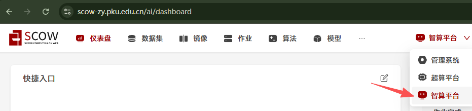

点击作业->推理打开创建作业界面

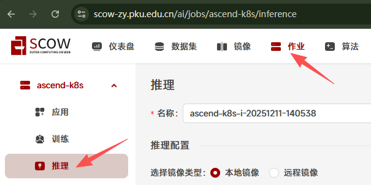

推理配置分别填写/选择以下内容：
* 选择镜像类型：远程镜像
* 远程镜像地址：`app-store-images.pku.edu.cn/library/mineru:npu-910b-vllm-latest`
* 服务端口：8000
* 运行命令：`export MINERU_MODEL_SOURCE=modelscope && mineru-openai-server --engine vllm --port 8000` (其中port的值需要与服务端口的值一致)
* 单节点加速卡卡数：1

其余保持不变，点击提交


在跳转后的页面点击详情进入

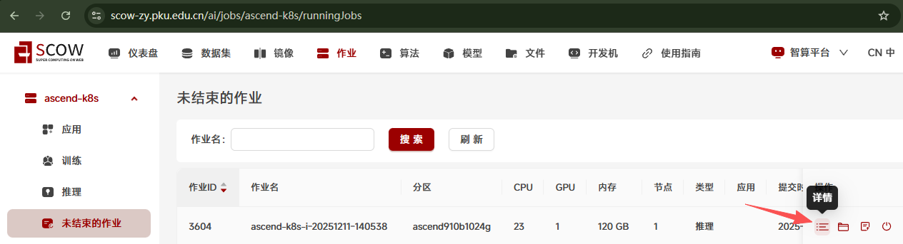

记录红框中的推理服务地址，后面远程调用的时候会用到

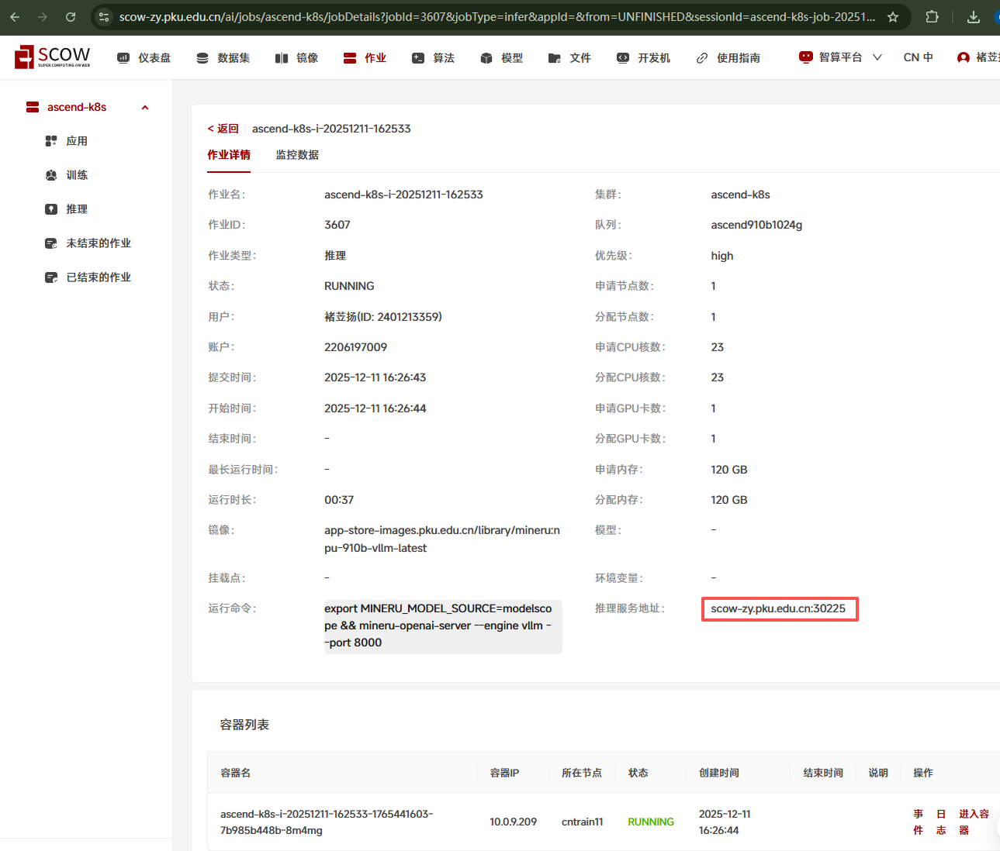

点击日志

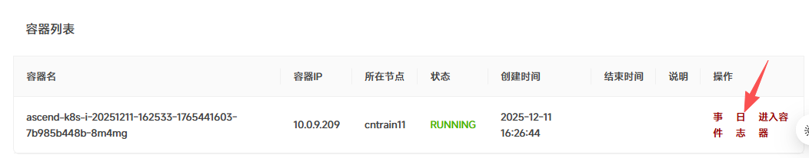

如果在日志中看到以下内容则推理作业已经启动成功，可以远程调用

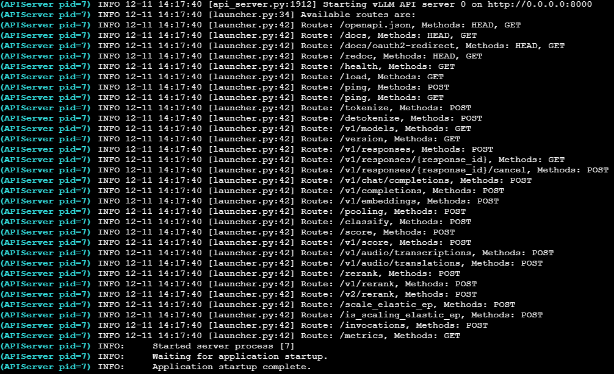

## 2、远程调用

切换到超算平台

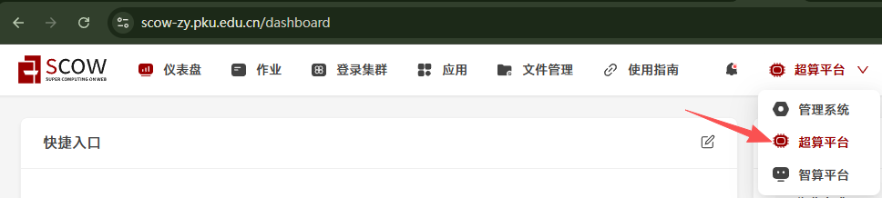

点击应用->创建应用->VSCode进入应用创建界面

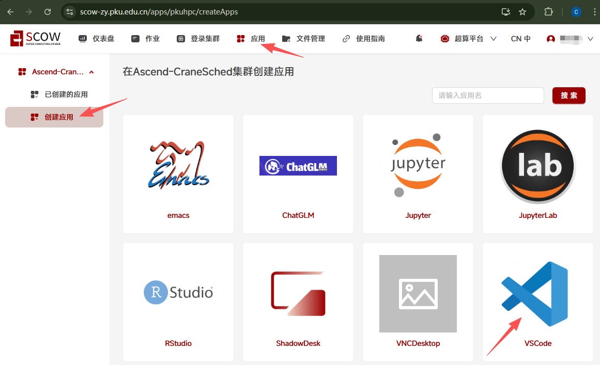

选择cnkunpeng分区，资源部分按需填写，最后点击提交（本部分运行在SCOW超算平台中，请确保运行过[Tutorial0 搭建Python环境](../Tutorial0_python_env/tutorial0.md)中1.2安装conda的步骤，再来尝试运行后面的步骤）

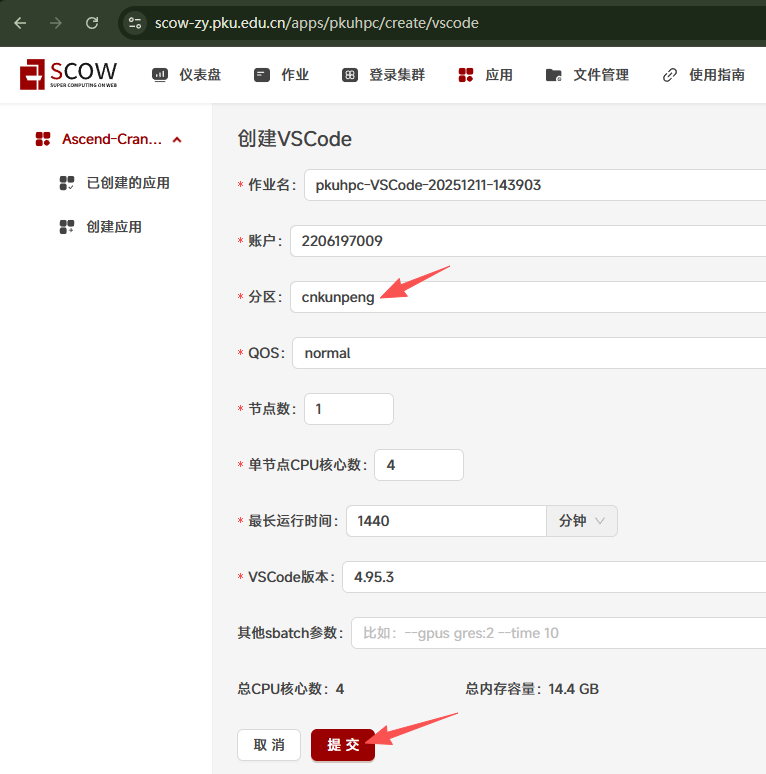

在跳转后的页面中点击进入

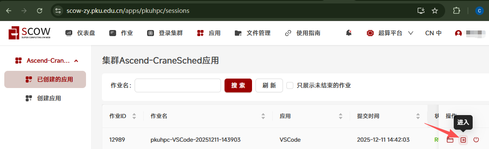

打开终端

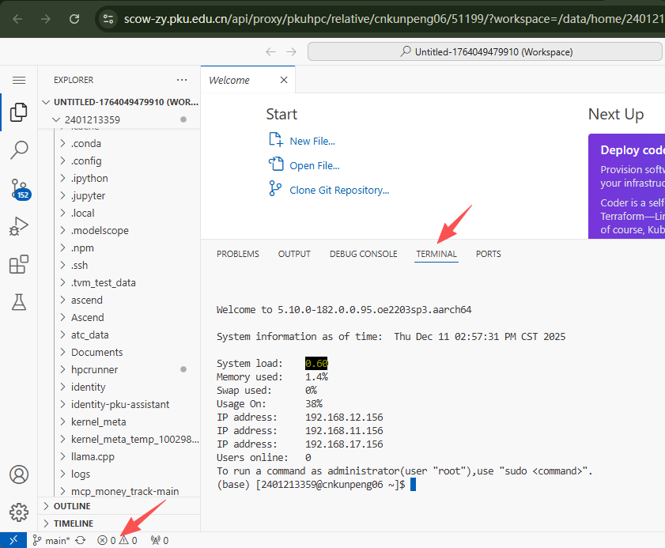

运行以下命令创建文件夹，安装环境
```shell
mkdir tutorial18
cd tutorial18
mkdir output
conda create -n tutorial18 python==3.10
conda activate tutorial18
pip install mineru==2.6.6
```

将教程同文件夹下给出的[Tutorial_EDIT.pdf](./Tutorial_EDIT.pdf)文件复制到tutorial18文件夹中，可以下载下来通过拖拽的方式

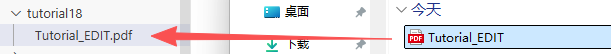

在终端中运行以下命令开始转换
* 请注意命令中-u后的内容就是前面记录的推理服务地址，请自行修改成你记录的值
* 并且推理服务地址有时有防火墙，这时需要联系你的集群管理人员开通访问权限才能够实现远程调用
```shell
mineru -p Tutorial_EDIT.pdf -o output/ -b vlm-http-client -u http://scow-zy.pku.edu.cn:30225
```

最后得到的文件夹结构如下，output文件夹中的内容就是生成的转换后的文件：


打开`Tutorial_EDIT.md`文件并点击预览，就能够在右侧看到转换后的markdown文件效果

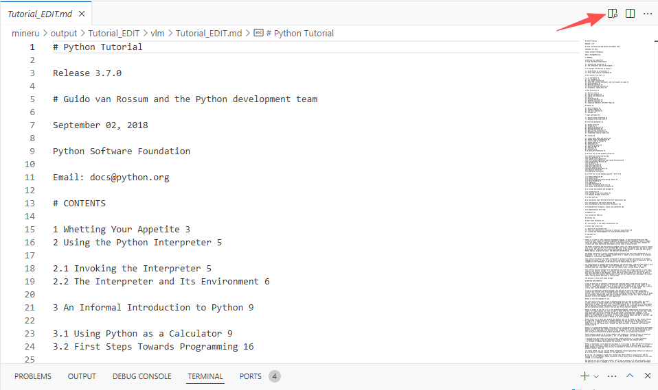
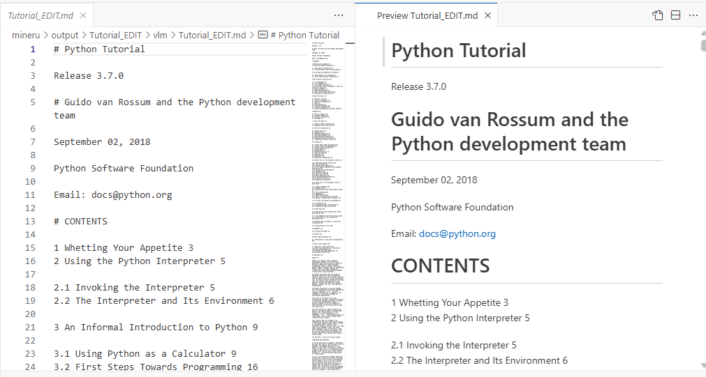