# Tutorial 19：基于智算集群容器的CANN包安装与SHMEM配置

* 集群类型：智算平台
* 所需镜像：app-store-images.pku.edu.cn/openeuler/openeuler-arm:22.03-lts-sp3
* 所需模型：无
* 所需数据集：教程内提供
* 所需资源：单机多卡（1*4 Ascend910B）
* 目标：本节在卓越集群的智算平台中使用VScode应用，基于CANN 8.3.RC1进行SHMEM的配置


## 1. 下载CANN 8.3.RC1
    8.3+的版本需要自行下载安装：[https://www.hiascend.com/developer/download/community/result?module=cann&cann=8.3.RC1](https://www.hiascend.com/developer/download/community/result?module=cann&cann=8.3.RC1)
    本次实验所需的包只有 Ascend-cann-toolkit_8.3.RC1_linux-aarch64.run，还可进一步安装 Ascend-cann-kernels-910b_8.3.RC1_linux-aarch64.run

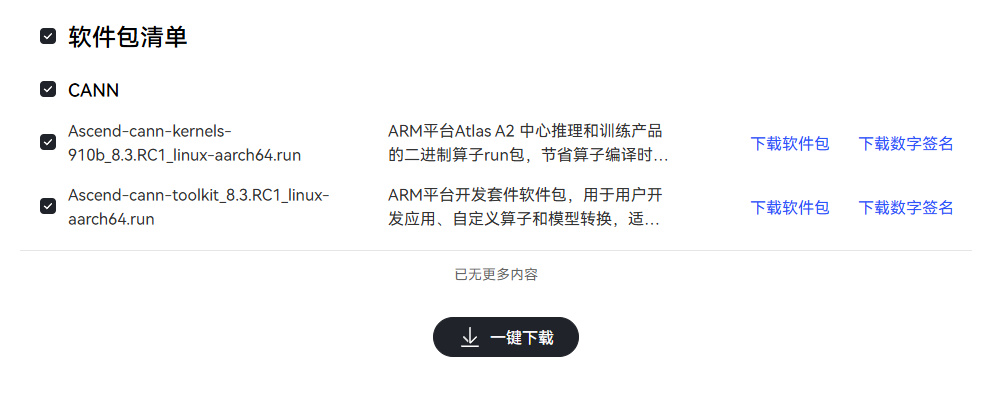

下载后的文件可通过scow网页上的 文件 进行上传，进入文件管理页面后，先点击 新目录 创建一个新的目录
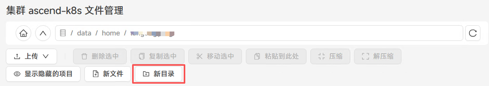
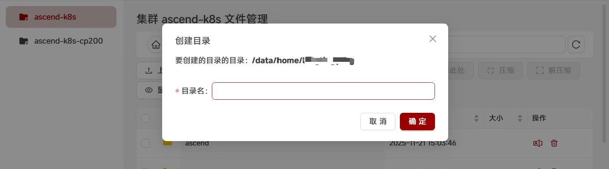

进入刚刚创建好的目录下，再点击 上传 进行上传
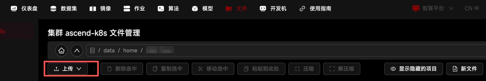

## 2. 作业申请
### 2.1 进入scow-zy.pku.edu.cn/dashboard，点击右上角进入 **智算平台；**


### 2.2 进入 智算平台 页面后选择 **作业**，并点击**vscode**创建应用；

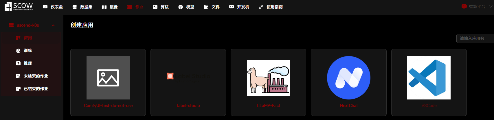

### 2.3 在创建VSCode交互应用页面中，进行配置：
2.3.1 进入 创建vscode 页面后 在应用配置处选择 **远程镜像**，并使用OpenEuler 22.03的版本；

```bash
app-store-images.pku.edu.cn/openeuler/openeuler-arm:22.03-lts-sp3
```
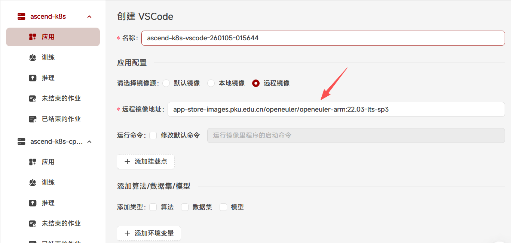

2.3.2 将 ${SCOW_AI_ALGORITHM_PATH}/bin/code-server 拷贝后，粘贴到 修改默认命令框中，用于平台启动VSCode应用；
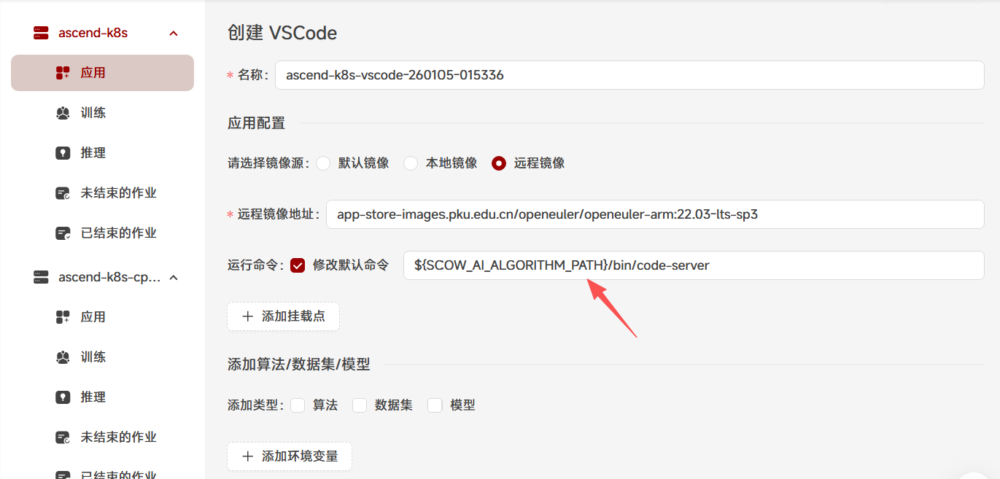

2.3.3 下载后的CANN包我们挂载到容器中，这里挂载点的目录要选择你上传了CANN包的目录
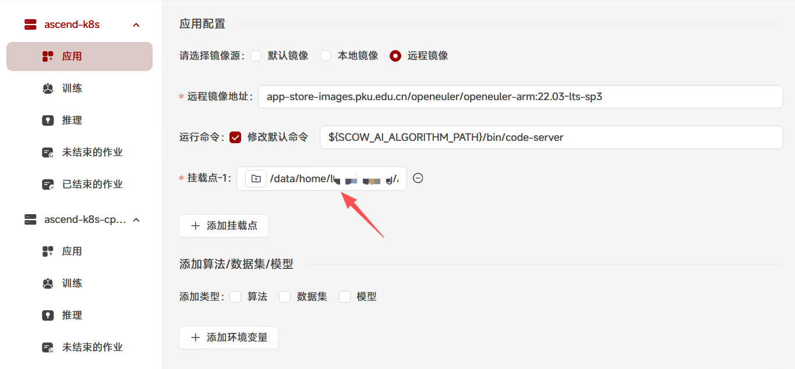

2.3.4 勾选添加类型 - 算法，下拉菜单中，选取 公共算法；算法下拉菜单中，选取 code-server(official) 算法，版本下拉菜单中，选取 4.95.3；此时应可以看到算法描述部分显示启动命令，与2.3.2步骤中的启动命令是一致的
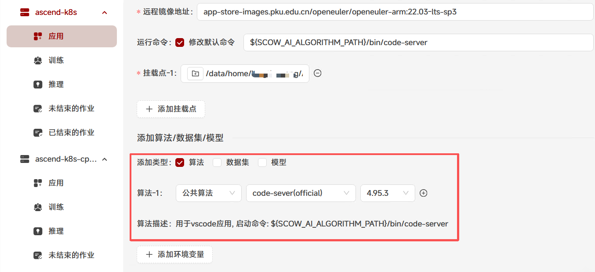

### 2.4 选择加速卡的数量，此处由于需要多卡环境，此处我们选择4卡作为例子，最多单个作业可申请8张卡；

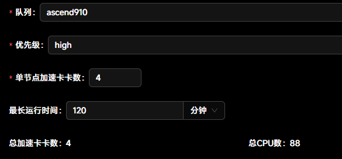

## 3. 作业连接与配置
### 3.1 进入vscode后，新建terminal


回到未结束的作业页面，点击 详情


这里能看到挂载点的目录，复制以便下一步使用
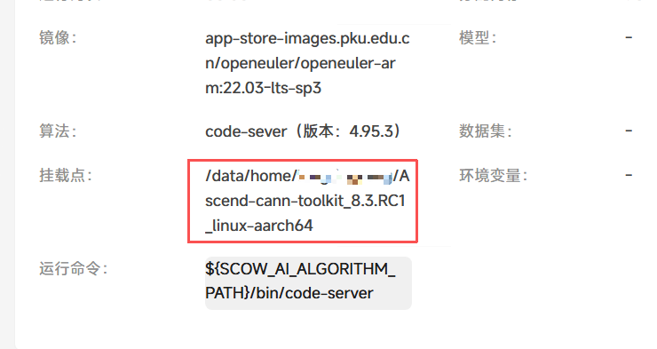

回到vscode应用中，进入到刚刚复制的目录下，后续的所有操作都在这个目录下进行
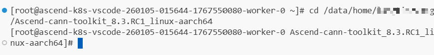

### 3.2 查看相关的系统版本

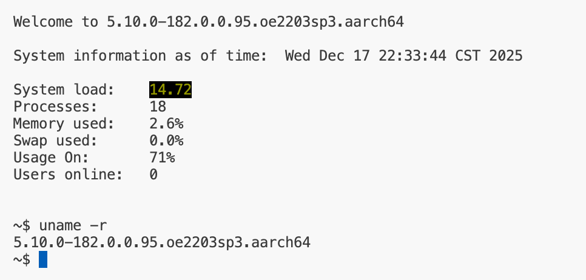

### 3.3 进行必要安装
 ```bash
yum install gcc g++ cmake make python3 vim tmux findutils util-linux python-pip git -y
```

结果：

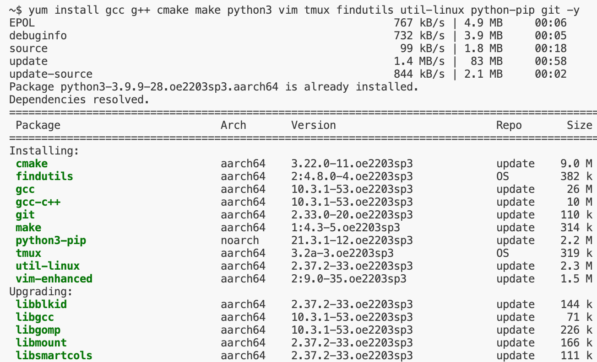

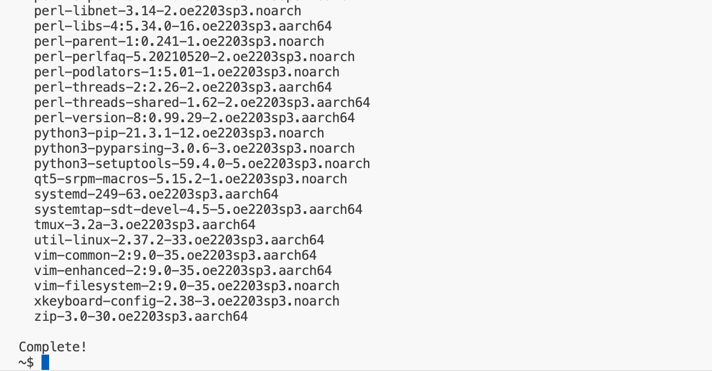

### 3.4 查看NPU的相关信息 
```bash
npu-smi info
```

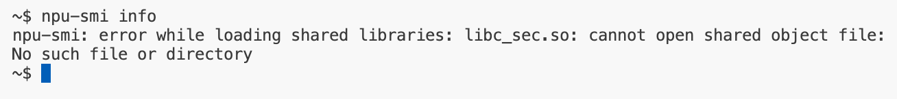
更新LD_LIBRARY_PATH，酌情添加到~/.bashrc中

```bash
    export LD_LIBRARY_PATH=/usr/local/Ascend/driver/lib64:/usr/local/Ascend/driver/lib64/driver:/usr/local/Ascend/driver/lib64/common
 ```

重新执行 npu-smi info

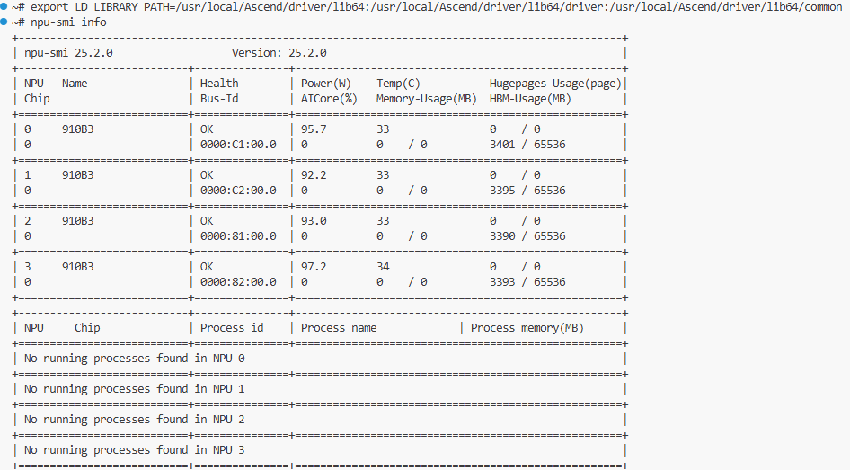

### 3.5 安装CANN,增加执行权限
    

```bash
chmod +x Ascend-cann*.run
```

结果：

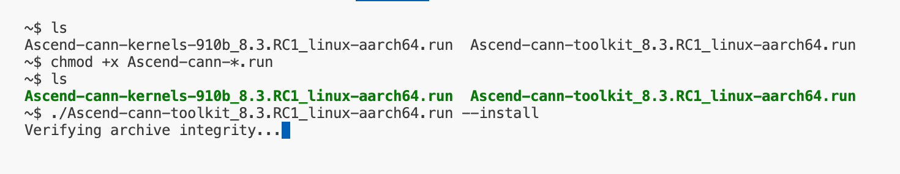

安装toolkit，将经过解压和EULA accept，选择Y

```bash
./Ascend-cann-toolkit_8.3.RC1_linux-aarch64.run --install
```

EULA要选Y，耗时约5-10分钟

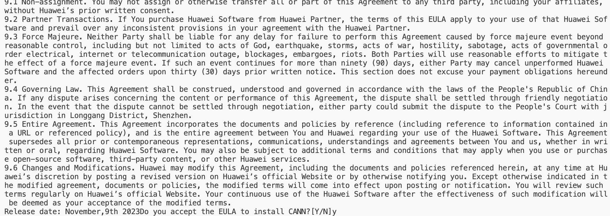

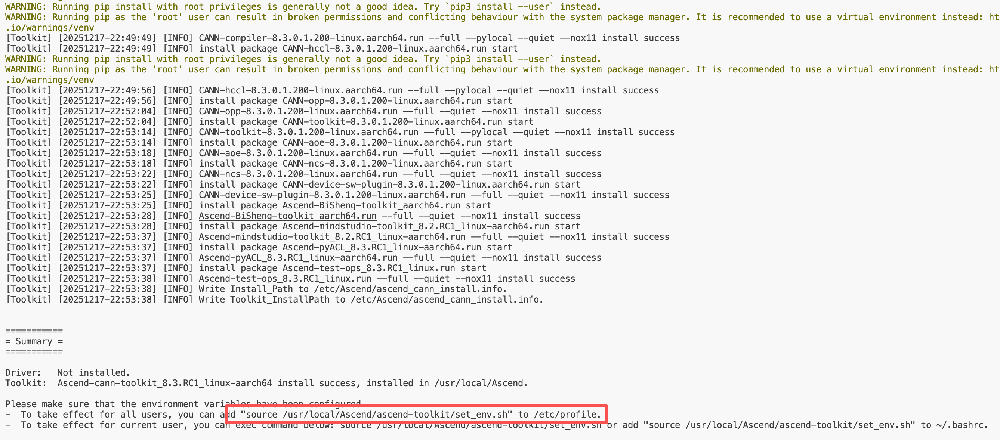

验证：

```bash
ls /usr/local/Ascend/ascend-toolkit
source /usr/local/Ascend/ascend-toolkit/set_env.sh
echo $ASCEND_HOME_PATH
```
结果：
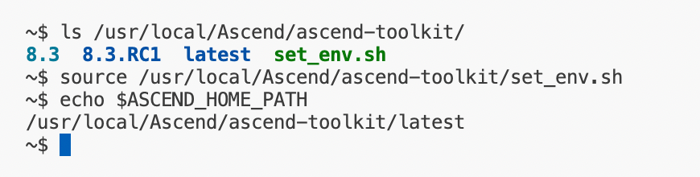

### 3.6 安装SHMEM相关的环境
安装virtualenv
        

```bash
pip install virtualenv
```

结果：

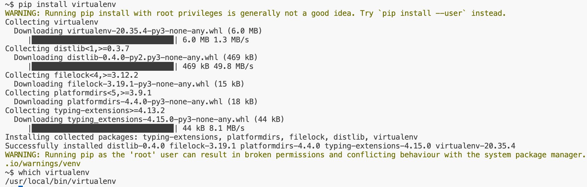

克隆SHMEM repo

```bash
git clone https://gitee.com/ascend/shmem.git
 ```

结果：

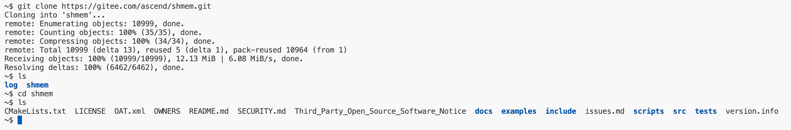

创建venv并激活，安装pip包

```bash
cd shmem && virtualenv myenv
source myenv/bin/activate
pip3 install attrs cython 'numpy>=1.19.2,<=1.24.0' decorator sympy cffi pyyaml pathlib2 psutil protobuf==3.20.0 scipy requests absl-py
pip3 install torch==2.1.0
```

结果：

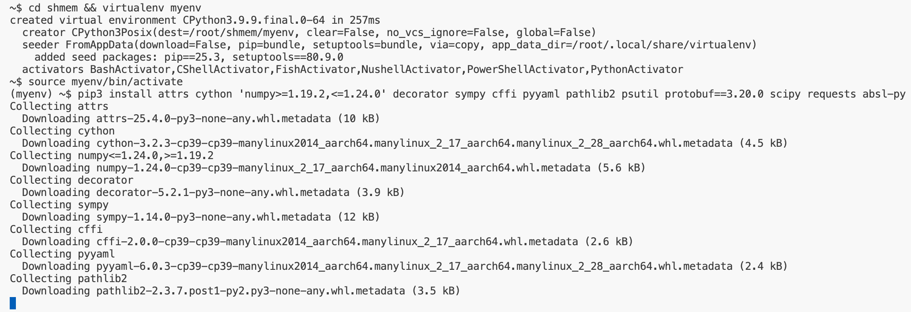

编译SHMEM库并安装到/usr/local/Ascend下

```bash
bash scripts/build.sh
./ci/release/aarch64/SHMEM_1.0.0_linux-aarch64.run --install
```

结果：

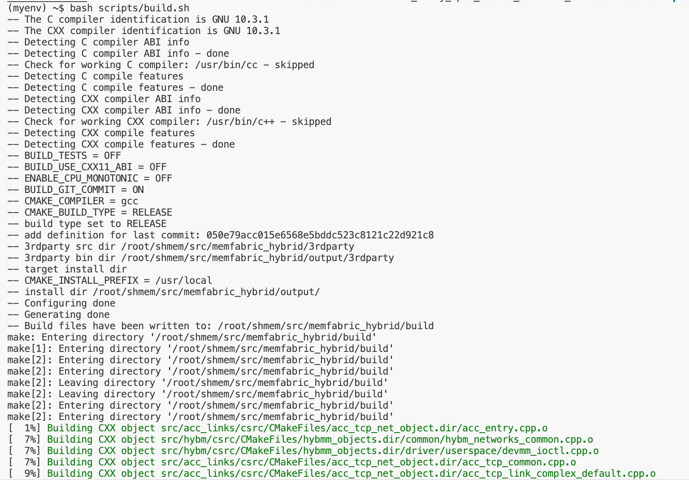

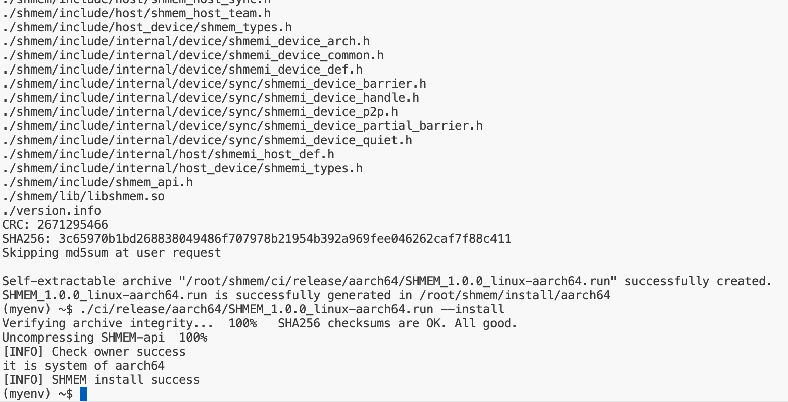

编译SHMEM examples并测试

```bash
source /usr/local/Ascend/shmem/latest/set_env.sh
bash scripts/build.sh -examples
cd examples/allgather_matmul
bash scripts/run.sh 0,1,2,3
```

结果：

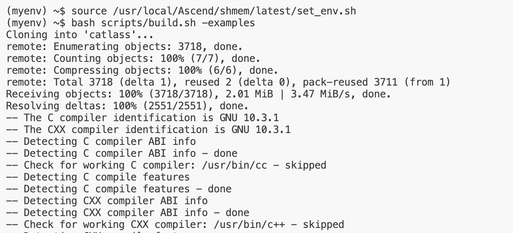

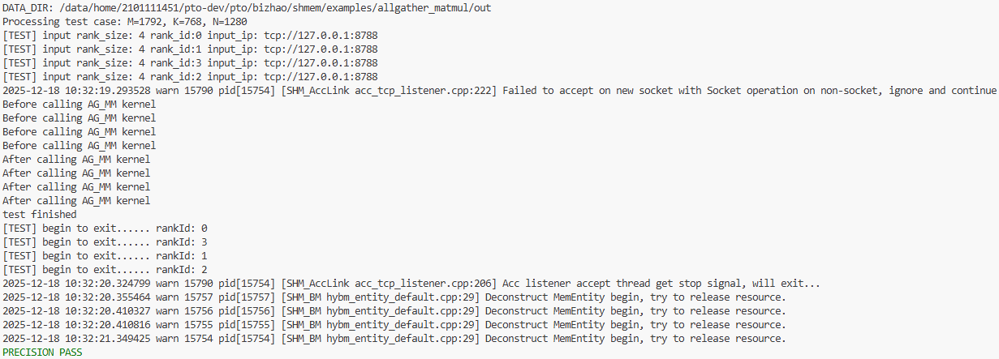


## 总结
在卓越中心智算平台上，按照Tutorial19的步骤，顺利完成了从OpenEuler开始配置CANN环境，到最终实现SHMEM目标的全过程。感谢学校和华为公司各位专家在环境配置中给予的帮助！

## 作者
> 作者：石弼钊，罗国杰 （北京大学 计算机学院）
> 
> 联系方式：{bshi, gluo}@pku.edu.cn