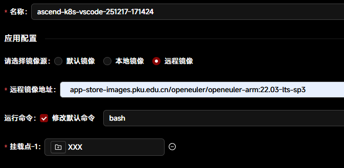

# Tutorial 19：基于智算集群容器的CANN包安装与SHMEM配置

* 集群类型：智算平台
* 所需镜像：app-store-images.pku.edu.cn/openeuler/openeuler-arm:22.03-lts-sp3
* 所需模型：无
* 所需数据集：教程内提供
* 所需资源：单机多卡（1*4 Ascend910B）
* 目标：本节在卓越集群的智算平台中使用VScode应用，基于CANN 8.3.RC1进行SHMEM的配置


## 作业申请
1. 进入scow-zy.pku.edu.cn/dashboard，点击右上角进入 **智算平台；**

    

2. 进入 智算平台 页面后选择 **作业**，并点击**vscode**创建应用；

    

3. 进入 创建vscode 页面后 在应用配置处选择 **远程镜像**，并使用OpenEuler 22.03的版本；
    1. **app-store-images.pku.edu.cn/openeuler/openeuler-arm:22.03-lts-sp3**
4. **添加挂载点，持久化保存数据。**

    

5. 选择加速卡的数量，此处由于需要多卡环境，此处我们选择4卡作为例子，最多单个作业可申请8张卡；

    

## 作业连接与配置
1. 进入vscode后，新建terminal

    

2. 查看相关的系统版本

    

3. 进行必要安装
    1. 命令：

    ```bash
    yum install gcc g++ cmake make python3 vim tmux findutils util-linux python-pip git -y
    ```

    2. 结果：

    

    

4. 查看NPU的相关信息 npu-smi info
    1. 现象： 

    

    2. 参考解决方案：**https://bbs.huaweicloud.com/blogs/452355**
        1. 更新LD_LIBRARY_PATH，酌情添加到~/.bashrc中

    ```bash
        export LD_LIBRARY_PATH=/usr/local/Ascend/driver/lib64:/usr/local/Ascend/driver/lib64/driver:/usr/local/Ascend/driver/lib64/common
    ```

    3. 重新执行 npu-smi info

    

5. 下载CANN 8.3.RC1
    1. 根据CANN包版本的不同，可使用不同的方式进行下载，截止到2025年12月17日，使用conda下载的版本最新为8.2，8.3+的版本需要自行下载安装：[https://www.hiascend.com/developer/download/community/result?module=cann&cann=8.3.RC1](https://www.hiascend.com/developer/download/community/result?module=cann&cann=8.3.RC1)
    2. 本次实验所需的包只有 Ascend-cann-toolkit_8.3.RC1_linux-aarch64.run，还可进一步安装 Ascend-cann-kernels-910b_8.3.RC1_linux-aarch64.run

    

    3. 下载后文件可通过scow网页上的 文件 进行上传，**此处我们默认已有挂载的目录到容器中**
6. 安装CANN
    1. 首先增加执行权限
        1. 命令：

        ```bash
            chmod +x Ascend-cann*.run
        ```

        2. 执行结果：

        

    2. 安装toolkit，将经过解压和EULA accept，选择Y
        1. 命令，CANN-kernels同理：

        ```bash
        ./Ascend-cann-toolkit_8.3.RC1_linux-aarch64.run --install
        ```

        2. 结果：EULA要选Y，耗时约5-10分钟

        

        

        3. 简单验证：

        ```bash
        ls /usr/local/Ascend/ascend-toolkit
        source /usr/local/Ascend/ascend-toolkit/set_env.sh
        echo $ASCEND_HOME_PATH
        ```

        

7. 安装SHMEM相关的环境
    1. 安装virtualenv
        1. 命令：

        ```bash
        pip install virtualenv
        ```

        2. 结果：

        

    2. 克隆SHMEM repo
        1. 命令：

        ```bash
        git clone https://gitee.com/ascend/shmem.git
        ```

        2. 结果：

        

    3. 创建venv并激活，安装pip包
        1. 命令：

        ```bash
        cd shmem && virtualenv myenv
        source myenv/bin/activate
        pip3 install attrs cython 'numpy>=1.19.2,<=1.24.0' decorator sympy cffi pyyaml pathlib2 psutil protobuf==3.20.0 scipy requests absl-py
        pip3 install torch==2.1.0
        ```

        2. 结果：

        

    4. 编译SHMEM库并安装到/usr/local/Ascend下
        1. 命令：

        ```bash
        bash scripts/build.sh
        ./ci/release/aarch64/SHMEM_1.0.0_linux-aarch64.run --install
        ```

        2. 结果：

        

        

    5. 编译SHMEM examples并测试
        1. 命令：

        ```bash
        source /usr/local/Ascend/shmem/latest/set_env.sh
        bash scripts/build.sh -examples
        cd examples/matmul_allreduce
        bash scripts/run.sh 0,1,2,3
        ```

        2. 结果：

        

        3. 在测试同时再打开一个terminal查看NPU的显存分配
            1. 命令：

        ```bash
        watch -n 1 npu-smi info
        ```

            2. 结果：能正常跑&分配显存，但精度存在一定误差

        

## 总结
在卓越中心智算平台上，按照Tutorial19的步骤，顺利完成了从OpenEuler开始配置CANN环境，到最终实现SHMEM目标的全过程。感谢学校和华为公司各位专家在环境配置中给予的帮助！

## 作者
> 作者：石弼钊，罗国杰 （北京大学 计算机学院）
> 
> 联系方式：{bshi, gluo}@pku.edu.cn