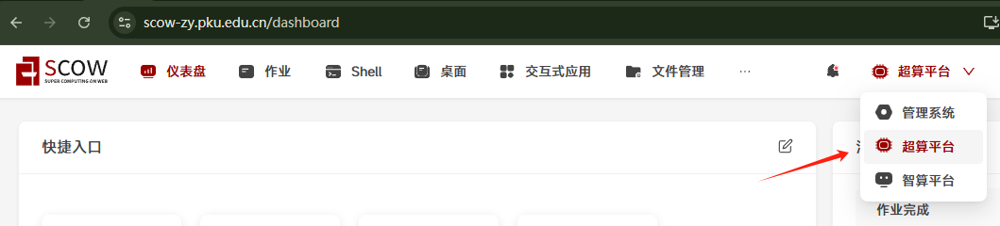
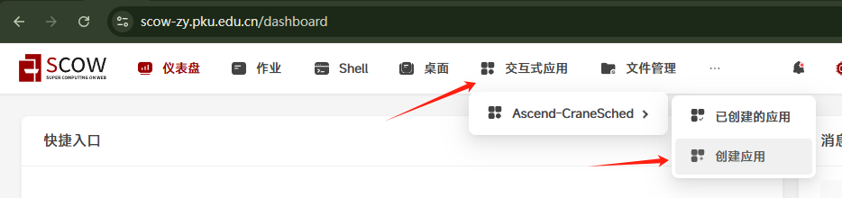
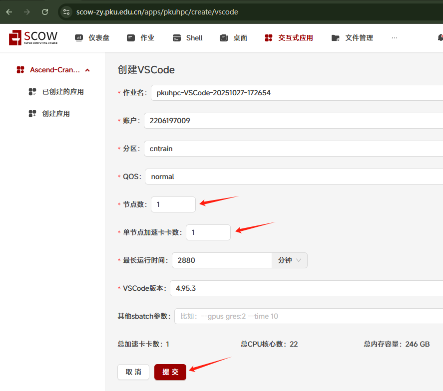
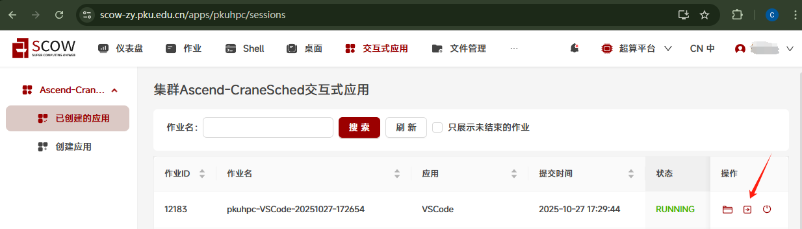
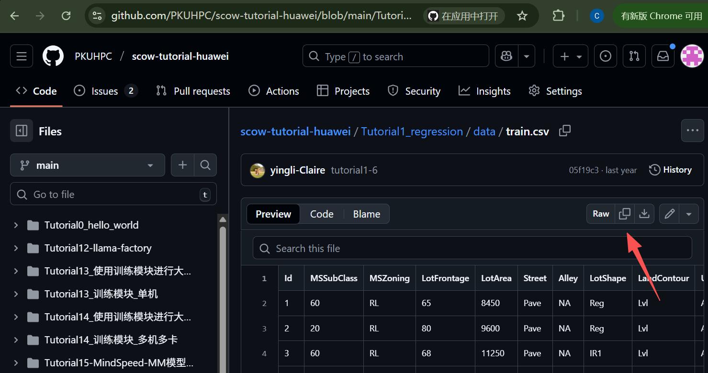
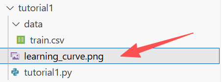
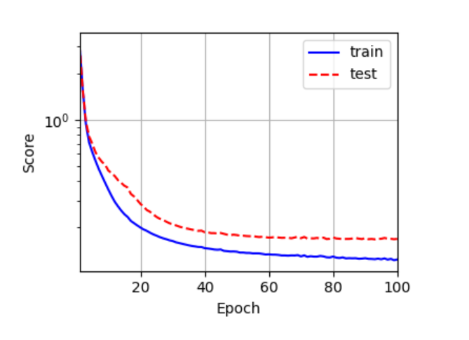

# Tutorial1: 房价预测-回归类问题

* 集群类型：超算平台
* 所需镜像：无
* 所需模型：无
* 所需数据集：教程内提供
* 所需资源：单机单卡，建议使用1张910B NPU运行本教程。
* 目标：本节旨在通过 [kaggle 房价预测竞赛](https://www.kaggle.com/competitions/house-prices-advanced-regression-techniques) 这一简单案例展示如何使用全连接神经网络解决回归问题。

此教程运行在SCOW超算平台中，请确保运行过[Tutorial0 搭建Python环境](Tutorial0_python_env/tutorial0.md)中1.2安装conda的步骤，再来尝试运行本教程

## 1. 环境准备
切换到超算平台中



点击交互式应用->创建应用进入创建界面，选择vscode应用




节点数填写1，单节点加速卡卡数填写1，最长运行时间适当填写，最后点击提交



在跳转到的页面中点击进入



进到vscode应用中打开terminal


运行下面的命令创建文件夹、配置环境
```shell
mkdir tutorial1
cd tutorial1
conda create -n tutorial1 python==3.10
conda activate tutorial1
pip install torch==2.3.1 torch-npu==2.3.1 numpy==1.26.4 matplotlib==3.8.4 pandas==2.2.2 scikit-learn==1.5.0 pyyaml==6.0.2 matplotlib_inline==0.2.1 traitlets==5.14.3 decorator==5.2.1 attrs==25.4.0 psutil==7.1.2
source /usr/local/Ascend/ascend-toolkit/set_env.sh
```

## 2. 数据集下载
作为简化模型的案例，这里使用的是 [kaggle 房价预测竞赛中的训练数据集](https://www.kaggle.com/competitions/house-prices-advanced-regression-techniques/data)。在后面的处理中，我们只使用了数值部分的特征，并把全部数据分为训练集和测试集两部分。

实验所用数据: [train.csv](https://github.com/PKUHPC/scow-tutorial-huawei/blob/main/Tutorial1_regression/data/train.csv)，到网页中点击复制



在~/tutorial1/data文件夹中新建train.csv，将复制的内容粘贴进去


## 3. 运行训练
在tutorial1下创建Python脚本
```shell
echo "" > tutorial1.py
```
在tutorial1.py中放入下面的代码
```python
import pandas as pd
import numpy as np
from sklearn.model_selection import train_test_split
from sklearn.preprocessing import StandardScaler
import torch
import torch_npu
import torch.nn as nn
from torch.utils.data import DataLoader, TensorDataset
from matplotlib import pyplot as plt

# 3.1 数据处理模块
def data_preprocess(file_path, test_size=0.2, random_state=42):
    data = pd.read_csv(file_path)
    data = data.iloc[:, 1:]  # 去掉第一列编号
    numeric_features = data.select_dtypes(include=[np.number])
    numeric_features.fillna(numeric_features.mean(), inplace=True)
    X = numeric_features.drop('SalePrice', axis=1).values
    y = numeric_features['SalePrice'].values
    X_train, X_test, y_train, y_test = train_test_split(
        X, y, test_size=test_size, random_state=random_state, shuffle=True)
    scaler = StandardScaler()
    X_train = scaler.fit_transform(X_train)
    X_test = scaler.transform(X_test)
    # 转换为torch张量
    X_train = torch.tensor(X_train, dtype=torch.float32)
    X_test = torch.tensor(X_test, dtype=torch.float32)
    y_train = torch.tensor(y_train.reshape(-1, 1), dtype=torch.float32)
    y_test = torch.tensor(y_test.reshape(-1, 1), dtype=torch.float32)
    return X_train, X_test, y_train, y_test

# 3.2 模型训练模块
class Net(nn.Module):
    def __init__(self, input_features):
        super(Net, self).__init__()
        self.fc1 = nn.Linear(input_features, 128)
        self.fc2 = nn.Linear(128, 1)
        self.relu = nn.ReLU()
    def forward(self, x):
        x = self.relu(self.fc1(x))
        x = self.fc2(x)
        return x

def score(model, X, y, criterion):
    pred = torch.clamp(model(X), 1, float('inf'))
    return torch.sqrt(criterion(torch.log(pred), torch.log(y))).item()

def train_model(X_train, X_test, y_train, y_test, 
                learning_rate=0.1, weight_decay=5, epochs=100, batch_size=32):
    device = torch.device('npu:0') if torch.npu.is_available() else torch.device('cpu')
    print(f"Using device: {device}")
    model = Net(X_train.shape[1]).to(device)
    criterion = nn.MSELoss()
    optimizer = torch.optim.Adam(model.parameters(), lr=learning_rate, weight_decay=weight_decay)
    train_dataset = TensorDataset(X_train, y_train)
    train_loader = DataLoader(train_dataset, batch_size=batch_size, shuffle=True)
    train_ls, test_ls = [], []
    for epoch in range(epochs):
        model.train()
        for inputs, targets in train_loader:
            inputs, targets = inputs.to(device), targets.to(device)
            outputs = model(inputs)
            loss = criterion(outputs, targets)
            optimizer.zero_grad()
            loss.backward()
            optimizer.step()
        model.eval()
        with torch.no_grad():
            train_ls.append(score(model, X_train.to(device), y_train.to(device), criterion))
            test_ls.append(score(model, X_test.to(device), y_test.to(device), criterion))
    return model, train_ls, test_ls

# 3.3 可视化模块
def plot_learning_curve(train_ls, test_ls, epochs, save_path='learning_curve.png'):
    plt.rcParams['figure.figsize'] = (4, 3)
    plt.plot(list(range(1, epochs + 1)), train_ls, 'b', label='train')
    plt.plot(list(range(1, epochs + 1)), test_ls, 'r--', label='test')
    plt.xlabel("Epoch")
    plt.ylabel("Score")
    plt.yscale('log')
    plt.xlim([1, epochs])
    plt.legend()
    plt.grid()
    plt.tight_layout()  # 推荐加上，防止标签被截断
    plt.savefig(save_path)
    plt.close()  # 推荐加上，防止内存泄漏

# 3.4 main函数
def main():
    # 数据路径
    file_path = './data/train.csv'
    # 1. 数据处理
    X_train, X_test, y_train, y_test = data_preprocess(file_path)
    # 2. 模型训练
    model, train_ls, test_ls = train_model(X_train, X_test, y_train, y_test)
    # 3. 可视化
    plot_learning_curve(train_ls, test_ls, epochs=100)

if __name__ == '__main__':
    main()
```

运行下面的命令开始训练
```shell
python tutorial1.py
```

## 4. 查看结果
运行代码后会在代码同路径下生成训练效果图



查看图片，这个训练曲线显示，随着训练轮数的增加，训练集和测试集的损失（Score）都在逐渐下降，且下降速度较快，最后趋于平稳。训练集损失始终低于测试集损失，二者之间有一定间隔，但没有明显发散，说明模型在训练集和测试集上都取得了较好的拟合效果，没有明显的过拟合或欠拟合现象，训练效果较好。



---
> 作者：黎颖；褚苙扬；龙汀汀*
>
> 联系方式：l.tingting@pku.edu.cn