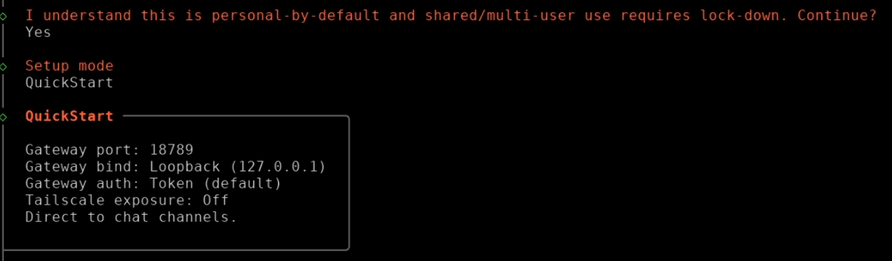
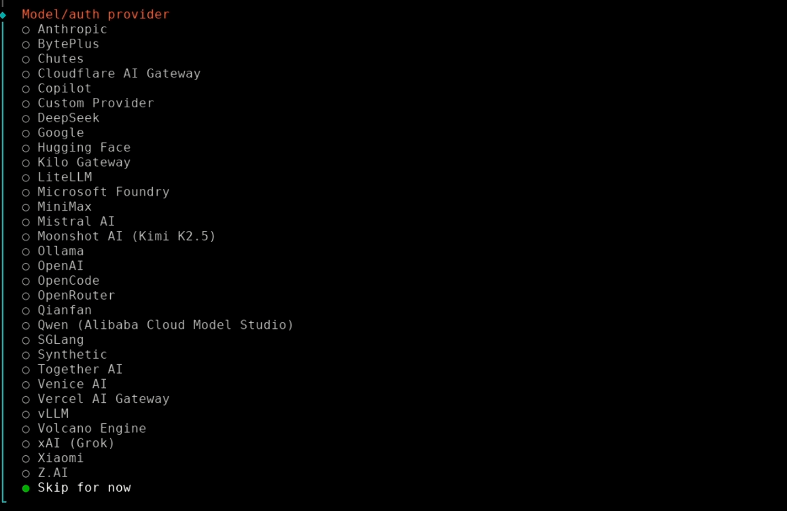
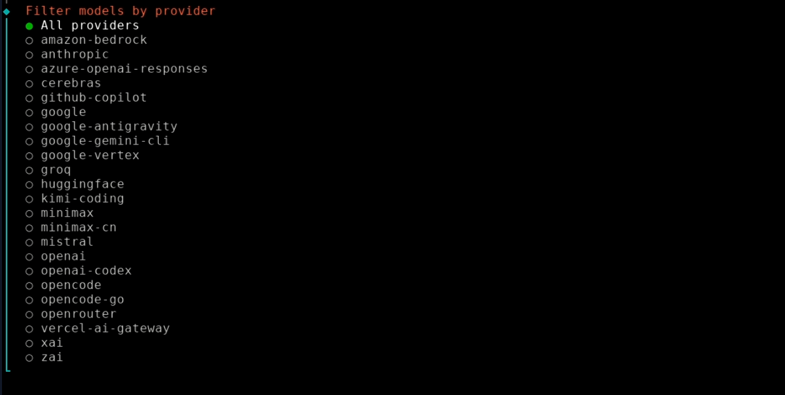
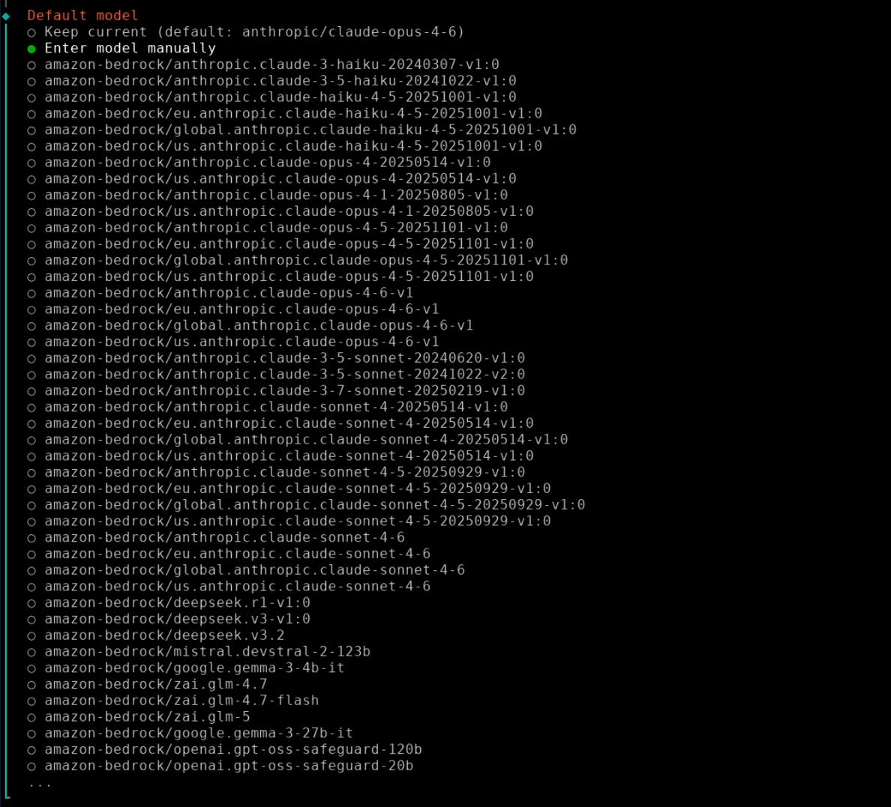
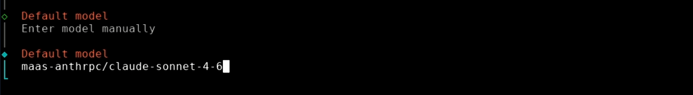
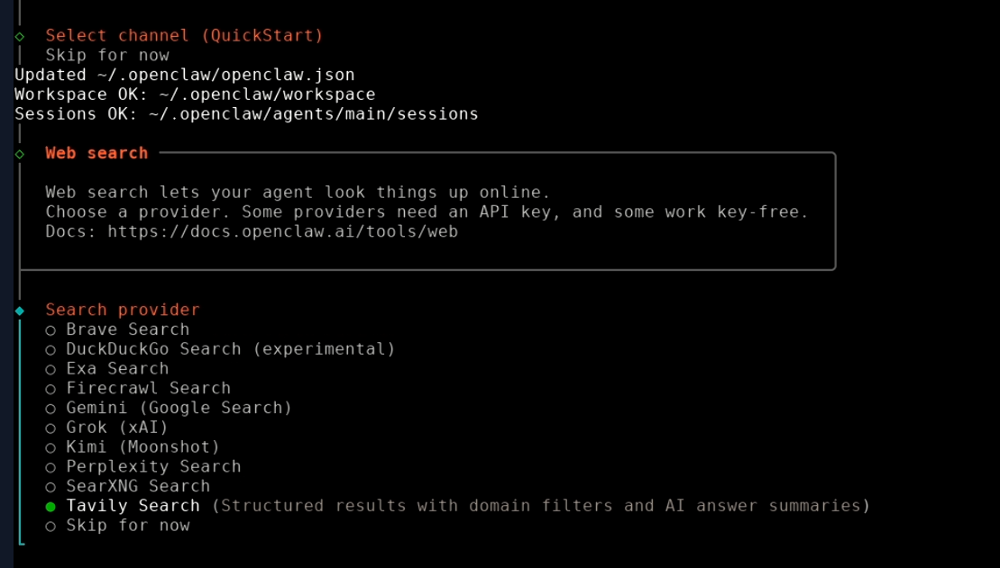
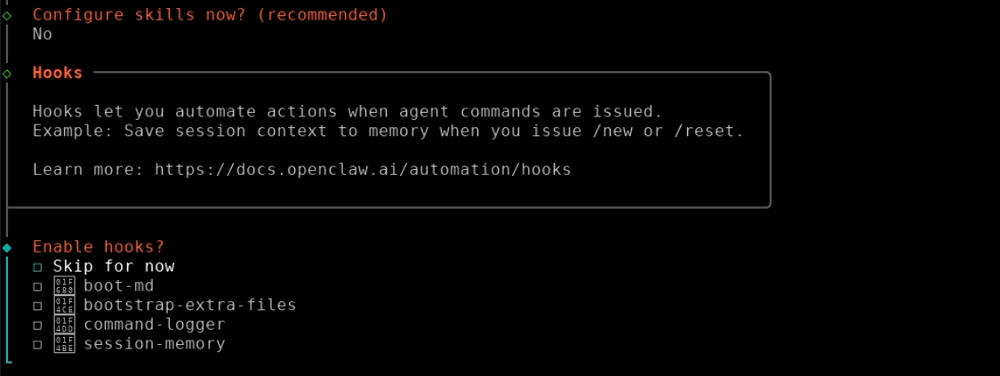
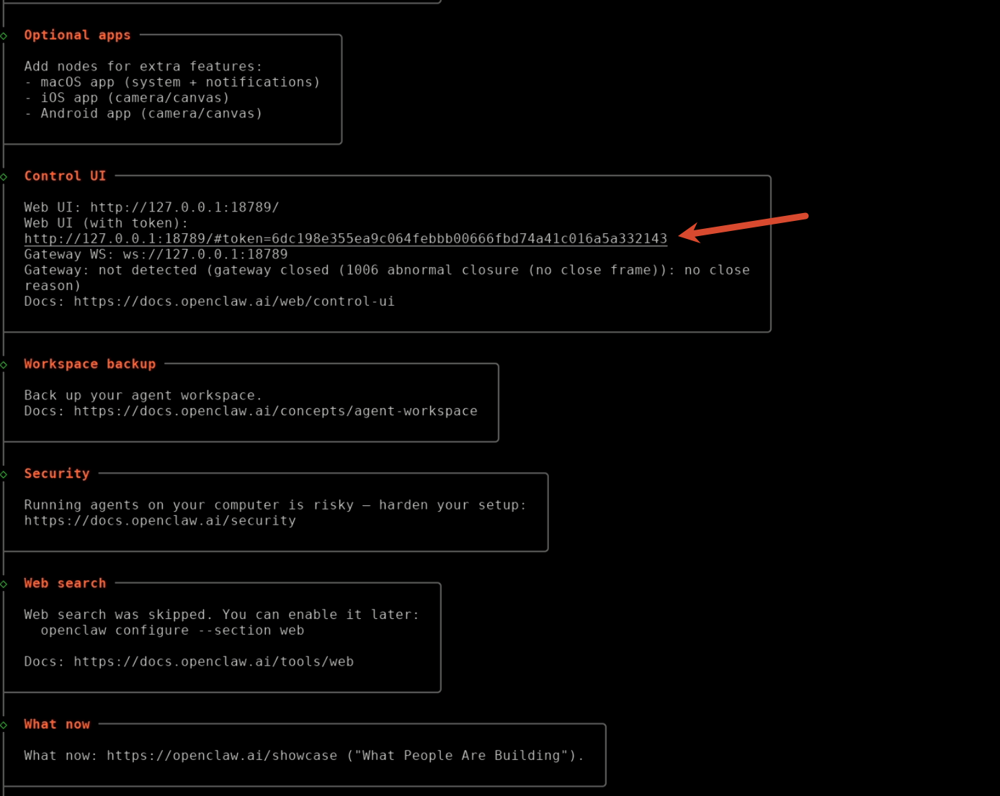

# Tutorial20: 在SCOW超算平台部署OpenClaw

* 集群类型：超算平台
* 所需镜像：无
* 所需模型：无
* 所需数据集：无
* 所需资源：无
* 目标：本节旨在演示如何在SCOW超算平台的ShadowDesk应用中部署OpenClaw，包括一键部署和手动部署两种方式。部署完成后可通过浏览器访问OpenClaw Web UI，与大模型进行对话交互，并使用浏览器控制等工具能力

## 0、前置准备

* 需要提前获取 MaaS API Key（来自 chat.noc.pku.edu.cn）
* 超算平台的ShadowDesk应用需要能访问外网

## 1、一键部署方式（推荐）

### 1.1、打开Shell

登录SCOW平台，选取超算平台

点击 应用 > 创建应用 > 选择ShadowDesk，配置好并提交后再点击 已创建的应用 > 进入ShadowDesk，在桌面右键打开终端Shell界面

### 1.2、执行一键部署脚本

拷贝以下命令粘贴到Shell界面，将 `<你的MaaS-API-Key>` 替换为实际的 API Key，按回车键执行：

```bash
bash install-openclaw.sh <你的MaaS-API-Key>
```

脚本会自动完成以下操作：

* 安装 Node.js
* 安装 openclaw gateway
* 安装 Chromium 浏览器
* 在配置文件中写入提供商信息和浏览器配置

安装完成后会自动启动 OpenClaw Gateway（localhost:18789）和 Chromium（CDP 端口 9222）。终端会打印 Web UI 地址和 Gateway Token，在浏览器中打开地址并输入 Token 即可使用。

### 1.3、重新启动 OpenClaw

注销重新登录后，OpenClaw 不会自动启动。拷贝以下命令粘贴到Shell界面，按回车键重新启动：

```bash
bash ~/start-openclaw.sh
```

该脚本由安装脚本自动生成，包含 Gateway Token，无需任何参数。会同时启动 Chromium（CDP 端口 9222）和 openclaw gateway。

### 1.4、升级 / 更换 API Key

重新执行安装脚本即可，脚本对已有配置采取非破坏性更新策略：

```bash
bash install-openclaw.sh <你的MaaS-API-Key>
```

### 1.5、模型配置

脚本会在 `~/.openclaw/openclaw.json` 中自动写入 MaaS 提供商（全部使用小写名称）及模型信息：

| Provider ID | API 类型 | 默认模型 | 说明 |
|-------------|---------|---------|------|
| `maas-anthrpc` | `anthropic-messages` | `claude-sonnet-4-6` | 默认主模型（对话） |
| `maas-openai` | `openai-completions` | `gpt-5-mini` | 图片识别 / PDF 解析模型 |

所有提供商的 baseURL 均指向 `https://chat.noc.pku.edu.cn`。

**默认模型分工：**

* 对话主模型：`maas-anthrpc/claude-sonnet-4-6`
* 图片模型（imageModel）：`maas-openai/gpt-5-mini`
* PDF 模型（pdfModel）：`maas-openai/gpt-5-mini`（最大 10MB / 20 页）

登录 Web UI 后可与 OpenClaw 对话，让其添加更多模型，只需告诉它模型 ID、提供商、API 类型和 API Key 即可。也可以手动编辑配置文件添加模型，详见[章节3：模型配置详解](#3模型配置详解)。

### 1.6、浏览器控制

安装脚本会自动在配置文件中写入浏览器配置（`browser` 字段），预配置了 `remote` profile 指向本机 CDP 端口 9222。安装完成后 Chromium 已在后台运行，OpenClaw 可直接通过浏览器工具操作页面，无需手动配置。只需跟 OpenClaw 对话让它使用浏览器工具即可，如：

```请使用浏览器工具通过CDP操控我的浏览器，打开百度首页，搜索“北京大学计算中心”，并告诉我搜索结果的标题和链接。```

如需确认浏览器工具已启用，在 Web UI 左侧边栏检查 **Agents → Tools → Quick Presets** 是否为 `Full`。须为 `Full` 才会启用浏览器工具。

## 2、手动部署方式

如果不使用一键部署脚本或者脚本部署失败，可以按照以下步骤手动安装和配置 OpenClaw。

### 2.1、打开Shell

登录SCOW平台，选取超算平台

点击 应用 > 创建应用 > 选择ShadowDesk，配置好并提交后再点击 已创建的应用 > 进入ShadowDesk，在桌面右键打开终端Shell界面

### 2.2、安装 nvm 和 Node.js

如果系统尚未安装 Node.js，推荐使用 nvm 安装和管理 Node 版本。拷贝以下命令依次粘贴到Shell界面，按回车键执行：

```bash
curl -o- https://raw.githubusercontent.com/nvm-sh/nvm/v0.40.4/install.sh | bash

source ~/.bashrc
nvm install 24
nvm use 24
```

运行命令 `node -v` 确认 Node.js 安装成功。

### 2.3、安装 OpenClaw

通过包管理器 npm 安装（推荐），默认为最新版：

```bash
npm install -g openclaw@latest
openclaw onboard --install-daemon
```

或通过以下命令安装 OpenClaw：

```bash
curl -fsSL https://openclaw.ai/install.sh | bash
```

运行命令后将进入交互式配置流程：



左右方向键切换选项，回车键确认。依次选择 `Yes`，选择 `Quick Start`；



对于模型提供商，选择 `Skip for now` 跳过；如果已有列表中提供商的 API Key，可以自行选择并按照相应流程配置；



选择 `All providers`；



选择 `Enter model manually`；



输入模型提供商/模型 ID，模型提供商名称可自定义（需小写），模型 ID 应与提供商提供的 ID 一致，如 `maas-anthrpc/claude-sonnet-4-6`，回车确认；



选择 `Skip for now` 跳过 Channel 配置；选择 `Skip for now` 跳过联网搜索配置；



选择 `No` 跳过 Skills 配置；可按下空格键多选要启用的 Hooks，回车确认，建议启用 `session-memory`；之后引导程序结束，可从终端输出中获取 Web UI 地址和 Gateway Token，在浏览器中打开地址即可：



注：现在配置还不完全，很有可能会遇到 gateway 启动失败的问题，需要继续完成后续配置。

### 2.4、配置模型

如果前面在模型提供商选择的是 `Skip for now`，则还需手动配置文件。打开 `~/.openclaw/openclaw.json`，在 `models` 字段下添加提供商和模型信息，详见[章节3：模型配置详解](#3模型配置详解)。

### 2.5、配置 Agent

编辑 `~/.openclaw/openclaw.json`，添加 `agents` 字段，示例如下：

```json
{
  "agents": {
    "defaults": {
      "model": {
        "primary": "maas-anthrpc/claude-sonnet-4-6"
      },
      "imageModel": {
        "primary": "maas-anthrpc/claude-sonnet-4-6"
      },
      "pdfModel": {
        "primary": "maas-anthrpc/claude-sonnet-4-6"
      },
      "pdfMaxBytesMb": 10,
      "pdfMaxPages": 20,
      "models": {
        "maas-anthrpc/claude-sonnet-4-6": {
          "alias": "Claude-sonnet-4-6"
        }
      },
      "workspace": "/data/home/<username>/.openclaw/workspace",
      "userTimezone": "UTC+8",
      "envelopeTimezone": "UTC"
    },
    "list": [
      {
        "id": "main",
        "model": "maas-anthrpc/claude-sonnet-4-6",
        "tools": {
          "profile": "full"
        }
      }
    ]
  }
}
```

**配置说明：**

* `agents.defaults.model.primary`：主模型，格式为 `<提供商>/<模型ID>`，需为前面 models 配置的模型 ID 之一
  * 可选：`imageModel.primary`：图片模型，格式同上
  * 可选：`pdfModel.primary`：PDF 模型，格式同上
  * `pdfMaxBytesMb`：PDF 模型处理的最大 PDF 大小，单位为 MB
  * `pdfMaxPages`：PDF 模型处理的最大 PDF 页数
* `agents.defaults.models`：模型配置，需包含主模型和可选的 imageModel、pdfModel，每个模型可配置一个 alias 字段作为别名，在 Web UI 中显示使用
* `agents.defaults.workspace`：工作空间路径，将 `<username>` 替换为实际用户名
* `agents.defaults.userTimezone`：用户所在时区，建议设为 UTC+8
* `agents.list`：Agent 列表，至少包含一个 Agent。每个 Agent 需指定 ID 和模型，`profile` 建议使用 `full`（启用所有工具）

### 2.6、配置 Gateway

编辑 `~/.openclaw/openclaw.json`，添加 `gateway` 字段以设置 Web UI 允许的访问来源：

```json
{
  "gateway": {
    "controlUi": {
      "allowedOrigins": [
        "http://127.0.0.1:18789",
        "http://localhost:18789"
      ]
    }
  }
}
```

### 2.7、启动 OpenClaw Gateway

保存配置文件后，拷贝以下命令粘贴到Shell界面，按回车键执行：

```bash
nohup openclaw gateway --bind lan --port 18789 >> "$HOME/.openclaw/gateway.log" 2>&1 &
```

在后台启动 OpenClaw Gateway。之后在浏览器中打开终端输出的 Web UI 地址，输入 Gateway Token 即可登录使用。

## 3、模型配置详解

若要手动配置或更改模型，编辑 `~/.openclaw/openclaw.json` 中 `models` 字段：

```json
{
  "models": {
    "mode": "merge",
    "providers": {
      "<你的提供商名称>": {
        "baseUrl": "<你的提供商 base URL>",
        "apiKey": "<你的提供商 API Key>",
        "api": "<你的提供商 API 类型>",
        "models": [
          {
            "id": "<模型 ID>",
            "name": "<模型名称>",
            "reasoning": false,
            "input": ["text", "image"],
            "cost": {
              "input": 0,
              "output": 0,
              "cacheRead": 0,
              "cacheWrite": 0
            },
            "contextWindow": 200000,
            "maxTokens": 8192
          }
        ]
      }
    }
  }
}
```

**配置说明：**

* 提供商名称：自定义名称，建议使用小写字母和短横线（-）命名，如 `maas-openai`
* baseUrl：提供商 API 的 base URL，如 `https://chat.noc.pku.edu.cn/v1`
* apiKey：提供商 API Key
* api：提供商 API 类型，一般为 `openai-completions`、`anthropic-messages`、`google-generative-ai` 三种之一，请按照提供商实际 API 类型选择
* models：提供商下的模型列表，每个模型包含以下字段：
  * id：请复制提供商平台上对应模型的 ID
  * name：自定义模型名称，供 Web UI 显示使用
  * reasoning：是否启用推理能力
  * input：支持的输入类型列表，如 `"text"`、`"image"` 等
  * cost：模型调用的费用配置，保持 0 即可
  * contextWindow：模型的上下文窗口大小，单位为 tokens
  * maxTokens：模型的最大输出长度，单位为 tokens

请替换尖括号 `<>` 中的内容为实际值，并确保 JSON 格式正确。保存后运行 `openclaw gateway restart` 命令重启网关即可生效。

---
> 作者：余成昊，龙汀汀
>
> 联系方式：l.tingting@pku.edu.cn
