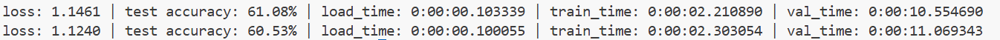

# Tutorial3: ResNet18训练cifar数据集

* 集群类型：
* 所需镜像：无
* 所需模型：教程内提供
* 所需数据集：教程内提供
* 所需资源：建议使用2张910B NPU运行本教程。
* 目标：本节旨在旨在展示更接近实际的训练场景，使用ResNet18训练cifar数据集，在多块加速卡上做并行。

此教程运行在SCOW超算平台中，请确保运行过tutorial0中安装conda的步骤，再来尝试运行本教程

## 1、环境准备
切换到超算平台中


点击交互式应用->创建应用进入创建界面，选择vscode应用


节点数填写1，单节点加速卡卡数填写2，最长运行时间适当填写，最后点击提交


在跳转到的页面中点击进入


进到vscode应用中打开terminal


运行下面的命令创建文件夹、配置环境
```shell
mkdir tutorial3
cd tutorial3
conda create -n tutorial3 python==3.10
conda activate tutorial3
pip install torch==2.3.1 torch-npu==2.3.1 numpy==1.26.4 pandas==2.2.2 torchvision==0.18.1 pyyaml==6.0.2 traitlets==5.14.3 decorator==5.2.1 attrs==25.4.0 psutil==7.1.2 scipy==1.15.3
source /usr/local/Ascend/ascend-toolkit/set_env.sh
```

## 2、模型训练
在tutorial3下创建Python脚本
```shell
echo "" > tutorial3.py
```
在tutorial3.py中放入下面的代码
```python
import torch
from torch import nn
import torch_npu
import torch.distributed as dist
from torch.utils.data import DataLoader
import torchvision.transforms as transforms
import torchvision.datasets as datasets
from torchvision.models import resnet18, ResNet18_Weights
import time
import os
from datetime import timedelta
import torch.multiprocessing as mp

torch.manual_seed(0)
os.environ['MASTER_ADDR'] = '127.0.0.1'
os.environ['MASTER_PORT'] = '29500'
# 数据预处理
train_transforms = transforms.Compose([
    transforms.Resize(40),
    transforms.RandomResizedCrop(32, scale=(0.64, 1.0), ratio=(1.0, 1.0)),
    transforms.RandomHorizontalFlip(),
    transforms.RandomRotation(10),
    transforms.ToTensor(),
    transforms.Normalize(mean=[0.4914, 0.4822, 0.4465], std=[0.2023, 0.1994, 0.2010])
])

val_transforms = transforms.Compose([
    transforms.ToTensor(),
    transforms.Normalize(mean=[0.4914, 0.4822, 0.4465], std=[0.2023, 0.1994, 0.2010])
])

# 加载数据集
train_dataset = datasets.CIFAR10(root='./cifar', train=True, download=True, transform=train_transforms)
val_dataset = datasets.CIFAR10(root='./cifar', train=False, download=True, transform=val_transforms)

def ddp_setup(rank, world_size):
    dist.init_process_group(backend="hccl", rank=rank, world_size=world_size)

def main_worker(rank, world_size, batch_size, device_ids):
    """
    rank: 当前进程的 rank
    world_size: 总进程数
    batch_size: 全局 batch size
    device_ids: 可用的设备 ID 列表
    """
    ddp_setup(rank, world_size)

    # 设置设备
    device_id = device_ids[rank]  # 根据 rank 获取对应的设备 ID
    torch_npu.npu.set_device(device_id)
    print(f"Process {rank} is using device npu:{device_id}")

    total_batch_size = batch_size
    total_workers = world_size

    batch_size = int(total_batch_size / world_size)
    workers = int((total_workers + world_size - 1) / world_size)

    # 使用 ResNet18 模型
    model = resnet18(weights=None, num_classes=10)

    loc = f'npu:{device_id}'
    model = model.to(loc)
    criterion = nn.CrossEntropyLoss().to(loc)
    optimizer = torch.optim.SGD(model.parameters(), lr=0.1, momentum=0.9, weight_decay=1e-4)

    train_sampler = torch.utils.data.distributed.DistributedSampler(train_dataset, num_replicas=world_size, rank=rank)
    test_sampler = torch.utils.data.distributed.DistributedSampler(val_dataset, num_replicas=world_size, rank=rank)

    train_loader = DataLoader(
        train_dataset, batch_size=batch_size, shuffle=False,
        num_workers=workers, pin_memory=True, sampler=train_sampler, drop_last=True)

    val_loader = DataLoader(
        val_dataset, batch_size=batch_size, shuffle=False,
        num_workers=workers, pin_memory=True, sampler=test_sampler, drop_last=True)

    model = nn.parallel.DistributedDataParallel(model, device_ids=[device_id])

    for epoch in range(5):
        print(f"Epoch {epoch+1} start")
        train_sampler.set_epoch(epoch)
        average_loss, average_load_time, average_train_time = train(train_loader, model, criterion, optimizer, epoch, device_id)

        # 验证
        val_start_time = time.time()
        accuracy_dict = accuracy(model, val_loader, loc)
        val_end_time = time.time()
        average_val_time = timedelta(seconds=val_end_time - val_start_time)

        # 输出信息
        print(f"loss: {average_loss:.4f} | test accuracy: {accuracy_dict:.2f}% | load_time: {average_load_time} | train_time: {average_train_time} | val_time: {average_val_time}")

        # 保存模型
        if rank == 0:  # 只在主进程中保存模型
            os.makedirs('./models', exist_ok=True)
            torch.save(model.state_dict(), f'./models/resnet18_epoch_{epoch+1}.pth')


def train(train_loader, model, criterion, optimizer, epoch, gpu):
    model.train()
    train_ls = []
    load_time = []
    train_time = []

    for i, (images, target) in enumerate(train_loader):
        loc = f'npu:{gpu}'
        
        # 加载数据
        start_load = time.time()
        images, target = images.to(loc, non_blocking=True), target.to(loc, non_blocking=True)
        end_load = time.time()
        load_time.append(end_load - start_load)

        # 前向传播和反向传播
        start_train = time.time()
        optimizer.zero_grad()
        output = model(images)
        loss = criterion(output, target)
        loss.backward()
        optimizer.step()
        end_train = time.time()
        train_time.append(end_train - start_train)

        train_ls.append(loss.item())

    average_loss = sum(train_ls) / len(train_ls)
    average_load_time = timedelta(seconds=sum(load_time))
    average_train_time = timedelta(seconds=sum(train_time))

    return average_loss, average_load_time, average_train_time

def accuracy(model, data_loader, device):
    model.eval()
    correct, total = 0, 0
    with torch.no_grad():
        for X, y in data_loader:
            X, y = X.to(device), y.to(device)
            outputs = model(X)
            _, predicted = outputs.max(1)
            total += y.size(0)
            correct += (predicted == y).sum().item()
    return 100 * correct / total

def main():
    world_size = torch_npu.npu.device_count()
    batch_size = 512
    device_ids = [0, 1]  # 强制指定设备为 npu:1 和 npu:2
    mp.spawn(main_worker, args=(world_size, batch_size, device_ids), nprocs=world_size, join=True)

if __name__ == "__main__":
    main()
```

运行下面的命令开始训练
```shell
python tutorial3.py
```

最后可以看到如下日志输出，可以知道经过简单的训练后，分类成功率能够到达61%左右

