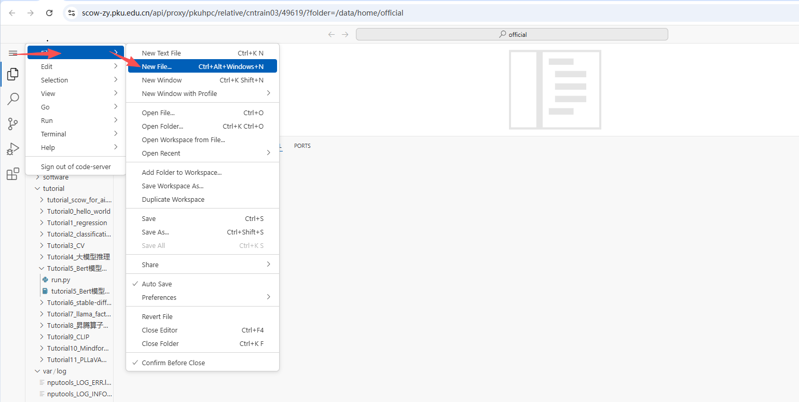
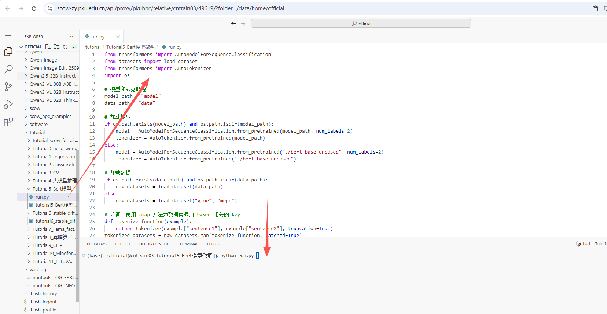

# Tutorial7: 通过在超算平台上上传模型、数据、镜像模型，展示模型微调

* 集群类型：超算平台
* 所需镜像：无
* 所需模型：教程内下载（bert-base-uncased）
* 所需数据集：教程内提供
* 所需硬件资源：建议使用1张910B NPU运行本教程。
* 目标：本节旨在使用 bert-base-uncased 模型展示Bert模型微调的过程。

分以下几步来实现：
1. 环境安装
2. 加载模型和数据
3. 运行模型微调


## 1. 环境安装
### 1.1 登录
我们可以通过如下网址访问 (校外访问需通过北大vpn)：

集群入口: https://scow-zy.pku.edu.cn/

### 1.2 在超算平台中安装环境

我们的教程使用 VSCode 运行，需要在 “交互式应用” 中创建应用。


在 VSCode 应用资源申请页面申请相应的资源，点击最下方的 “提交”，进行创建。


创建成功后，在“已创建的应用”中点击 “连接” 进入应用：


进入 VSCode 后界面如下：


### 1.3 安装依赖

确保已经根据[tutorial0](../Tutorial0_python_env/tutorial0.md)安装conda环境

```
# 在Shell命令行中执行：

conda create -n tutorial python=3.9
conda activate tutorial

# 添加昇腾相关的环境变量
mkdir -p ${CONDA_PREFIX}/etc/conda/activate.d/

echo '#!/bin/bash
source /usr/local/Ascend/ascend-toolkit/set_env.sh
source /usr/local/Ascend/nnal/atb/set_env.sh' > ${CONDA_PREFIX}/etc/conda/activate.d/npu_load_env.sh

chmod +x ${CONDA_PREFIX}/etc/conda/activate.d/npu_load_env.sh
conda deactivate tutorial
conda activate tutorial

# 安装依赖
pip install torch==2.3.1 torch-npu==2.3.1 numpy==1.26.4 matplotlib==3.8.4 pandas==2.2.2 \
scikit-learn==1.5.0 pyyaml==6.0.2 torchvision==0.18.1 torchaudio==2.3.1 accelerate==1.2.1 \
scipy==1.13.1 attrs==24.3.0 deepspeed==0.16.2 transformers==4.42.4 datasets==3.2.0 \
evaluate==0.4.3 diffusers==0.32.1 sentencepiece==0.2.0 protobuf==5.29.2 decorator==5.2.1 \
-i https://mirrors.pku.edu.cn/pypi/web/simple

pip install  huggingface_hub==0.35.3
pip install  modelscope==1.22.3 
# 平台已预置了驱动固件和CANN算子库，用户无需安装。
```

## 2. 下载模型和数据
```
# 通过命令行下载模型和数据
export HF_ENDPOINT=https://hf-mirror.com
modelscope download --model google-bert/bert-base-uncased --local_dir ./bert-base-uncased
```

## 3. 运行模型微调

打开新的终端


创建新文件



输入文件名：run.py 


将以下代码复制粘贴到新文件内 



代码如下：
```
from transformers import AutoModelForSequenceClassification
from datasets import load_dataset
from transformers import AutoTokenizer
import os

# 模型和数据路径
model_path = "model"
data_path = "data"

# 加载模型
if os.path.exists(model_path) and os.path.isdir(model_path):
    model = AutoModelForSequenceClassification.from_pretrained(model_path, num_labels=2)
    tokenizer = AutoTokenizer.from_pretrained(model_path)
else: 
    model = AutoModelForSequenceClassification.from_pretrained("./bert-base-uncased", num_labels=2)
    tokenizer = AutoTokenizer.from_pretrained("./bert-base-uncased")

# 加载数据
if os.path.exists(data_path) and os.path.isdir(data_path):
    raw_datasets = load_dataset(data_path)
else:
    raw_datasets = load_dataset("glue", "mrpc")

# 分词，使用 .map 方法为数据集添加 token 相关的 key
def tokenize_function(example):
    return tokenizer(example["sentence1"], example["sentence2"], truncation=True)
tokenized_datasets = raw_datasets.map(tokenize_function, batched=True)

# 数据处理，去除不相关的 key，重命名 label key
tokenized_datasets = tokenized_datasets.remove_columns(["sentence1", "sentence2", "idx"])
tokenized_datasets = tokenized_datasets.rename_column("label", "labels")

# 模型微调
from torch.utils.data import DataLoader
from transformers import AdamW, get_scheduler, DataCollatorWithPadding
import torch
import torch_npu
from tqdm.auto import tqdm
import os
import evaluate
import numpy as np


# 指定 batch_size
data_collator = DataCollatorWithPadding(tokenizer=tokenizer) # 按照 batch 中最大的长度自动填充 padding
train_dataloader = DataLoader(
    tokenized_datasets["train"], shuffle=True, batch_size=8, collate_fn=data_collator
)
eval_dataloader = DataLoader(
    tokenized_datasets["validation"], batch_size=8, collate_fn=data_collator
)

# 硬件
device = torch.device("npu:0") if torch.npu.is_available() else torch.device("cpu")
model.to(device)

# 训练参数
optimizer = AdamW(model.parameters(), lr=5e-5)
num_epochs = 3
num_training_steps = num_epochs * len(train_dataloader)
lr_scheduler = get_scheduler(
    "linear",
    optimizer=optimizer,
    num_warmup_steps=0,
    num_training_steps=num_training_steps,
)

# 评估函数
metric = evaluate.load("glue", "mrpc")
def compute_eval(model, eval_dataloader, device, metric=metric):
    model.eval()
    for batch in eval_dataloader:
        batch = {k: v.to(device) for k, v in batch.items()}
        with torch.no_grad():
            outputs = model(**batch)
            logits = outputs.logits
            predictions = torch.argmax(logits, dim=-1)
            metric.add_batch(predictions=predictions, references=batch["labels"])
    
    eval_result = metric.compute()
    
    return eval_result

# 训练过程
progress_bar = tqdm(range(num_training_steps))
print('begin train', flush=True)
for epoch in range(num_epochs):
    model.train()
    print(f'begin epoch {epoch}', flush=True)
    for batch_idx, batch in enumerate(train_dataloader):
        print(f'begin batch_idx {batch_idx}', flush=True)
        # 前向传播
        batch = {k: v.to(device) for k, v in batch.items()}
        outputs = model(**batch)
        loss = outputs.loss
        
        # 反向传播
        optimizer.zero_grad()
        loss.backward()
        
        # 更新参数
        optimizer.step()
        lr_scheduler.step()
        
        progress_bar.update(1)
        
        if (batch_idx + 1) % 100 == 0:
            print(f"Epoch {epoch}, Batch {batch_idx}, Loss: {loss.item():.4f}", flush=True)
    
    print(f"Epoch {epoch}: eval metric --> {compute_eval(model, eval_dataloader, device)}")

# 保存模型
model.save_pretrained('model_trained')
```

执行命令
```
python run.py
```

日志可以看到训练结果，同路径下可以看到训练后的模型输出


