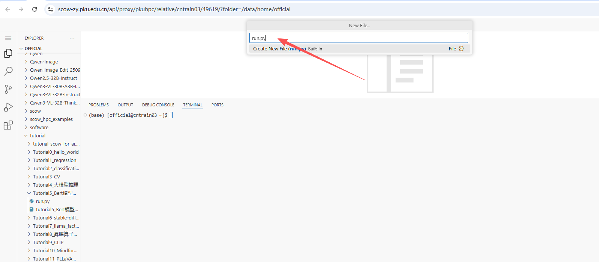

# Tutorial8: stable-diffusion-3-medium 文生图任务，通过 prompt 提示生成对应的图片

* 集群类型：超算集群
* 所需镜像：无
* 所需模型：教程内下载（stable-diffusion-3-medium-diffusers）
* 所需数据集：教程内提供
* 所需硬件资源：单机单卡，建议使用1张910B NPU运行本教程。
* 目标：本节旨在展示使用 stable-diffusion-3-medium-diffusers 模型进行文生图任务。

分以下几步来实现：
1. 环境安装与应用创建
2. 下载模型
3. 文生图

Stable Diffusion 是由 Stability AI 开发的一个开源的深度学习模型，用于生成高质量图像。

## 1. 环境安装与应用创建
### 1.1 登录
我们可以通过如下网址访问 (校外访问需通过北大vpn)：

集群入口: https://scow-zy.pku.edu.cn/

### 1.2 在超算平台中安装环境

我们的教程使用 VSCode 运行，需要在 “交互式应用” 中创建应用。


在 VSCode 应用资源申请页面申请相应的资源，点击最下方的 “提交”，进行创建。


创建成功后，在“已创建的应用”中点击 “连接” 进入应用：


进入 VSCode 后界面如下：


### 1.3 安装依赖

确保已经根据[tutorial0](../Tutorial0_python_env/tutorial0.md)安装conda环境

```
# 在Shell命令行中执行：

conda create -n tutorial python=3.9
conda activate tutorial

# 添加昇腾相关的环境变量
mkdir -p ${CONDA_PREFIX}/etc/conda/activate.d/

echo '#!/bin/bash
source /usr/local/Ascend/ascend-toolkit/set_env.sh
source /usr/local/Ascend/nnal/atb/set_env.sh' > ${CONDA_PREFIX}/etc/conda/activate.d/npu_load_env.sh

chmod +x ${CONDA_PREFIX}/etc/conda/activate.d/npu_load_env.sh
conda deactivate tutorial
conda activate tutorial

# 安装依赖
pip install torch==2.3.1 torch-npu==2.3.1 numpy==1.26.4 matplotlib==3.8.4 pandas==2.2.2 \
scikit-learn==1.5.0 pyyaml==6.0.2 torchvision==0.18.1 torchaudio==2.3.1 accelerate==1.2.1 \
scipy==1.13.1 attrs==24.3.0 deepspeed==0.16.2 transformers==4.42.4 datasets==3.2.0 \
evaluate==0.4.3 diffusers==0.32.1 sentencepiece==0.2.0 protobuf==5.29.2 decorator==5.2.1 \
-i https://mirrors.pku.edu.cn/pypi/web/simple

pip install  huggingface_hub==0.35.3
pip install  modelscope==1.22.3
# 平台已预置了驱动固件和CANN算子库，用户无需安装。
```
## 2. 下载模型
建议在shell中与当前脚本相同目录下进行模型下载，而不是在应用中进行，以免造成资源浪费


```
# 通过命令行下载模型和数据
modelscope download --model stabilityai/stable-diffusion-3-medium-diffusers --local_dir stabilityai/stable-diffusion-3-medium-diffusers
```

## 3. 文生图

打开新的终端


创建新文件


输入文件名：run.py 



将以下代码复制粘贴到新文件内 


代码如下：
```
import torch
import torch_npu
from diffusers import StableDiffusion3Pipeline

# 检查 NPU 是否可用
device = torch.device("npu:0") if torch.npu.is_available() \
    else torch.device("cpu")

# 加载模型
pipe = StableDiffusion3Pipeline.from_pretrained(
    "./stabilityai/stable-diffusion-3-medium-diffusers", 
    torch_dtype=torch.float16
)

# 使用 NPU
pipe = pipe.to(device)

# prompt 内容，可以使用多个 prompt
# prompt2 = "Photorealistic"
prompt = ("Albert Einstein leans forward, holds a Qing dynasty fan. "
"A butterfly lands on the blooming peonies in the garden. "
"The fan is positioned above the butterfly.")

# 根据 prompt 生成多张图片
for i in range(10):
    image = pipe(
        prompt=prompt,
        # prompt_2=prompt2,
        negative_prompt=\
            "ugly, deformed, disfigured, poor details, bad anatomy",
        num_inference_steps=70,
        guidance_scale=7,
        height=1024,
        width=1024,
    ).images[0]

    image.save(f"{i}.png")
```

运行以下命令，从文字生成图像：
```
python run.py
```

在脚本同路径下会生成十张图片和一个输出结果的json文件，打开其中一张，可以看到生成的图片内容符合我们给到大模型的prompt


