# Tutorial9
: 使用LLaMA-Factory官方镜像完成Qwen2.5大模型的微调、推理

* 集群类型：智算平台
* 所需镜像：app-store-images.pku.edu.cn/hiyouga/llamafactory:0.9.4-npu-a2
* 所需模型：Qwen2.5-1.5B-Instruct
* 所需数据集：教程内提供
* 所需资源：单机单卡，建议使用1张910B NPU运行本教程。
* 目标：本节以Qwen2.5-1.5B-Instruct模型为例，使用LLaMA-Factory官方镜像对这个Qwen大模型完成微调、推理的步骤。未经过微调的Qwen大模型认为自己是Qwen大模型；经过微调后，Qwen大模型认为自己是北大人工智能助手。

分以下几步来实现：
1. 创建VSCode交互应用，拉取LLaMA-Factory官方镜像，选取Qwen2.5-1.5B-Instruct模型
2. 按照步骤，使用LLaMA-Factory交互应用完成对大模型的微调和推理

## 1、拉取镜像并安装

1.1 准备数据集

根据[Tutorial5_添加和管理数据集](../Tutorial5_添加和管理数据集/tutorial5_添加和管理数据集.md) 准备数据集

1.2 创建交互式应用

1.2.1 然后点击 作业 > 选择集群（这里ascend-k8s是AI集群的名称） > 应用 >创建应用


1.2.2 点击VSCode


在创建VSCode交互应用页面中，进行配置：

1.2.3 拉取镜像
选择镜像源 - 远程镜像
运行命令 - 勾选 修改默认命令
* 将 app-store-images.pku.edu.cn/hiyouga/llamafactory:0.9.4-npu-a2 拷贝后，粘贴到 远程镜像地址框中，用于平台根据镜像地址拉取相应的LLaMa-Factory镜像
* 将 ${SCOW_AI_ALGORITHM_PATH}/bin/code-server 拷贝后，粘贴到 修改默认命令框中，用于平台启动VSCode应用


1.2.4 添加模型、算法、和数据集
* 勾选添加类型 - 模型，下拉菜单中，选取 公共模型；模型下拉菜单中，选取 Qwen2.5-1.5B-Instruct(official) 模型，版本下拉菜单中，选取 latest


* 勾选添加类型 - 算法，下拉菜单中，选取 公共算法；算法下拉菜单中，选取 code-server(official) 算法，版本下拉菜单中，选取 4.95.3，此时应可以看到算法描述部分显示启动命令，与1.1.4步骤中的启动命令是一致的


* 勾选添加类型 - 数据集，下拉菜单中，选取 我的数据集；数据集下拉菜单中，选取刚创建的 identity（这里有你的用户名） 数据集，版本下拉菜单中，选取刚在数据集中设置的版本号；有多个版本的话，选取恰当的版本


1.2.5 本教程采用单节点单卡，资源部分不需要修改。也可以根据实际需要，如单节点多卡的话，在 单节点加速卡卡数 中修改为2/4/8（单节点上限是8卡，卡数越多，对大模型训练的时间会相应缩短）然后点击 提交 按钮


1.2.6 进入新创建的VScode应用的浏览器界面

提交后，刚创建的作业在 未结束的作业 列表中，作业状态为 PENDING


点击 刷新 按钮，手动进行刷新后，作业状态转为 RUNNING


在这条作业的操作中，点击 进入 图标，浏览器将打开新的页面来展示新创建的VScode应用


如果你是首次走到这一步，会看见如下弹窗，勾选 信任作者，并点击 信任作者 按钮
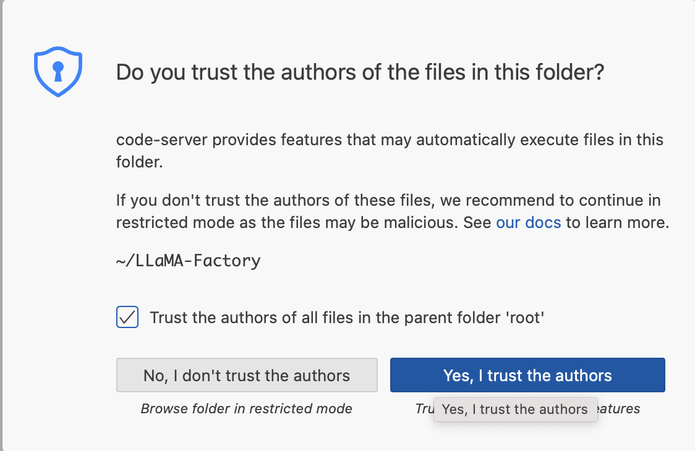

进入新创建的VScode交互应用的浏览器界面


1.2.7 打开app文件夹，之后的所有文件都将保存在这个文件夹下，之后的所有操作都将在这个文件夹下进行
点选左侧导航栏中第二个选项，显示 打开文件夹 按钮

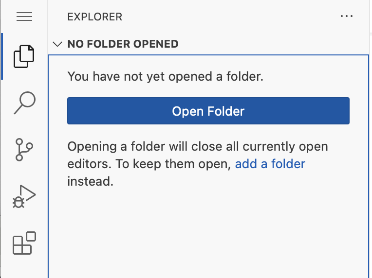

点击 打开文件夹 按钮，可见 最初的文件夹是 /root/
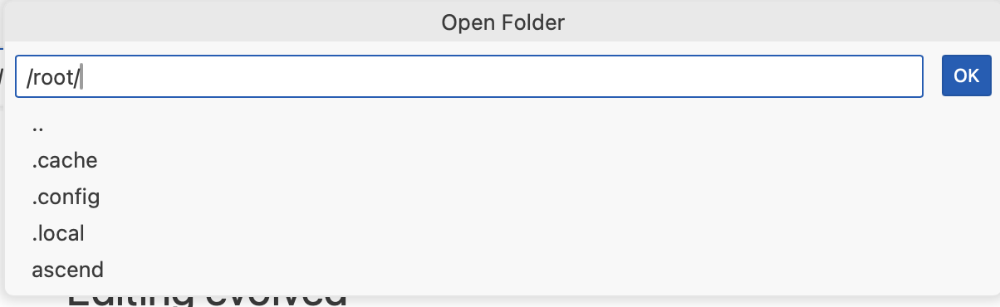

将输入框内的文件夹修改为 /app/，点击 OK 按钮
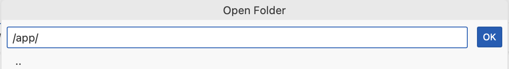

app文件夹打开，里面包含子文件夹和文件
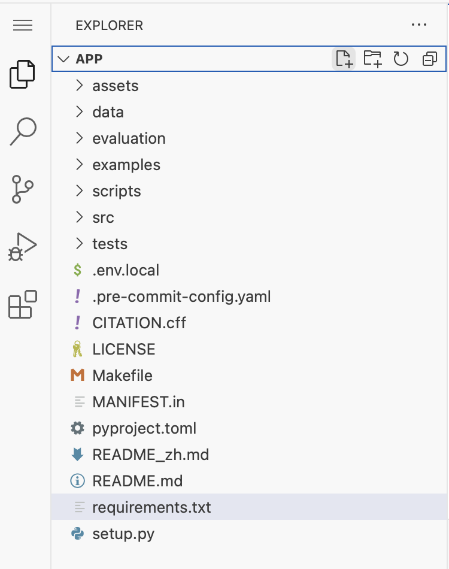

点选左侧导航栏中第一个选项，选择 Termianl > New Terminal 创建新终端

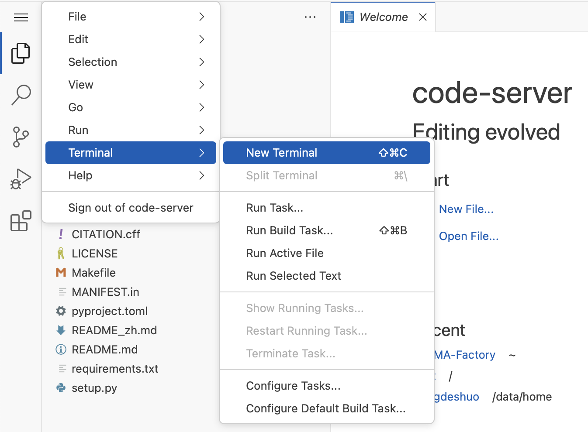

完整的VSCode应用包含的左侧app文件夹、右侧上半区域的文件显示窗口、和右侧下半区域的终端
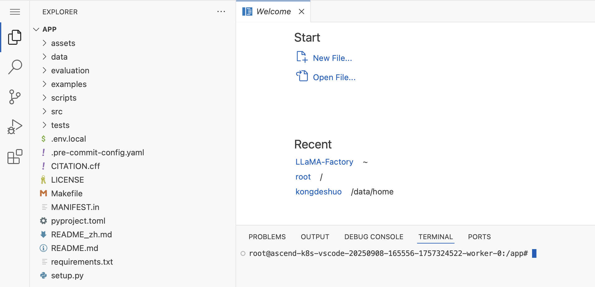

## 2、进行配置

2.1 在app文件夹中创建config.yaml文件
2.1.1 拷贝下面代码：
```json
echo "model_name_or_path: $SCOW_AI_MODEL_PATH

stage: sft  # Supervised Fine-Tuning 有监督的微调
do_train: true
finetuning_type: lora # 微调类型,例如lora
lora_target: all  # LoRA微调的目标模块
dataset_dir: $SCOW_AI_DATASET_PATH
dataset: identity # 新模型的数据集名称，位置在dataset_dir/data/identity.json
template: qwen # 数据模板
cutoff_len: 1024 # 序列截断长度
max_samples: 1000 # 最大样本数 
learning_rate: 1.0e-4 # 学习率
num_train_epochs: 20.0 # 训练轮数
output_dir: ${WORK_DIR}/llama-factory-output
# output_dir: /root/LLaMA-Factory/models/Qwen2.5-1.5B-Instruct-output

# 配置文件中的TensorBoard设置
logging_dir: ./logs/tensorboard
# report_to: tensorboard" > config.yaml
```
2.1.2 粘贴到终端terminal，再按回车键执行这些代码，完成创建config.yaml 文件


2.1.3 查看在app文件夹中已经创建了 config.yaml 文件，点击这个文件，右侧上部的窗口中显示文件包含的内容


2.2 在app文件夹中创建 step1_model_reasoning.py 文件，这是作为模型微调前做推理的文件
2.2.1 点击红色箭头所指的图标，新建文件，在蓝色方框内给新建的文件取名 step1_model_reasoning.py 再按回车键
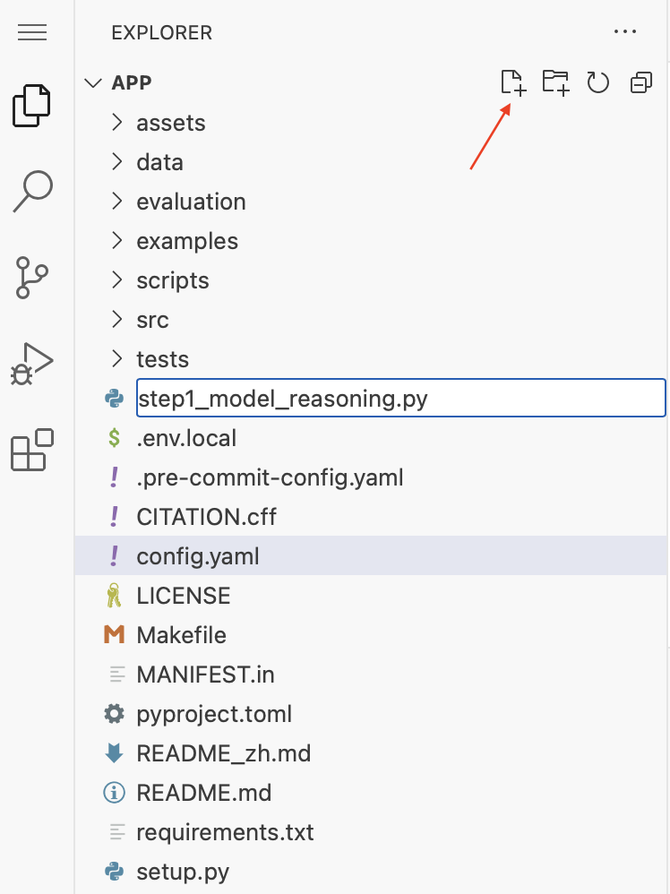

2.2.2 右侧上半部的窗口打开了这个新建的 step1_model_reasoning.py 空白文件
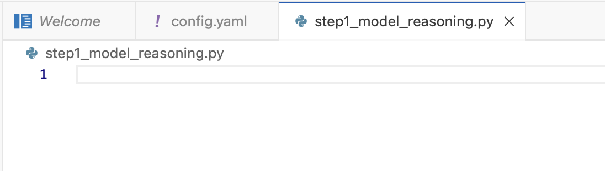

2.2.3 拷贝下面代码:
```python
import torch
import torch_npu
from transformers import AutoModelForCausalLM, AutoTokenizer
import os

model_dir =  './models/Qwen2-1.5B-Instruct')
print(f"Model downloaded to: {model_dir}")


# 设置NPU设备
device = 'npu:0'
torch.npu.set_device(device)

# 加载模型和分词器
tokenizer = AutoTokenizer.from_pretrained(model_dir)
model = AutoModelForCausalLM.from_pretrained(model_dir).to(device)

model.eval()  # 设置为评估模式

# 准备输入数据
input_text = "你好，你是谁？"
input_ids = tokenizer.encode(input_text, return_tensors='pt').to(device)
print("input_ids:", input_ids)

# 运行推理
with torch.no_grad():
    output = model.generate(input_ids, max_length=500)

# 解码输出
generated_text = tokenizer.decode(output[0], skip_special_tokens=True)
print("\ngenerated_text:", generated_text)
```

2.2.4 粘贴到已经打开的空白的 step1_model_reasoning.py 文件，这样就完成了文件创建
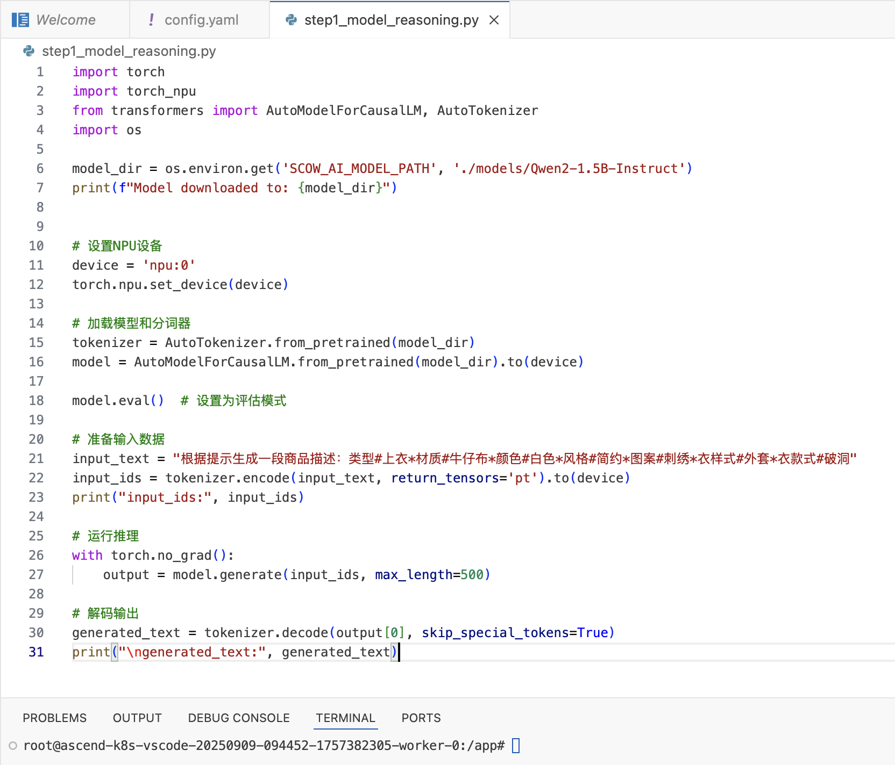

2.3 在app文件夹中创建 step2_refined_model_reasoning.py 文件，这是作为模型微调后做推理的文件

2.3.1 击红色箭头所指的图标，新建文件，在蓝色方框内给新建的文件取名 step2_refined_model_reasoning.py 再按回车键
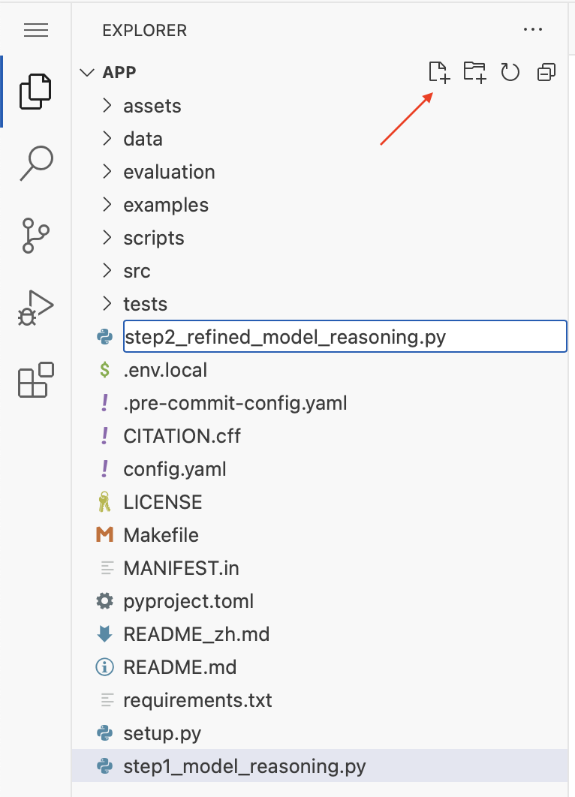

2.3.2 右侧上半部的窗口打开了这个新建的 step2_refined_model_reasoning.py 空白文件
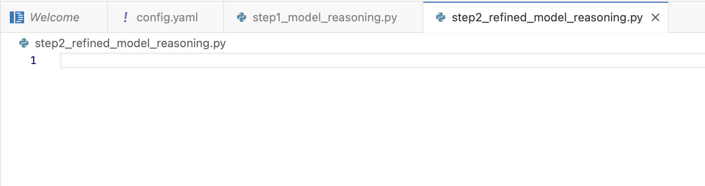

2.3.3 拷贝下面代码:
```python
import torch
import torch_npu
from transformers import AutoModelForCausalLM, AutoTokenizer
import os


# 设置NPU设备
device = 'npu:0'
torch.npu.set_device(device)

# for model_dir in [os.environ.get('SCOW_AI_MODEL_PATH', './models/Qwen2-1.5B-Instruct'), '/root/LLaMA-Factory/models/Qwen2.5-1.5B-Instruct-output']:
for model_dir in [os.environ.get('SCOW_AI_MODEL_PATH'), os.path.join(os.environ.get('WORK_DIR'), 'llama-factory-output')]:
    print(f"=== Model: {model_dir} =========")

    # 加载模型和分词器
    tokenizer = AutoTokenizer.from_pretrained(model_dir)
    model = AutoModelForCausalLM.from_pretrained(model_dir).to(device)

    model.eval()  # 设置为评估模式

    # 准备输入数据
    input_text = "你好，你是谁？"
    input_ids = tokenizer.encode(input_text, return_tensors='pt').to(device)
    print("input_ids:", input_ids)

    # 运行推理
    with torch.no_grad():
        output = model.generate(input_ids, max_length=500)

    # 解码输出
    generated_text = tokenizer.decode(output[0], skip_special_tokens=True)
    print("\ngenerated_text:", generated_text)
```

2.3.4 粘贴到已经打开的空白的 step2_refined_model_reasoning.py 文件，这样就完成了文件创建
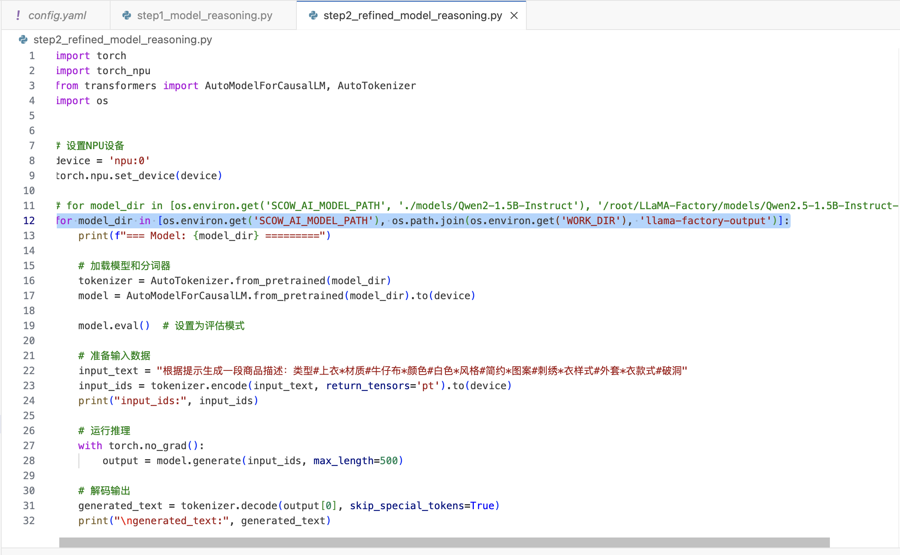

## 3、用镜像对模型进行推理、微调

3.1 使用还没有经过微调的模型进行推理

3.1.1 在右侧下半部的终端terminal中，粘贴命令 python step1_model_reasoning.py 再按回车键


3.1.2 在右侧下半部的终端terminal中，查看推理结果
可以看到下载并使用的是 Qwen2.5-1.5B-Instruct 模型，任务是QWen大模型的身份认知，没有经过微调的大模型认为自己是 AI助手 通义千问

再次执行3.1.1的步骤，这次没有经过微调的大模型认为自己是 阿里云开发的AI助手


3.2 对模型进行微调

3.2.1 安装两个工具，这是为了llama factory的官方镜像可以正常使用
* torch 在右侧下半部的终端terminal中，粘贴命令 pip3 install torch-npu==2.6.0 再按回车键，确保成功安装

* torchvision 在右侧下半部的终端terminal中，粘贴命令 pip3 install torchvision==0.21.0 再按回车键，确保成功安装


3.2.2 在右侧下半部的终端terminal中，粘贴命令 llamafactory-cli train ./config.yaml 再按回车键


3.2.3 在右侧下半部的终端terminal中，查看训练结果
模型进行微调所用的参数等信息


3.3 使用经过微调后的模型进行推理

3.3.1 在右侧下半部的终端terminal中，粘贴命令 python step2_refined_model_reasoning.py 再按回车键


3.3.2 在右侧下半部的终端terminal中，查看微调后的结果：
可以看到使用的是 没有经过微调后的模型时，也就是Qwen2.5-1.5B-Instruct模型时，大模型认为自己是 通义千问


可以看到使用的是 经过微调后的模型时，大模型认为自己是 北大助手
