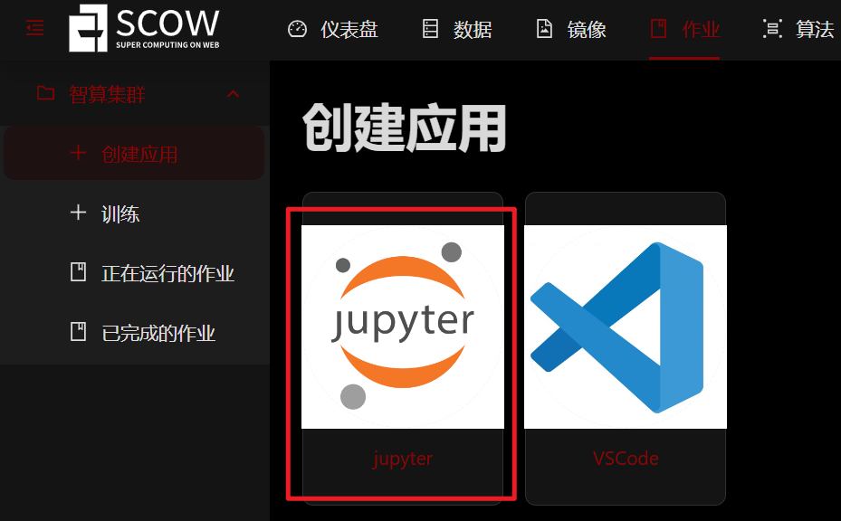
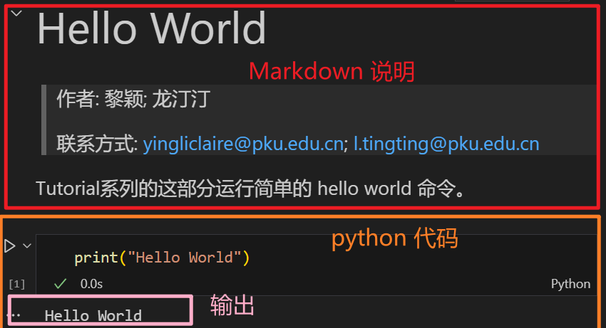

# Tutorial SCOW-for-AI

人工智能（AI）的迅猛发展正深刻影响着学术界和工业界。AI技术的进步依赖于处理海量数据和复杂模型的能力，因此，高性能计算（HPC）平台成为推动AI研究和应用的关键工具。尽管HPC在技术上提供了强大的支持，其使用的复杂性却给学术研究人员和工业从业者带来了挑战。许多研究人员和工程师面临着平台配置繁琐、资源调度复杂以及编程模型不友好的问题，这些因素可能延缓AI项目的开发进程。

SCOW for AI 是基于 SCOW 研发的算力网络融合与交易平台，通过SCOW for AI，超算用户无需安装任何软件，只需使用现代浏览器即可高效利用超算资源完成 AI 计算任务。用户可以通过 Web 界面进行管理 AI 训练中的数据集、算法、模型，并通过镜像的方式来进行 AI 训练任务，极大降低了使用门槛。

本教程通过一系列在SCOW for AI上运行AI的案例，帮助用户快速掌握在HPC环境中进行AI学习和研究的方法，助力学术界和工业界更高效地利用高性能计算资源。

下面我们首先介绍如何在 SCOW for AI 平台上申请计算资源，然后通过简单案例 Tutorial 0 介绍如何在 SCOW for AI 平台上进行计算，最后是 AI 相关的教程介绍。 

## SCOW for AI 平台申请计算资源

**1. 登陆**

我们可以通过如下网址访问：

集群入口: https://aigc-scow.pku.edu.cn/dashboard

**2. 创建交互式应用** 

我们的教程是使用 Jupyter Lab 运行的，所以需要在 “交互式应用” 中创建 Jupyter Lab 应用。




在 Jupyter Lab 应用资源申请页面申请相应的资源，点击最下方的 “提交”，进行创建。注意：这里我们使用了默认的预装了  Jupyter  应用的  **cuda-jupyter:0.3**  镜像，这是一个公共镜像。


创建成功后显示 “Running”，点击 “连接” 进入应用：


进入 Jupyter Lab 后界面如下：


## 安装 conda

Conda 是一个开源的包管理和环境管理系统。它用于安装和管理软件包及其依赖项，同时允许用户创建独立的环境，以便在一个系统上运行多个项目。在命令行终端中运行如下命令以安装 conda：

```bash
# 0. 安装 wget
sudo apt update
sudo apt install wget

# 1. 获得最新的miniconda安装包；
wget https://repo.anaconda.com/miniconda/Miniconda3-latest-Linux-x86_64.sh

# 2. 安装到自己的HOME目录下的software/miniconda3中
chmod +x Miniconda3-latest-Linux-x86_64.sh
./Miniconda3-latest-Linux-x86_64.sh

# 3. 安装成功后可以删除安装包，节省存储空间
rm -f Miniconda3-latest-Linux-x86_64.sh

# 4. 退出重新登录或者执行以下命令，即可导入 conda 环境
source ~/.bashrc

# 5. 检查是否安装成功
conda --version
```

## 注册ipykernel

在使用 Jupyter Notebook 时，注册 `ipykernel` 为 Python 环境的内核是一个重要的步骤，因为这会使得该环境能够被 Jupyter 识别和使用。即使是 Conda 的 `base` 环境，也常常需要进行这种配置。下面我们为 conda 的 base 环境安装和注册 ipykernel：

```bash
# 安装内核
conda install ipykernel
# 注册内核
python -m ipykernel install --user --name=base --display-name="base"
# 查看已注册的内核
jupyter kernelspec list
```

## 运行 Tutorial 0

**1. 获取教程所需文件**

在命令行终端中执行：

```bash
<!-- VAR_PLACEHOLDER -->
wget https://scow.pku.edu.cn//tutorial/tutorial.tar.gz
tar -xzf tutorial.tar.gz
```

**2. 运行 Tutorial 0**

在所下载的教程文件夹中打开 tutorial/Tutorial0_hello_world/tutorial0_hello_world.ipynb 文件。可以看到文件中有 markdown 单元格和 python 代码单元格。首先选择  kernel 为 base，然后用鼠标点击选中单元格后，“Ctrl + Enter” 可运行单元格，markdown 在运行后起到渲染的效果，python 会在下方输出结果。注意：苹果电脑使用的快捷键会有所不同。





## 数据与模型路径

部分集群中, 数据和模型已经提前下载好在公用存储下：

- 数据
<!-- VAR_PLACEHOLDER -->
`/lustre/public/tutorial/data`

- 模型
<!-- VAR_PLACEHOLDER -->
`/lustre/public/tutorial/models`

如果您所用的集群中不含上述目录，则需按后续教程中的提示进行下载

## 教程内容

教程目前由 9 个独立的案例构成：

### Pytorch 基础
  - **[Tutorial1](Tutorial1_regression/tutorial1_regression.ipynb)**: 通过预测房价这一简单案例展示如何使用全连接神经网络解决回归问题，并在单机单显卡上运行案例。

### CV 相关
  - **[Tutorial2](Tutorial2_classification/tutorial2_classification.ipynb)**: 通过MNIST数据集和一个规模较小的简单CNN网络展示使用CNN进行图像分类的简单案例。
  - **[Tutorial3](Tutorial3_CV/tutorial3_CV.ipynb)**: 实际应用和研究中通常会使用大型数据集和多卡并行，这部分使用著名的ResNet50网络和ImageNet数据集，展示在多张显卡上并行的图像分类任务。

### 大模型相关
  - **[Tutorial4](Tutorial4_大模型推理/tutorial4_大模型推理.ipynb)**: 通过在 SCOW 平台上运行 cpm-bee-2b 模型，展示模型推理任务。
  - **[Tutorial5](Tutorial5_大模型微调/tutorial5_大模型微调.ipynb)**: 通过在 SCOW 平台上上传模型、数据、镜像模型，展示模型微调。
  - **[Tutorial6](Tutorial6_stable-diffusion-3-medium/tutorial6_stable_diffusion.ipynb)**: stable-diffusion-3-medium 文生图任务，通过 prompt 提示生成对应的图片。
  
### 使用自定义镜像和模型

  - **[Tutorial7](Tutorial7_使用自定义镜像和模型/tutorial7_使用自定义镜像和模型.ipynb)**: 上传自定义的镜像、模型、数据，使用 AI 训练模块进行训练。
  
---

> 作者: 黎颖; 龙汀汀
>
> 联系方式: yingliclaire@pku.edu.cn;   l.tingting@pku.edu.cn