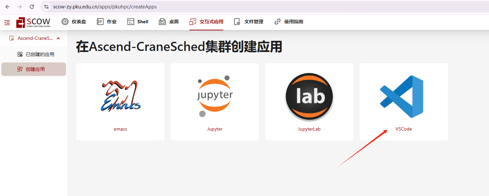
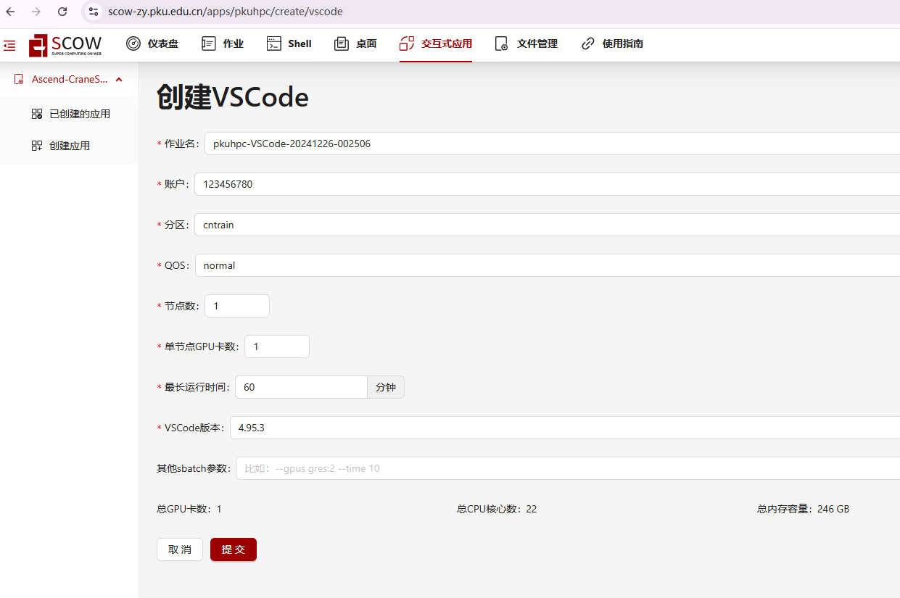
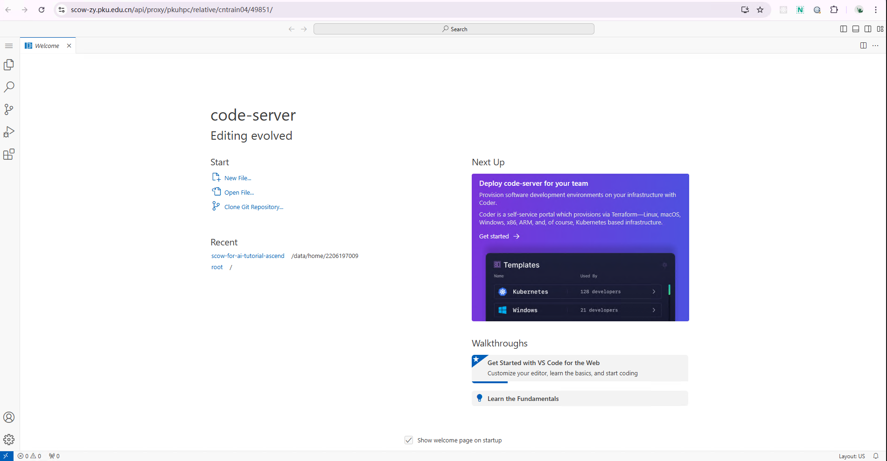

# Tutorial SCOW
本教程介绍如何在基于 [SCOW](https://www.pkuscow.com/) 的华为鲲鹏昇腾集群上申请计算资源并运行各类计算任务。本教程已纳入 [华为官方在线课程](https://www.hiascend.com/developer/courses/detail/1909399063897702401)。

平台分为智算平台（SCOW AI集群）和超算平台（SCOW HPC集群）。根据不同需求，某些单位部署的SCOW系统仅包含SCOW AI或SCOW HPC。其中SCOW AI是基于Kubernetes容器的算力集群，SCOW HPC是基于鹤思作业调度系统的裸金属服务器的算力集群。请根据自身情况选择使用。两个集群里，用户共享同一个HOME目录。


## 教程内容

教程目前由多个独立的案例构成：


### Python 环境
  - **[Tutorial0 搭建Python环境](Tutorial0_python_env/tutorial0.md)**: 在超算平台，通过安装miniconda工具来创建和管理隔离的Python环境；在智算平台中，基础镜像一般已经包含Python环境，只需要验证即可。


### Pytorch 基础
  - **[Tutorial1 回归类问题](Tutorial1_regression/tutorial1.md)**: 在超算平台，通过预测房价这一简单案例展示如何使用全连接神经网络解决回归问题，并在单机单显卡上运行案例。


### CV 相关
  - **[Tutorial2 图像文本分类问题-单机单卡](Tutorial2_classification/tutorial2.md)**: 在超算平台，通过OpenAI的多模态预训练模型‌CLIP对图像文本在单机单卡的资源下进行分类的简单案例。
  - **[Tutorial3 图像文本分类问题-单机多卡](Tutorial3_CV/tutorial3.md)**: 在超算平台，通过使用图像数据集CIFAR-10在单机多卡的资源下训练ResNet18模型，并使用一系列函数测试训练过程的性能的简单案例。
 

### 大模型相关
  - **[Tutorial4 下载模型](Tutorial4_下载模型/tutorial4_下载模型.md)**: 在超算平台，展示如何下载大模型的过程。
  - **[Tutorial5 添加和管理数据集](Tutorial5_添加和管理数据集/tutorial5_添加和管理数据集.md)**: 在智算平台，展示如何添加和管理数据集的过程。
  - **[Tutorial6 大模型推理-单机单卡](Tutorial6_大模型推理/tutorial6_大模型推理.md)**: 在智算平台，通过使用Qwen3-4B模型展示大模型如何根据提示词进行推理。
  - **[Tutorial7 大模型微调-单机单卡](Tutorial7_Bert模型微调/tutorial7_Bert模型微调.md)**: 在超算平台，通过使用谷歌Google的bert-base-uncased模型展示Bert模型微调的过程。
  - **[Tutorial8 大模型文生图任务-单机单卡](Tutorial8_stable-diffusion-3-medium/tutorial8_stable_diffusion.md)**: 在超算平台，使用stable-diffusion-3-medium 模型，通过 prompt 提示词生成对应的图片的过程。
  - **[Tutorial9 使用LLaMA-Factory官方镜像对Qwen大模型进行微调-单机单卡](Tutorial9_llama_factory/tutorial9_llama_factory.md)**: 在智算平台，使用LLaMA-Factory官方对Qwen大模型进行微调的过程。
  - **[Tutorial10 使用LLaMA-Factory交互应用对Qwen大模型进行微调-单机单卡](Tutorial10-llama-factory/tutorial10-llama-factory.md)**: 在智算平台，使用LLaMA-Factory交互应用对Qwen大模型进行微调的过程。
  - **[Tutorial11 使用LLaMA-Factory官方镜像对Qwen大模型进行微调-多机多卡](Tutorial11_llama_factory多机多卡/tutorial11.md)**: 在智算平台，使用LLaMA-Factory官方对Qwen大模型进行微调的过程。
  - **[Tutorial12 在训练模块中使用LLaMA-Factory对Qwen大模型进行微调-单机单卡/多卡](Tutorial12_使用训练模块进行大模型微调(单机)/Tutorial12.md)**: 在智算平台，训练模块中使用LLaMA-Factory框架对Qwen大模型进行单机单卡/多卡微调、推理的过程。
  - **[Tutorial13 在训练模块中使用LLaMA-Factory对Qwen大模型进行微调-多机多卡](Tutorial13_使用训练模块进行大模型微调(多机多卡)/tutorial13.md、)**: 在智算平台，训练模块中使用LLaMA-Factory框架对Qwen大模型进行多机多卡微调、推理的过程。
  - **[Tutorial14 对QwenVL模型图生文进行微调-单机单卡](Tutorial14-MindSpeed-MM模型微调/Tutorial14.md)**: 在智算平台，通过MindSpeed-MM框架使用COCO2017数据集对QwenVL模型进行微调。
  

## SCOW HPC 超算平台申请计算资源 (使用SCOW AI集群则不需要)

**1. 登陆**

请从集群管理员处获取登录地址。

**2. 在 SCOW HPC 集群中安装环境** 

我们的教程使用 VSCode 运行，需要在 “交互式应用” 中创建应用。



在 VSCode 应用资源申请页面申请相应的资源，点击最下方的 “提交”，进行创建。



创建成功后，在“已创建的应用”中点击 “连接” 进入应用：


进入 VSCode 后界面如下：


请确保运行过[Tutorial0 搭建Python环境](Tutorial0_python_env/tutorial0.md)中1.2安装conda的步骤，再进行下面的步骤。

## 安装依赖、注册ipykernel

在Shell命令行中执行：

```bash
conda create -n tutorial python=3.9
conda activate tutorial

# 添加昇腾相关的环境变量
mkdir -p ${CONDA_PREFIX}/etc/conda/activate.d/
echo '#!/bin/bash
source /usr/local/Ascend/ascend-toolkit/set_env.sh
source /usr/local/Ascend/nnal/atb/set_env.sh' > ${CONDA_PREFIX}/etc/conda/activate.d/npu_load_env.sh
chmod +x ${CONDA_PREFIX}/etc/conda/activate.d/npu_load_env.sh
conda deactivate tutorial
conda activate tutorial

# 安装内核
conda install -y ipykernel
# 注册内核
python -m ipykernel install --user --name=tutorial --display-name="tutorial"

# 查看已注册的内核
jupyter kernelspec list

# 安装依赖
pip install torch==2.3.1 torch-npu==2.3.1 numpy==1.26.4 matplotlib==3.8.4 pandas==2.2.2 \
scikit-learn==1.5.0 pyyaml==6.0.2 torchvision==0.18.1 torchaudio==2.3.1 accelerate==1.2.1 \
scipy==1.13.1 attrs==24.3.0 deepspeed==0.16.2 transformers==4.33.2 datasets==3.2.0 \
evaluate==0.4.3 diffusers==0.32.1 sentencepiece==0.2.0 protobuf==5.29.2 \
-i https://mirrors.pku.edu.cn/pypi/web/simple
```
平台已预置了驱动固件和CANN算子库，用户无需安装。


---
> 联系人: 龙汀汀 l.tingting@pku.edu.cn
> 
> 作者: 黎颖; 褚苙扬; 石晶; 谢成淋; 龙汀汀
>
> 联系方式: yingliclaire@pku.edu.cn; cly2412307718@stu.pku.edu.cn; jingshi@stu.pku.edu.cn; chenglinxie@pku.edu.cn; l.tingting@pku.edu.cn
